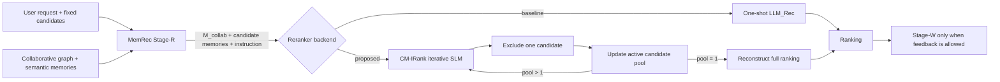

# CM-IRank — Full Research & Implementation Design

> **Working title:** Collaborative-Memory-Grounded Iterative Ranking for Full MemRec\
> **Short name:** **CM-IRank**\
> **Document role:** source-of-truth implementation/research specification for agents and human reviewers\
> **Status:** design v1.1 — user-approved model/snapshot amendment; method not yet validated\
> **Date:** 2026-09-30; execution ledger updated 2026-10-09\
> **Primary benchmark:** InstructRec Books unless the thesis scope is explicitly changed by the human researcher\
> **Primary metric:** NDCG@5\
> **Compute assumption:** self-hosted LLM/SLM and fine-tuning/RL are in scope. The existing internal GPU runbook allows **one H100 concurrently**; a two-H100 PPO run requires separate human approval and a runbook amendment. No GPU work is authorized by this design alone.

---

## 0. How this document must be used

This file is an **execution specification**, not a retrospective result report. An implementation agent should treat statements in this document in three categories:

1. **Locked project facts** — facts already established by project artifacts and the current benchmark documents. These must not be silently changed.
2. **Source-derived method facts** — descriptions of MemRec, R1-Ranker/IRanker, and nearby work. These are background constraints, not project results.
3. **Proposed design** — hypotheses and implementation decisions introduced by this project. These must be tested; they must never be written up as proven facts before the corresponding experiment passes.

### 0.1 Mandatory behavior for an implementation agent

The agent **MUST**:

- preserve the original InstructRec Books candidate-set task;
- keep the 5,377-user held-out outcomes sealed until the confirmation gate;
- never tune method choices, prompt wording, reward coefficients, model size, checkpoint, seed, candidate sampler, or stopping rule using the already-exposed 200 target labels;
- keep Stage-R/Stage-W changes separate from Stage-ReRank changes so attribution remains possible;
- record source commit, config, model revision, cohort hashes, prompt hash, candidate-manifest hash, checkpoint hash, prediction hash, and per-user failures for every promoted run;
- treat malformed rankings as failures in reported evaluation, not silently repair them into successes;
- run CPU/schema tests and a 20–30-example real-model smoke before every promoted GPU run;
- stop and report rather than improvising if a required source artifact, file, field, or provenance relationship is missing.

The agent **MUST NOT**:

- call a local-ranker-only experiment “full MemRec”;
- claim that Books supports strict global-time replay: `.inter` has only within-user order, not a cross-user global clock;
- use the test positive, its position, or any target-derived feature to construct Stage-R evidence at evaluation time;
- use the old random-negative/leaky benchmark as a valid comparison;
- choose the best training seed after looking at held-out target metrics;
- claim novelty for “RL for ranking” or “RL for adaptive memory retrieval” by themselves, because prior work already covers those ideas;
- silently fold a MemRec fidelity bug fix into the proposed method and then attribute its gain to CM-IRank.

### 0.2 Precedence when sources disagree

Use the following precedence:

1. immutable raw/current benchmark artifacts + hashes;
2. `BOOKS_BENCHMARK.md` for current Books protocol/results;
3. the thesis constraints in §0.3 and gates in this design;
4. `EXPLORATORY_HISTORY.md` for closed directions and negative results;
5. pinned project code/configs;
6. upstream paper descriptions;
7. this design, for yet-unimplemented components.

If an implementation detail in this design is incompatible with the actual repository/API, preserve the **scientific invariant** and adapt only the software interface. Record the deviation in a design-change log before running an experiment.

### 0.3 Thesis constraints inherited from the earlier roadmap

The method must have a falsifiable research question, a clear formulation, strong controls, ablations and failure analysis; code porting or fidelity repairs alone are not a thesis contribution. The solution must be general and robust: no Books-specific rule stack, manual prompt/weight/seed selection on exposed labels, negative-sampling shortcut, or hidden outcome leakage. A one-year master's thesis additionally needs reliable benchmark reconstruction, method/attribution analysis, robustness across cohorts or domains, cost–quality measurements, and sealed confirmation. A small positive delta on 200 development users is insufficient. If CM-IRank does not beat **full MemRec and SASRec** under matched protocol, report that honestly rather than rebranding local-ranker or efficiency-only gains as the original thesis goal.

### 0.4 G0 implementation ledger (updated 2026-10-09)

| Component | Status | Boundary |
|---|---|---|
| Repository and Books protocol inspection | Done | Existing 700/200 baseline and 5,377-user seal preserved; no new score |
| Opt-in `RankRequest` capture/replay | CPU implementation + synthetic parity tests done | Normal MemRec runs unchanged by default; real 30B request cache not yet generated |
| Opaque labels, strict action parser, N−1 environment | CPU implementation + twenty-user full N−1/direct fake smoke done; real-input runner implemented | No real SLM N−1/direct inference result yet; §0.17 |
| MPSS, R1-binary and terminal-only reward functions | CPU implementation + rank-1…10 identity tests done | PPO reward-manager integration not yet done |
| Instruction provenance | Risk flagged, **not resolved** | `.instruction` is user-specific and may be target-conditioned; do not reuse for pseudo-target training without provenance evidence; neutral instruction is safe fallback |
| 1,500/300 policy split and last-train pseudo-target eligibility | **Approved/locked by researcher, 2026-09-30** | `configs/cmirank/policy_split_manifest.json` freezes source hash, seed, cohort/eligibility hashes, prefix ≥5 and novelty; 1,497/1,500 train and 300/300 validation users eligible; 3 short-history users excluded without replacement; final test targets not used |
| Static fidelity + 20-user fake-LLM trace | Done as G0 diagnostic, not performance | In the 20-user evaluation phase 318/318 selected neighbors were packed; all 214 selected item neighbors had placeholder overlap 0.5 and all 318 selected neighbors had zero memory similarity; Stage-W ran only in warm-up, no test-label write. Packer's early-break limitation was **not triggered in this sample**. |
| Primary memory provider signoff | **Approved by researcher, 2026-09-30** | `upstream_aligned` is primary; `feature_complete_fixed_rule` is a separately reported secondary control. No fidelity fix is attributed to CM-IRank. |
| Baseline-parity pseudo-graph snapshot | CPU graph audit done; **Stage-W memory not yet proven safe** | Approved roles `train[:-2]` / `train[-2]` / `train[-1]`; smoke 20 first, then all 1,797 eligible query users. Exactly 3,594 query edges removed; full graph hash `22c78a5b483e137f2b0cfff23c6027471c6c553f7313b4c1aa51ec67d9a37921`. No global clock or Stage-W memory state built yet |
| Pseudo-memory CPU wiring smoke | 20 users passed with fake LLM; **not quality/leakage proof for real LLM** | 20 warm-up Stage-W calls on `train[-2]`, 0 pseudo-target Stage-W writes, 20 target-blind RankRequests; 100 fake logical requests, 0 real requests; smoke-only uniform candidates, not the final sampler |
| Qwen3.5-4B model contract | Revision pinned; **v3 infrastructure smoke passed: 20/20 valid + backward/one discarded AdamW update** | Target-free single-action synthetic requests only. Peak reserved 34.66 GiB under memory fraction 0.60; GPU released. Full N−1/real-memory smoke, PPO runtime/memory and Books ranking quality remain untested. See §0.5 |
| Episode candidates | **V1 statistical gate stopped; v2 candidate/feature smoke and full CPU audit completed, no fixed-probe flags** | All 1,797 users / 3,594 sets retained; seven unchanged probes, fit 1,497 train / evaluate 300 validation. No flag is not proof of no shortcut or PPO readiness. See §0.7–0.10 |
| Real LM_Mem/LM_Rec smoke | **V7 secondary control and independent CPU review PASS** | 100 calls/0 retries; 20 raw writes replay exactly, 20 pseudo inputs read-only, 0 unknown IDs / 67 candidate warnings over 2,060 citation occurrences. Not semantic grounding, primary replacement or PPO promotion. See §0.17 |
| R1/VeRL compatibility audit | Pinned source inspection done; runtime/PPO smoke **not done** | Historical R1 stack cannot be assumed compatible with Qwen3.5; upstream VeRL example is GRPO/multi-GPU, not our one-card PPO gate. G0 not passed |

**Pre-outcome researcher decisions, 2026-09-30:** The primary policy base is now **`Qwen/Qwen3.5-4B`**, replacing the proposed Qwen2.5-3B; the R1 binary-reward, terminal-only, direct/no-RL and MPSS arms must all use the same Qwen3.5-4B base for attribution. The official Hub revision `851bf6e806efd8d0a36b00ddf55e13ccb7b8cd0a` is pinned in `configs/cmirank/policy_model_v1.json`; at the time of this decision no weights had been downloaded or loaded. See §0.5 for the subsequent failed infrastructure smoke. Qwen2.5-3B remains a *fact about the R1-Ranker paper*, not this project's primary model. For each eligible policy user with `train=[..., warmup, target]`, the approved pseudo-episode roles are `graph=train[:-2]`, `Stage-W feedback=train[-2]`, and reward-only `pseudo-target=train[-1]`. This changes the earlier one-edge graph-only audit; the superseding audit is recorded below. Neither decision was based on CM-IRank ranking outcomes, which do not yet exist. PPO/backend compatibility remains to be verified before training.

Implementation paths added so far: `src/cmirank/`, opt-in capture in `src/models/memrec_agent.py`, replay in `src/models/reranker_llm.py`, and `tests/test_cmirank_g0.py`. The actual Stage-ReRank call receives facets, ordered candidate payloads/item memories, instruction and two prompt flags; it does **not** receive a separate personal-memory field. CM-IRank may not invent that field. For the full-MemRec prompt, candidate `tags` are present in Python payloads but not rendered by the existing LLM reranker; the CM-IRank serializer therefore only renders baseline-visible title and item memory. The instruction preview is not a provenance proof and does not open held-out labels.

Read-only split verification: `python scripts/cmirank/02_preview_policy_split.py --seed cmirank-books-v1-draft-20260930 --min-prefix-length 5 --verify-locked configs/cmirank/policy_split_manifest.json`. Policy-train/validation sorted-ID SHA-256 are `fd3d1573d7be98e9fbee236c9d317506da509aa40e947ce409448d7680b240d7` and `7817f0d6b2de27f84efac0eea91b70560b90c6ccaa1a4de4b3de6123eb18c83d`; exposed-200 hash remains `5395ee7775d9e5d0add11ed386715c34a002138c282f4f910f775ea90871a837`. Three ineligible policy-train users (4704, 4907, 7279) fail only the locked prefix-length criterion; there is no replacement or result-based filtering. This reveals only dev user IDs and `train_data` eligibility, not final test targets. Superseding snapshot audit: `python scripts/cmirank/03_audit_prefix_snapshot.py --query-users 20`, then `--query-users all`; the full run removed 3,594 query-user edges from 193,005 source edges, prepared 1,797 Stage-W feedback events without running them, and verified the target absent from its own graph. The earlier one-edge-only hash `4687c8...` is **obsolete** and must never key a promoted cache. This audit did **not** build or certify Stage-W memories. CPU wiring/fidelity command: `python scripts/smoke_full_memrec_cpu.py --users 20 --cmirank-fidelity-trace`; aggregate output is `results/full_memrec_cpu_smoke_20_eval-hnv/cmirank_fidelity_trace.json`. As of 2026-09-30 no real-model/GPU run had occurred; the subsequent infrastructure attempt is recorded in §0.5.

Local verification on 2026-10-01 after the scoped resource exception: `python -m pytest -q` → **141 passed**; Python compilation, shell syntax checks and `git diff --check` passed. The five-document cap remains intact. These are software/data-integrity checks, **not** ranking results.

### 0.5 Qwen3.5 infrastructure smoke — 2026-10-01

**FAILED — logging bug before inference/backward:** `cmirank-qwen35-g0-smoke-v1-20261001-hnv`, locked in `configs/cmirank/qwen35_gpu_smoke.json`, launched from source commit `aa895a5813687d895b82ddbd8dcb41e8cba5a14e`. CPU preparation completed in an isolated Torch 2.8.0+cu128 / Transformers 5.13.0 environment, and the pinned official checkpoint (two weight shards) downloaded successfully. The launcher selected one empty H100; weight loading reached completion, but `save_json(..., loading)` failed with `TypeError: Object of type set is not JSON serializable`. This happened before checking loading-key diagnostics, generating the first output or calling backward. **No 20-example format result, gradient/optimizer result, peak-training-VRAM result or model-quality conclusion exists.** This is an infrastructure failure, not evidence against Qwen3.5-4B.

Cleanup recorded exit code 1, `gpu_released=true` and 1 MiB VRAM after exit; the subsequent one-time resource check also found that card empty with no compute process. The shared allocation remained RUNNING. All 13 run artifacts were copied to `results/cmirank-qwen35-g0-smoke-v1-20261001-hnv/` and their SHA-256 hashes matched the remote copies. The preparation log is also retained locally. Preserve the original manifest's stale `status=running` as raw evidence; `failure.json` and `cleanup.json` establish the terminal outcome. No remote output/model/cache was deleted.

The smoke uses 20 deterministic synthetic, target-free ranking requests: one elimination action each, greedy decoding, thinking disabled, BF16, SDPA, batch 1, input cap 2,048, output cap 128 and CUDA memory fraction 0.90. It then tests full text-backbone backward and one AdamW update with frozen vision parameters. This arbitrary format-only update is discarded; **no policy checkpoint, Books ranking score, PPO training or held-out access** is produced. A full N−1 real-Books smoke and rollout/trainer log-probability parity remain separate gates; this test cannot promote a research full run.

Implementation: `src/cmirank/gpu_resources.py`, `smoke_fixtures.py`, `provenance.py`; scripts `05_download_qwen35.py`, `06_smoke_qwen35_gpu.py`, `prepare_qwen35_smoke.sh`, `run_qwen35_gpu_smoke.sh`; resource/fixture tests in `tests/test_cmirank_gpu_safety.py`. Streaming SHA-256 replaces Python-3.11-only hashing so CPU audit scripts support the cluster's Python 3.10.

GPU process lifetime is bounded to 45 minutes. The launcher owns only its child PID, unloads/exits at task completion, saves before/after GPU/process snapshots and `cleanup.json`, and does not cancel the shared allocation. If format fails, the run is not promoted; any changed contract gets a new run ID. Full PPO peak memory is still unknown: the one-step AdamW smoke does not include a reference policy, critic, rollout backend or PPO activation footprint.

Preparation has its own 40-minute timeout and holds no GPU. The earlier provisional wall-clock ETA was 20–45 minutes including setup/download, not a measured throughput estimate. Status is checked once rather than continuously polled. This failed run cannot promote any full research run.

**Next, in order:** (1) fix only loading-diagnostic JSON serialization, add a CPU regression test for set-valued loading information, and create a v2 smoke run ID without changing the ranking prompt or decoding; (2) preflight again and rerun the same 20 synthetic actions plus backward/optimizer check, reusing the existing checkpoint; (3) after a pass, resolve the T0 PPO runtime, rollout/trainer log-probability parity and thinking contract before outcomes; (4) build/audit clean real Stage-W/Stage-R pseudo-request caches and mixed-hardness candidates, with a real 20-user N−1 smoke; (5) run matched direct/iterative controls and tiny PPO before any full training. The status request did not trigger a new GPU run. G0 remains incomplete.

**V2 follow-up, authorized by the subsequent “làm tiếp đi” request:** the diagnostic serializer now converts only `set`/`frozenset` to sorted JSON arrays; unknown objects and nonfinite numbers still fail rather than being silently stringified. Three CPU regression tests cover deterministic/nested collections, non-mutation and fail-closed behavior. The new run ID is `cmirank-qwen35-g0-smoke-v2-20261001-hnv`; model revision, fixtures, prompt, decoding, context/output caps, optimizer, dtype and memory cap are unchanged. The existing prepared environment and checkpoint will be reused. Preflight found one empty H100 (1 MiB, 0% utilization, no compute process), but the launcher must check again immediately before model load. V2 has not yet reported an outcome; G0 is not promoted.

**V2 launched:** source commit `55f53e8b2e0b9c8d4eb2a4b54843e9216856ca05`. The one status check found `manifest.json` recording RUNNING on the selected single H100, with no summary/failure yet. The original checkpoint hashes and environment versions were preserved. Provisional ETA is 5–15 minutes (no setup/download required), with the unchanged 45-minute timeout and automatic release. The next continuation must inspect the terminal artifacts and verify cleanup before proceeding to any new GPU task; this launch is not a PPO or Books performance result.

**V2 terminal result — FORMAT_SMOKE_FAILED (exit 3):** inspected on the next status request. Checkpoint loading had zero missing/unexpected/mismatched keys and no loading errors. All 20 synthetic actions completed, but only **4/20 (20%) met the locked schema**. Every invalid output had the same issue: `<answer>[Cxx]</answer>` instead of a bare label `<answer>Cxx</answer>`. All outputs were 11–12 tokens, so truncation did not cause this failure. The prompt displays candidates as `[Cxx]` and does not explicitly disallow copying those brackets into the answer; this is a plausible format-ambiguity explanation, not a ranking-quality diagnosis. Preserve all 16 failures under the original parser; do not retrospectively count them as successes.

Full text-backbone backward and one discarded AdamW update completed with finite loss **0.3509436**, nonzero gradients in 426 tensors, and 4,205,751,296 trainable text parameters; 333,514,240 vision parameters were frozen. Peak allocated/reserved VRAM was **35,412.33 / 35,474 MiB** (reserved **34.64 GiB**). Total process time was **55.35 s**, including **8.13 s** for 20 actions and **1.40 s** for backward/optimizer. These timings concern 355–356-token synthetic prompts and one short update, not full-length Books trajectories or PPO. The update was discarded; no trained policy checkpoint exists.

Cleanup reported `gpu_released=true`, 1 MiB VRAM and no compute process on the selected card; the shared allocation stayed RUNNING. All **15** remote run artifacts were copied locally and SHA-256 verified, including 20 distinct request hashes in `responses.jsonl`. No new GPU task was started during this status check. The raw manifest remains unchanged; `summary.json` and `cleanup.json` establish the terminal result.

**Revised immediate next step:** make the bare-label output contract unambiguous as a general schema clarification, with target-blind regression checks and a new v3 run ID; then repeat the 20-example smoke without relaxing the parser or changing ranking evidence. This is not prompt tuning on target ranking scores: no Books outcome has been read in these infrastructure runs. After a format pass, complete PPO/runtime parity and real-memory/candidate audits before training. G0 remains incomplete; neither this format failure nor the hardware smoke measures the method's recommendation quality.

**V3 prepared after researcher continuation:** `cmirank-qwen35-g0-smoke-v3-20261001-hnv` adds only a context-independent explanation that candidate-list brackets are display delimiters and that the answer must contain the bare `C` + two-digit label. No concrete label is used as a demonstration, avoiding an example-position cue. Parser, evidence, fixtures, model, decoding and optimizer settings are unchanged. Four CPU checks in `tests/test_cmirank_prompt_schema.py` verify active-label rendering, request non-mutation, context-independent instructions and continued rejection of bracketed answers. Preflight found one empty H100; selection must be repeated immediately before load. V3 is a new run, not a reinterpretation or repair of v2 outputs.

**V3 launch blocked before model load:** source `c1033830107ede922d731450511f932f6bd1b51e` was pushed/pulled and the launcher ran, but the immediate load-time preflight found no empty H100. Both visible cards had compute processes and VRAM above the 512 MiB idle threshold, even though utilization was 0% at that snapshot. GPU availability changed since the initial inspection. The selector failed closed (launcher exit 1) before creating the remote run directory or starting a model process. MemRec reserved no GPU/VRAM; there is no v3 format/backward result and no need to unload a model from this attempt. Both preflight snapshots were copied to the local v3 result directory and SHA-256 verified. No retry, GPU sharing, other-process kill or allocation cancellation was attempted. The schema/config is ready to smoke when a card is genuinely empty; estimated runtime remains 1–3 minutes based on v2, not a promise of GPU availability.

**User-approved resource exception, 2026-10-01:** after explicitly being asked whether this one smoke may share GPU 1 without touching its existing process, the researcher confirmed “chạy đi”. The separate run ID is `cmirank-qwen35-g0-smoke-v3-sharedgpu1-20261001-hnv`; the v3 schema/model/fixtures/decoding/optimizer remain unchanged, but memory fraction is reduced to **0.60** and timeout to **10 minutes**. This scoped gate requires H100 index 1, utilization 0% and baseline VRAM ≤4 GiB; it does not weaken the default idle-only gate or authorize shared PPO/full runs. Cleanup must verify the task's child exited, no new GPU PID remains outside the before-run baseline, and VRAM returned to baseline (+128 MiB tolerance); do not require another workload to exit. Tests cover scope/cap/timeout expansion rejection and preservation of the default gate. Initial inspection for this retry found GPU 1 already empty again (1 MiB, no process); the launcher will still preflight immediately before load. No outcome from this retry is yet reported.

**V3 terminal result — INFRASTRUCTURE_SMOKE_PASS (exit 0):** run `cmirank-qwen35-g0-smoke-v3-sharedgpu1-20261001-hnv`, source `55977dc87888d0c4e688f606b45c38e402bb51de`, official model revision unchanged. **20/20** distinct target-free synthetic requests returned valid bare labels under the unchanged strict parser. Checkpoint diagnostics were clean. Full text-backbone backward and one discarded AdamW update completed with finite loss **0.2552929**, nonzero gradients in 426 tensors and the same 4,205,751,296 trainable text parameters. No research checkpoint was saved.

Total process time **40.17 s**; inference **9.00 s**; backward/optimizer **1.30 s**. Prompts were 403–404 tokens. Peak allocated/reserved VRAM **35,409.78 / 35,492 MiB**, reserved **34.66 GiB**, within the locked 0.60 cap. GPU 1 was actually empty at load time (1 MiB, no baseline PID), so the permitted sharing exception was not needed in practice. Cleanup confirmed return to **1 MiB**, zero compute PIDs on that card and allocation still RUNNING. All **15** artifacts were copied locally and SHA-256 verified. No extra job/process was stopped, and no follow-on GPU workload was launched.

**Gate decision / next work:** this passes model-load, single-action format and short-update feasibility only, not G0 as a whole and not PPO or recommendation-quality gates. Sharing permission is scoped to this completed smoke; subsequent tasks require idle-only preflight. Next implement/verify the Qwen3.5-compatible PPO rollout/trainer contract (including log-probability parity, gamma and token-level reward placement), finish leakage/negative-sampler audits and clean real Stage-W/Stage-R request caches, then run a 20-user real-memory N−1 smoke and matched direct/iterative controls. Train a tiny PPO only after those gates; do not jump to full training based on synthetic format compliance.

---

### 0.6 Candidate infrastructure and PPO compatibility — 2026-10-01

**Implemented before new ranking outcomes:** `configs/cmirank/candidate_sampler_v1.json` freezes the candidate seed, exact 3+3+3 composition, item-text template, pool, popularity bucket/fallback, hash shuffle and semantic encoder. `src/cmirank/candidates.py` samples without replacement, excludes the user's prefix, keeps one positive and returns separate policy-input and reward/audit allowlists. Sampling components, positive position and similarity are **not** policy features. Evaluation continues to use the original immutable candidates; this sampler is training-only, not a retrieval change.

The frozen semantic encoder is [all-MiniLM-L6-v2](https://huggingface.co/sentence-transformers/all-MiniLM-L6-v2/tree/1110a243fdf4706b3f48f1d95db1a4f5529b4d41), revision `1110a243fdf4706b3f48f1d95db1a4f5529b4d41`, 384-dimensional FP32, masked mean pooling and L2 normalization, maximum 256 tokens. Static `.meta` title/description only: collapsed whitespace, `Title: {title}\nDescription: {description}`, bounded to 16,384 characters before tokenization. This is a fixed standard encoder selected without ranking outcomes, **not** the repository's hash-based `FacetEncoder`. No instruction, review, graph score or sampler annotation enters the embedding text. Catalog eligibility requires a nonempty title; metadata SHA-256 is `69b46870c62e207fca11b6d695d203efef5ee1925f33428f43c1e6eb6ccec88c`. Missing positive metadata or invalid embeddings fail closed; semantic negatives never fall back silently to random items.

Popularity counts **interactions in the common 1,797-query snapshot**, not full untrimmed histories or evaluation frequencies. Buckets are `floor(log2(count+1))`; choose the nearest available bucket after exclusion, then lower bucket on a tie, with hash selection inside a bucket. Zero-popularity metadata items remain eligible. This avoids pre-excluding cold catalog items using outcome knowledge, but does **not** establish absence of a popularity/cold-item shortcut. Full-cohort position/popularity/semantic-hardness audits remain required; 20 users cannot certify statistical robustness.

`src/cmirank/policy_inputs.py` reproduces the approved split/eligibility and snapshot hash `22c78a5b483e137f2b0cfff23c6027471c6c553f7313b4c1aa51ec67d9a37921`. It reads the physical interaction source (which includes suffix rows), discards the last two per user by position **before parsing their item identities into the adapter**, and exposes no original validation/test dictionaries. Unit tests use nonnumeric `SEALED_*` suffix identities to verify they are neither parsed nor used. No original candidate/instruction/review file is read. All 1,797 eligible warm-up events are novel to their graph prefixes in this source; no extra eligibility filter or replacement was introduced.

**CPU pipeline:** `07_prepare_candidate_index_cpu.py` first runs a real 20-item encoder smoke (finite/unit vectors, dimensions, batch-order invariance, model/config/text hashes). Only a pass permits full-catalog indexing, under the identical contract; smoke vectors are reused. `08_audit_candidates_cpu.py` then checks 20 real policy users, 40 warm-up/pseudo sets, deterministic replay, 10 unique identities, exact component counts, prefix exclusion and exclusion of the user's pseudo-target from warm-up negatives. It uses the **full common graph**, not a different 20-user snapshot. The index and sampler are intermediate preprocessing artifacts, **not** a Stage-W/R cache, policy checkpoint, PPO pass or recommendation result.

The bounded launcher `run_candidate_index_cpu.sh` uses eight CPUs inside the authorized existing Slurm allocation, `CUDA_VISIBLE_DEVICES=''`, a project-owned lock/cache/run folder, a 180-minute index timeout and a separate 15-minute candidate-audit timeout. It holds **no GPU** and installs no dependencies into the existing baseline environment. The completed shared-GPU exception in §0.5 is not reused. Source commit and GPU/process snapshots are saved for provenance; the shared allocation is never cancelled. The full index is only an extension of a passed metadata-encoder smoke, not permission to launch full policy training.

**Backend evidence, not runtime readiness:** `configs/cmirank/ppo_backend_audit_v1.json` pins R1-Ranker `d165b7590421eaa54ce11e9d9c86352cca1cfb18` and VeRL `fbb4b3a8bf636f290c9c59fc346f756849e9c241`. The [official historical IRanker launch script](https://github.com/ulab-uiuc/R1-Ranker/blob/d165b7590421eaa54ce11e9d9c86352cca1cfb18/scripts/train_iranker.sh) uses PPO/GAE and an older stack; it is prior-art reference, not a demonstrated Qwen3.5 port. The [pinned VeRL Qwen3.5 example](https://github.com/verl-project/verl/blob/fbb4b3a8bf636f290c9c59fc346f756849e9c241/examples/grpo_trainer/run_qwen3_5_35b_fsdp.sh) uses GRPO, a 35B model and multiple GPUs; it does not validate our PPO critic/actor on one H100. Its [requirements](https://github.com/verl-project/verl/blob/fbb4b3a8bf636f290c9c59fc346f756849e9c241/requirements.txt) require Transformers `>=5.5.3, !=5.6.0, <5.13`, incompatible with simply reusing our Transformers 5.13.0 infrastructure-smoke env. A separate pinned training environment is mandatory; do not upgrade the baseline or silently replace PPO with GRPO.

**Next gates, still open:** (1) real encoder/index and 20-user candidate integrity; (2) full candidate shortcut audit and clean real Stage-W/Stage-R cache with exact model/source/journal provenance; (3) locked PPO dependency/runtime contract, actor/reference/critic support, generation/training log-probability parity, gamma=1 and token-level MPSS placement; (4) real-memory 20–30-episode N−1/control and tiny PPO save/reload smoke on **one genuinely idle H100**, followed by immediate release. G0 and `training_ready` stay false until the required gates pass; no new user decision or GPU-sharing permission is assumed.

**Local verification before cluster execution:** **160 tests passed**, including 19 new candidate/contract/suffix-boundary tests; shell syntax, Python compilation and whitespace checks passed. The train-only adapter recovered the exact common snapshot and 1,497/300 eligible users without original outcome parsing. Encoder inference reuses the prepared isolated Transformers env without modifying it; the later CPU cohort audit uses the existing data-capable env **read-only** because the baseline data package imports pandas. Neither environment is a PPO training env. The source and contract are ready for CPU smoke/index execution; no new encoder, sampler or PPO result has yet been claimed.

**Launched on the next continuation:** source `08d3781c4f9c08ff931c2d395b6d5853ad36e336`, run `cmirank-minilm-candidate-index-v1-20261001-hnv`. Source was tested/pushed and the cluster pulled the exact clean commit before an eight-CPU Slurm step. Initial resource inspection found one genuinely idle H100; **no GPU was selected or reserved** because this pipeline is CPU-only. The chain is real 20-item encoder smoke → full metadata index only if pass → 20-user candidate smoke only if complete. The index stage has a 180-minute hard timeout; failure stops downstream work. A single status inspection and throughput-based ETA will follow; no background polling or full policy training is started by this launch.

**V1 terminal outcome — metadata preflight failed, no encoder/model loaded:** the source has repeated item IDs, so the initial duplicate gate stopped the CPU task (exit 1), before smoke/index/downstream audit. GPU was never reserved and the child exited. A subsequent CPU-only identity diagnostic found **424,830 rows / 190,756 unique IDs / 234,074 duplicate rows**, affecting 72,131 IDs (maximum 333 rows per ID). Every repeated row has identical ASIN, title and description; **zero conflicting identities/texts** were found. This is benign redundant static metadata, not additional items or an outcome-based correction. The baseline loader's repeated dictionary writes have the same final content.

**V2 pre-outcome correction:** `src/cmirank/metadata.py` explicitly collapses only exact ASIN/title/description duplicates and records counts; a conflicting duplicate still fails closed, rather than using last-row wins or imputation. Four regression tests cover identical rows and independent ASIN/title/description conflicts. The raw dataset is unchanged. New run ID `cmirank-minilm-candidate-index-v2-20261001-hnv`; encoder, candidate seed, text/pooling, CPU cap, batch size, timeout and all research settings remain unchanged. V1 is retained as a failed metadata-preflight artifact, never promoted or merged into a successful index. The real encoder/index and real-user candidate smoke still need to pass under v2.

**V2 launched:** **164 CPU tests passed**; source `550fa1384c3b4456e30ce1eca342ad794e0bacc7` was pushed/pulled cleanly and the same bounded CPU-only chain started. All **10** v1 remote artifacts were retrieved and SHA-256 verified; its child/cleanup confirm exit 1 and no GPU requested. V2 cannot promote training merely by finishing an index. Next continuation must verify encoder smoke, index completeness, candidate audit and terminal cleanup before using its outputs.

**V2 single status check:** the real encoder smoke **passed 20/20 items** in **3.78 s**; finite FP32 384-dimensional unit vectors, batch-order max absolute difference **0.0**, pinned weight/tokenizer/loading hashes recorded. Metadata audit confirms all 234,074 repeated rows are identical; 42 unique items have empty titles and are excluded under the pre-outcome eligibility rule, leaving **190,714 catalog items**. Full indexing started only after the smoke pass. First full batch: 32 items in **1.72 s**, implying roughly **171 minutes** for the whole index if sustained. Provisional ETA **about 3 hours CPU-only**, not GPU time; first-batch extrapolation is uncertain, and the 180-minute hard stop remains unchanged. No repeated polling, GPU reservation, trained checkpoint or ranking outcome. The downstream 20-user candidate smoke has not yet run.

**Additional train-side metadata boundary check:** all **1,797 pseudo-targets** belong to the nonempty-title pool. Two warm-up positives (users **4671 and 7065**) do not. The original test/validation suffix identities were not used. The old 20-user smoke does not include those two users and cannot prove full warm-up coverage. No user was dropped/replaced, no title imputed, and no outcome-informed setting changed. The uniform-warm-up proposal was awaiting signoff here; it was **approved 2026-10-02**, as recorded in §0.7 below.

### 0.7 Approved warm-up policy and continued data preparation — 2026-10-02

**Researcher decision locked:** use **one positive + nine uniform negatives for every warm-up event**, not a per-user fallback; retain **3 uniform + 3 popularity-matched + 3 semantic-hard negatives for PPO pseudo-episodes**. Keep all **1,497 train + 300 validation** eligible users, the original snapshot/split, and original evaluation candidates. No missing-title imputation or silent user exclusion. `configs/cmirank/episode_candidates_v1.json` pins this decision separately from the unchanged pseudo sampler/index contract. Warm-up negatives use the same existing nonempty-title eligible pool; the positive must have a static metadata identity but need not have a title or an encoder vector. The positive identity is never treated as a negative, and the user's graph prefix and own pseudo-target are excluded from warm-up negatives.

**Completed index inspected:** v2 produced all **190,714 × 384** FP32 vectors, total elapsed **6,410.80 s (~107 min)**, indexing **6,382.38 s**. Its older mixed/mixed 20-user integrity audit passed **40 sets** in **50.78 s**. Cleanup exit **0**, child exited, no GPU requested. All **17** remote artifacts, including vectors, were copied locally and SHA-256 verified. This is a successful metadata index, **not** a real-memory cache or a PPO/quality result. Keep the older audit immutable; it does not certify the newly approved uniform/mixed episode recipe.

**New execution contract:** `UniformWarmupSampler` needs no semantic embedding for the positive and applies the same rule to every user. Both phases return the same target-free candidate allowlist and keep reward/component annotations separate. Heap-based selection replaces full sorting without changing SHA-256 keys or order; regression tests establish selection equivalence, not a tuned sampler. The common graph remains hash `22c78a5b483e137f2b0cfff23c6027471c6c553f7313b4c1aa51ec67d9a37921`.

The updated `08_audit_candidates_cpu.py` first smokes **20 real users**, deliberately including users 4671/7065 plus the smallest remaining eligible IDs. This is boundary-test coverage, not method/user selection by ranking quality. It validates **40** phase-specific candidate sets, exact component counts, replay equality, metadata identity, prefix/gold exclusion and policy/reward separation. A full **1,797-user / 3,594-set** candidate preparation is allowed only with the matching successful smoke report, source commit, config/index/snapshot/split hashes and intact smoke rows. Full reuses all 40 smoke sets byte-for-byte. All other policy users remain in the same frozen train/validation groups.

`run_policy_candidates_cpu.sh` is CPU-only (eight CPUs inside Slurm, GPU visibility empty), with five-minute smoke and 60-minute full timeouts and a task-owned lock/run/PID/cleanup. It neither rebuilds the index nor installs packages nor touches other workloads. Scope is **preparing training inputs**, not full policy training; the statistical shortcut audit, fresh real Stage-W/Stage-R provenance, matched controls and one-card PPO gates remain open. Real memory generation must use the approved episode artifacts rather than the old mixed warm-up cache.

**Verification before launch:** **179 CPU tests passed**, including uniform warm-up with a known positive outside the text index, unchanged hash-order selection, approved-recipe/coverage validation and fail-closed smoke promotion for changed source, graph, recipe, cohort or rows. Shell syntax, Python compilation and whitespace checks passed. No model/API call, outcome metric, new user exclusion or GPU task was introduced by this implementation.

**Launched:** source `554d19f9635d5857815510aede4523eb3c03119b` tested/pushed, pulled as an exact clean commit, then started `cmirank-policy-candidates-v1-20261002-hnv` inside the authorized eight-CPU step. The chain first runs the approved 20-user boundary smoke and only then the gated full candidate preparation. It holds no GPU; a resource inspection found one idle H100 but it was not reserved for CPU preprocessing. This does not launch PPO, change a cohort, or grant full real-memory-cache promotion. One status check will establish smoke outcome/progress/ETA; terminal full artifacts and cleanup must be verified on continuation.

**Single status check:** the approved smoke **passed 20 users / 40 sets in 27.67 s**, including both metadata-boundary users 4671 and 7065. Every warm-up uses nine uniform negatives; every pseudo-episode retains the locked 3+3+3 mix. History collisions and warm-up negatives containing the user's own pseudo-target are both **zero**. Original evaluation candidates/instructions/suffix identities were not accessed; physical LLM requests **0**. The smoke report and 40 candidate rows were retrieved locally; both SHA-256 hashes match the remote artifacts. This is candidate integrity, not a recommendation-quality result or proof that the statistical shortcut/real-memory gates have passed.

Full preparation started only after that pass. At the single inspection it had completed **201 / 1,797 users in 105.04 s**; the latest 100-user interval took 52.65 s, implying **roughly 15–17 minutes total CPU time**, about **14 minutes remaining at that inspection**, subject to throughput variation. The 60-minute hard timeout remains. No repeated polling or GPU reservation. Next continuation: verify all **3,594** full candidate sets, byte-for-byte reuse of the 40 smoke sets, artifact hashes and terminal cleanup; then implement fresh real Stage-W/Stage-R memory-cache smoke and the separate PPO compatibility gates. `training_ready` remains **false**.

**Terminal verification on continuation:** full preparation completed **1,797 users / 3,594 sets in 928.46 s (15.47 min)**, exactly 1,797 warm-up and 1,797 pseudo sets, reusing **40** smoke sets. Both warm-up boundary users remain included. History collisions and own-pseudo-target warm-up negatives remain zero. Candidate SHA-256 `5ca6c35bdbd9f246c7f6abbfc88ac68908fde0cdd8a98c231fbc29527cc07205`; full report SHA-256 `af9ffe52ef9bfdf08e517b2347434f06d3b7c46a9355dc05f1bc551de4c17b06`. All **12** remote run artifacts were retrieved locally and their SHA-256 hashes matched. Cleanup exit **0**, child exited, no GPU requested; shared allocation still running. This closes candidate **preparation/integrity**, not the statistical shortcut, memory or PPO gates. No new source data or held-out outcomes were used.

### 0.8 CPU-only shortcut diagnostic contract — 2026-10-02

The next CPU step implements §32 before any real-memory/PPO promotion. `configs/cmirank/shortcut_audit_v1.json` freezes the completed candidate run/source/report/row hashes and seven probes **before reading their score results**: position, item-ID magnitude, common-snapshot popularity, title length, bounded metadata-text length, description presence and candidate-set semantic centrality. `09_audit_shortcuts_cpu.py` independently rechecks every full row, immutable split/roles, exclusion, policy/reward allowlists, hash shuffle, CPU cleanup and byte-for-byte reuse of all 40 candidate-smoke sets. It does not rerun sampling or encode/download a model.

**Analysis protocol, not a new method:** position frequencies and +/- score directions are fitted only on the **1,497 policy-train pseudo-targets**; direction maximizes train NDCG@5, preferring positive direction on an exact tie. The frozen **300 policy-validation pseudo-targets** are evaluated once. Tied scores receive exact expected ranking credit over all tied ranks; no item-ID/position tiebreak creates artificial success. Semantic centrality is the mean off-diagonal cosine within the ten-item set, never similarity to a known positive. Only candidate identities/static texts/allowed-snapshot counts/frozen vectors construct features; reward and negative-component annotations are separate. Item-ID/description probes are **dataset diagnostics**, not claims that the CM-IRank prompt exposes those fields. Warm-up sets are checked structurally; statistical probes target the mixed PPO pseudo-episodes, not the original evaluation candidate lists.

**Predeclared risk criterion:** for each validation probe, test Hit@1 against independent uniform target position conditional on its fixed scores, using 9,999 seeded null draws (seed 20261002 + fixed probe ordinal) and Bonferroni correction for seven probes. Flag if Hit@1 exceeds chance 0.10 by at least **0.05 absolute** and corrected p ≤0.05. Random-ranking NDCG@5 is `(sum_{r=1..5} 1/log2(r+1))/10`, not zero. A flag is a warning about pseudo-training shortcut risk, **not proof of held-out leakage** or a recommendation gain. Absence of a flag is not proof of absence of all shortcuts. No coefficient, threshold, seed, sampler, prompt or user filter is adjusted after observing scores; a flag requires review **before PPO**.

**Smoke-first and resources:** the new run `cmirank-shortcut-audit-v1-20261002-hnv` first extracts/replays features for the same 20 boundary-smoke users, without fitting/evaluating a partial statistical cohort. Full diagnostics require that successful smoke with matching audit source/contract/data/index/snapshot/split hashes and reuse its 20 feature rows. The CPU-only Slurm launcher uses eight CPUs, empty GPU visibility, five-minute smoke and 15-minute full hard timeouts, the project-owned candidate lock and separate run/PID/cleanup. No baseline env modifications, LLM requests, GPU loading or full training. Outputs are audit-only `features.jsonl` and `report.json`; they must not become policy inputs. Real Stage-W/Stage-R memory generation remains GPU-dependent and outside this CPU-only continuation.

**Verified and launched:** **195 CPU tests passed**, including 16 new synthetic checks for exact tie credit, validation-label-independent fitting, deterministic null tests, target/component-independent features, fixed audit contract, completed candidate provenance/cleanup, smoke reuse and fail-closed tamper handling. Shell syntax, compilation and whitespace checks passed. Source `5f6d6d9a5eab81591e7215aa535fb75450138838` was tested/pushed and pulled as the exact clean cluster commit before launching the bounded CPU smoke→full chain. Both GPUs were busy at preflight; neither was selected, reserved or loaded. Source/feature/artifact verification will be recorded after one status inspection; no new memory cache, policy checkpoint or PPO run has been launched.

**Single status inspection:** the new feature smoke **passed 20 users in 20.71 s**, including users 4671/7065, after independently verifying **all 3,594 completed candidate sets** and their 40 reused smoke rows. Target-blind features are deterministic, finite and replayable; no original instruction/evaluation candidates/suffix identities were accessed, no real LLM requests and no GPU requested. Audit contract SHA-256 `db5dd72a6e557c7fe116f2d6f36150f8f27bffa4067bfdb873ac10fc5b7c3578`; feature SHA-256 `2a60a75b80b3c2f6229ddeba368c7b621b85a88bc73768063153204482ddf5d9`. Full diagnostics had started under the identical contract, but no full report or risk decision existed at that inspection. Provisional ETA **1–3 minutes CPU-only** from that inspection (20.71 s smoke/preflight overhead plus full features/null tests; no throughput guarantee), with the unchanged 15-minute full hard timeout. Do not poll again this turn. Next continuation must verify full diagnostic report, validation risk flags and terminal cleanup before deciding whether to proceed; a successful feature smoke alone does not pass the statistical gate or authorize PPO.

The smoke report and feature rows were retrieved locally; both SHA-256 hashes matched the remote files. No unfinished full output was copied or interpreted, and the running cluster source was not changed by the subsequent documentation commit.

### 0.9 Terminal shortcut result and stopped promotion — inspected 2026-10-05

**Completed, but not promoted:** `cmirank-shortcut-audit-v1-20261002-hnv` finished its full diagnostic in **26.90 s**, with 1,497 train users for probe fitting and **300 disjoint policy-validation users** for reporting. All 3,594 candidate sets were independently verified; the 40 candidate-smoke sets and **20 audit-feature smoke rows** were reused. All **12** remote run artifacts were retrieved and SHA-256 matched. An independent local line comparison confirmed all 20 feature rows are byte-identical in full output. Cleanup exit **0**, child exited, no GPU or real LLM requests; the shared allocation was left running at completion. Local suite rerun: **195 tests passed**. Full diagnostic report SHA-256 `c3d896c129eb8eae9b3cbace92993d3a596ae7fe320cc85463ede9a39e623ead`; full feature SHA-256 `e9c589adb2233c96c25431a16ff875c4d0a92741d95d3a985871fd6e9a45c7ae`.

**Pseudo-validation diagnostics only — not CM-IRank/MemRec benchmark results:**

| Probe (orientation fitted on train only) | Hit@1 | Hit@5 | NDCG@5 | Predeclared risk flag |
|---|---:|---:|---:|---|
| Random ranking, exact expected credit | 0.1000 | 0.5000 | 0.2948 | Reference |
| Position frequency | 0.0500 | 0.4767 | 0.2597 | No |
| Item ID, higher first | 0.1033 | 0.4833 | 0.2902 | No |
| Popularity, lower first | 0.0944 | 0.5359 | 0.3069 | No |
| Title length, longer first | 0.0733 | 0.5353 | 0.2985 | No |
| Bounded metadata length, shorter first | 0.0183 | 0.5467 | 0.2604 | No |
| Description present | 0.1000 | 0.5000 | 0.2948 | No |
| **Semantic centrality, higher first** | **0.2994** | **0.9967** | **0.6633** | **Yes; Bonferroni p = 0.0007** |

The semantic probe uses **only the candidate set**, without user history, collaborative memory, original instructions or component labels. It also performs strongly on pseudo-train (NDCG@5 **0.6452**, Hit@5 **0.9940**), consistent with a reproducible dataset-level artifact rather than validation-only fitting. The Monte Carlo p is subject to the predeclared 9,999-draw resolution; do not present it as an exact analytic p-value. Other probes not being flagged is not a proof that those features are harmless under every scoring criterion.

**Source-supported explanation, still a causal hypothesis:** v1 chooses its three semantic negatives nearest to the **positive embedding** (`MixedCandidateSampler.sample`). This tends to form a positive-centred four-item cluster beside six other sampled candidates. Candidate centrality can then recover much of the ranking without learning user–memory relevance. The observed near-perfect Hit@5 is a strong warning about this recipe. It is **not** evidence of sealed-label access, nor proof that the real SLM exploits this feature: the probe uses title+description embeddings, whereas the baseline-parity policy prompt exposes titles and item memories, not raw descriptions. Do not compare NDCG@5 0.6633 to the original-candidate 200-user MemRec/SASRec table or call it method improvement.

**Gate:** report decision `STOP_BEFORE_PPO_SHORTCUT_REVIEW`. Preserve v1 configs/rows/results unchanged as a rejected promotion artifact; no threshold, seed, prompt, cohort or label reinterpretation. `training_ready=false`, statistical gate not passed, real-memory safety and PPO compatibility gates still open. An available GPU does not waive this stop.

**Proposed minimal repair — awaiting researcher approval, not implemented:** keep the ten-candidate shape, **3 uniform + 3 popularity-matched + 3 semantic** composition, encoder/index/text contract, seed, 1,497/300 users, graph snapshot and nine-uniform warm-up recipe. Change **only semantic selection** from positive-anchored to **allowed-prefix-anchored**, using a normalized mean of available frozen embeddings from `graph_prefix + warmup`; no pseudo-target may enter that anchor. Continue excluding the positive/history from negatives, keep component/reward fields outside policy inputs and preserve original evaluation candidates. Check anchor coverage and fail explicitly for a missing/degenerate anchor rather than impute or drop users. This is a candidate-data validity repair, not a new thesis contribution or a claim that the new sampler will pass.

If approved, implement a **new v2 candidate contract/run**, reference the existing frozen index without rewriting its historical manifest, rerun 20-user candidate/feature smoke then full CPU diagnostics with the **same** risk criterion. Do not search sampler variants or accept one merely for giving higher ranking scores. Only after the statistical review permits continuation: fresh real Stage-W/Stage-R smoke → one-card real-policy/PPO compatibility smoke → tiny PPO; no full training or held-out scoring is approved by this proposal.

**Resource preflight boundary:** on this continuation the running allocation no longer matched the name explicitly authorized in the private runbook. A replacement allocation was discovered read-only, but not used. Resource reauthorization is needed separately, still limited to **one genuinely idle H100**, descending physical index preference and immediate release. No GPU workload, resource reservation or new Slurm allocation was started. Exact infrastructure identifiers and the pending authorization are recorded only in the ignored private runbook.

### 0.10 Approved prefix-anchor repair — 2026-10-05

**Researcher signoff:** the researcher confirmed the replacement shared allocation with “1: đúng”, without increasing the one-H100 limit. After clarification that the sampler repair is **not a CM-IRank method pivot**, the subsequent “tiếp đi” is taken as approval to implement and test that specific repair. The private runbook records the new allocation name; fresh owner/state/name resolution and idle-only GPU gates remain mandatory. No authority to use all GPUs in the shared allocation is inferred.

**Implemented v2:** `PrefixAnchoredCandidateSampler` changes only the semantic query. It pools frozen metadata vectors of `graph_prefix + pre-target warmup`, sorts identities canonically while preserving repeated interaction multiplicity, accumulates the mean in FP64, L2-normalizes and casts the query to FP32 for unchanged catalog scoring. No pseudo-target embedding enters that query. Missing prefix embeddings are explicitly counted, never imputed; no usable vector or norm ≤1e−12 fails the whole preparation rather than replacing/removing users or switching sampler. The target still determines the unchanged v1 popularity bucket and exclusions/reward; do not misdescribe v2 as fully target-independent sampling.

`configs/cmirank/candidate_sampler_v2.json` is a hash-locked **delta** against the unchanged v1 sampler and episode contracts plus the original index manifest. The same index/model/texts are reused without re-encoding or rewriting historical manifests. Seed, event IDs (`books-policy-v1-user-…`, intentionally preserved to avoid a resampling confound), hash shuffle, 3+3+3, original evaluation candidates, cohort/snapshot and nine-uniform warm-up remain fixed. A v2 contract hash identifies new provenance even though event IDs stay the same. V1 remains preserved as a rejected PPO-promotion artifact.

**Avoid unnecessary recomputation:** generation verifies the completed v1 run's source/report/row hashes, full structural integrity and CPU cleanup, then reuses its **uniform warm-up policy inputs and reward/audit lists**. Only the row's episode-contract provenance is changed to v2. No rejected v1 pseudo list is reused. The new 20-user v2 smoke includes users 4671/7065 and checks all **1,797** prefix anchors before generating its 40 candidate sets. Full v2 generation requires matching source/contracts/split/snapshot/index/coverage and reuses those 40 new smoke rows. Warm-up reuse and smoke reuse counts overlap and must not be added as disjoint counts.

**Unchanged diagnostic criterion:** `configs/cmirank/shortcut_audit_v2.json` references the exact v1 audit hash. Seven probes, train-only fitting, 300-user validation, exact tie credit, null seed/draws, Bonferroni and material threshold are unchanged. New candidate artifact hashes are bound only after successful **same-source** v2 smoke/full generation, exact prefix-anchor coverage verification and terminal candidate cleanup, then independently rechecked row by row. The bound hashes and both audit-contract hashes are recorded in report provenance. No runtime threshold/seed/feature override is accepted.

**Bounded execution order:** v2 candidate smoke → full candidates only on pass → candidate child exits/cleanup → v2 feature smoke → full diagnostic only on pass, all CPU-only with eight CPUs in the authorized existing allocation. Candidate smoke/full retain 5/60-minute hard limits, feature smoke/full retain 5/15-minute limits. Project lock, separate v2 run folders/PIDs, overwrite refusal, clean exact source and empty GPU visibility remain in force. The two run IDs are `cmirank-policy-candidates-v2-20261005-hnv` and `cmirank-shortcut-audit-v2-20261005-hnv`. Do not change source on the cluster while this chain runs. No real-memory model loading or PPO is part of this chain; no GPU is held while waiting for CPU results.

**Decision after completion:** verify counts, candidate/feature smoke reuse, all anchor coverage, hashes and both cleanups; inspect the same fixed validation probes once. A v2 flag again stops PPO and requires explicit review, not further sampler/seed/threshold search. No flag only permits consideration of the remaining real-memory/SLM/PPO gates; it is neither model quality nor full-MemRec improvement nor proof that all shortcuts are absent.

**Local verification before launch:** **209 tests passed**, including 14 new synthetic checks for target-vector-independent prefix anchors, unchanged uniform/popularity selection, top-three prefix semantics, deterministic order with interaction multiplicity, missing/zero-anchor fail-closed behavior, exact delta/criterion inheritance and same-source/coverage promotion. Shell syntax, Python compilation and whitespace checks passed. Historical v1 sampler/episode/audit SHA-256 hashes remain unchanged. V2 delta SHA-256 `17091d846e7ef1a20b90acb5782cf6b49bc68fbb5df2656668b45f6e5d4b0985`; audit delta SHA-256 `231eaf430677c2f683bd42e367a2cc8455290d8396ab95eedbbd0bd3fd6b3649`. These are implementation checks, not a real-data candidate/shortcut pass or a trained model result.

**Launched:** source `8a81e0825b1697ed910661418b958ee9ebc48c2f` was pushed and pulled as the exact clean cluster commit. The replacement shared allocation was resolved under the explicitly approved name and validated for owner/state/name; the new eight-CPU chain was launched with that exact expected name passed to the guarded launchers. Snapshot showed four H100s, but **none was selected or reserved**: GPU visibility is empty for all preparation/audit children. Candidate cleanup must succeed before the second launcher runs. Scope ends at full CPU diagnostics, not real memory generation, PPO or held-out scoring. One status inspection will establish smoke outcome/progress/ETA; no background result polling or source update on the running cluster is planned.

**Single status inspection:** v2 candidate smoke **passed 20 users / 40 sets in 21.87 s**, reusing 20 hash-verified uniform warm-up sets and generating/replaying 20 new prefix-semantic pseudo sets. No history collisions, own-pseudo-target warm-up negatives, original evaluation/instruction/suffix access or real LLM requests. Anchor coverage **passed all 1,797 users** with no degenerate/missing-all anchor. Six users (3751, 4302, 4671, 6093, 6962, 7065) each have one unembedded prefix interaction; each still has usable prefix vectors, so all are retained without imputation or fallback. Coverage SHA-256 `0cb83f65f3f27ab010a1218d3c6a4452dae7208c7f3efa9351c3611f7a7eb824`; smoke candidate-row SHA-256 `65c535999159cf7155e8799caad5b38a3a8994cc6d34f691e0ffd2a421ee3e19`.

Full candidate preparation had begun (**1/1,797 users, 6.55 s** including startup) at that inspection; no v2 statistical outcome yet. Provisional ETA **12–15 minutes CPU-only** for remaining preparation plus audit: the 21.87 s smoke includes 40 pseudo constructions (two replays per user) and similar startup overhead, implying roughly 0.38 s per new pseudo set and about 11–12 minutes for the remaining 1,777 sets, plus startup/features/null-test overhead. This is an extrapolation, not measured full throughput or GPU time; unchanged hard timeouts apply. The final 40 smoke rows are reused, and only unchanged v1 uniform warm-up inputs may be reused beyond them. No second poll this turn. Verify full candidates, audit risk flags and both cleanups on continuation before real-memory GPU smoke or PPO.

All three completed smoke artifacts (report, candidate rows and whole-cohort anchor coverage) were retrieved locally and SHA-256 matched the remote files. No unfinished full output was copied, no v2 quality result was inferred, and the running cluster source remains the exact launch commit despite this local documentation update.

**Terminal review on continuation:** full candidate preparation completed **1,797 users / 3,594 sets in 699.71 s**, reusing all 40 smoke rows and all 1,797 unchanged uniform warm-up sets (overlapping reuse counts). All prefix anchors remain valid, no user replaced, no history collision or own-pseudo-target warm-up negative. Full CPU shortcut audit completed in **19.20 s**, fitting only 1,497 train users and evaluating 300 validation users. Both children exited 0; GPU was never requested. All **26 remote files** were retrieved locally and SHA-256 matched; 40 candidate smoke rows and 20 feature smoke rows were independently checked as byte-exact reuse. These runs remain under `results/cmirank-policy-candidates-v2-20261005-hnv/` and `results/cmirank-shortcut-audit-v2-20261005-hnv/`.

| Fixed validation probe | Hit@1 | Hit@5 | NDCG@5 | Bonferroni p | Risk flag |
|---|---:|---:|---:|---:|---|
| Position | 0.0700 | 0.4567 | 0.2586 | 1.0000 | No |
| Item identity | 0.1000 | 0.4900 | 0.2949 | 1.0000 | No |
| Popularity (lower first) | 0.0972 | 0.5474 | 0.3148 | 1.0000 | No |
| Title length (longer first) | 0.1000 | 0.5450 | 0.3229 | 1.0000 | No |
| Metadata length (shorter first) | 0.1333 | 0.5700 | 0.3506 | 0.2457 | No |
| Description presence (ties) | 0.1000 | 0.5000 | 0.2948 | 1.0000 | No |
| Candidate semantic centrality (lower first) | 0.0833 | 0.5667 | 0.3110 | 1.0000 | No |

**Decision:** no flag under the unchanged preregistered material-Hit@1/Bonferroni criterion; proceed to the remaining real-memory infrastructure gate, **not PPO/full training**. Candidate-only semantic centrality fell from v1 NDCG@5 **0.6633** to v2 **0.3110**, near chance **0.2948**. This is removal of a nuisance diagnostic, not a recommendation-quality loss or method gain. Metadata-length prior remains visible (raw p 0.0351, adjusted p 0.2457, Hit@1 delta 0.0333); absence of flags does not prove universal exchangeability or rule out untested shortcuts. No criterion, direction-fitting rule, seed, cohort or sampler was retuned after seeing v2.

Verified full candidates SHA-256 `dd27a6ab4a750d5a66c9540be30f9a60cae5161bf2497eca13d362dc9d4fe2ac`; candidate report `e6a1ec0db85f952cebfa5c06384ccc9bcfd3ef494a66df2ee5cd0874976443f9`; full features `33688c308d68563d980a0c11c42770bec2f6a738bcef9212e9f56dc046a8291c`; audit report `795e0404a236e8f15af4d7b466fb13cd6ef867005b7013a29de04daec92639f5`. Historical source remains `8a81e0825b1697ed910661418b958ee9ebc48c2f`; raw report's generic `full_statistical_shortcut_audit_passed=false` and `training_ready=false` are not relabeled as full G0 promotion.

### 0.11 Next gate: fresh real-memory diagnostic — 2026-10-05

No further researcher choice is needed for this gate: primary `upstream_aligned`, approved v2 candidates, neutral instruction, exact baseline LM_Mem/LM_Rec and one idle H100 are already approved. **Qwen3.5-4B is the policy to train later**, not a replacement memory model in this smoke.

`configs/cmirank/real_memory_smoke_v1.json`, `src/cmirank/memory_smoke.py`, `scripts/cmirank/10_smoke_real_memory.py` and its guarded launcher lock the scope **before real outcomes**:

- Same 20 predeclared candidate smoke users, including metadata-boundary users 4671/7065. Common graph is still the immutable all-1,797-query snapshot; only these **20 users** receive Stage-W during this diagnostic, in ascending ID order. All 20 warm-ups precede all 20 read-only pseudo rankings. No pseudo-target Stage-W, original instruction, original candidate list or original suffix identity is loaded.
- Real baseline `Qwen/Qwen3-30B-A3B-Instruct-2507-FP8`, revision `5a5a776300a41aaa681dd7ff0106608ef2bc90db`, vLLM 0.10.2 / TP1 / memory fraction 0.60 / length 16,384 / batch 1 / seed 42 / greedy / output cap 4,000. Agent k16, tau1,800, seven requested facets, mixing4/6 and fanout8; existing prompts/schemas unchanged. Static metadata uses the unchanged loader (including literal `nan` behavior), without constructing `RecDataset` and thereby parsing original outcomes.
- Exactly **100 nominal physical calls**: warm-up `20 × (Stage-R + ReRank + Stage-W)=60`, pseudo `20 × (Stage-R + ReRank)=40`. Fresh write-only exact-input response cache; SDK retries zero, only existing identical 429 retries allowed, durable hard cap **110**. No output/ID/score repair, no resampling after failure. Whole task hard timeout **90 minutes** and bounded server readiness/request timeouts. The cap is a failure guard, not a prediction of actual latency.
- Recheck pinned successful v2 candidate/audit hashes, row integrity, cleanups, neutral role/split/snapshot and unchanged model/checkpoint before GPU selection. CPU preparation holds no GPU. Re-resolve the authorized allocation; snapshot all cards and PIDs, require idle-only and prefer descending physical index. Recheck the selected UUID immediately before load. Model sees exactly one device; no allocation cancellation or other-process interference.
- Journal exact physical request kwargs/schema/raw output/token counts; reject truncation and structural/schema errors. Capture the exact Stage-ReRank boundary and compare replayed prompt to **actual physical API messages**. Keep `policy-inputs.jsonl` label-free and `reward-audit.jsonl` separate. Record raw Stage-R/pruned/packed traces plus each Stage-W feedback/mutation/hash, reject out-of-context support IDs or out-of-list neighbor mutations, and verify Stage-R/ReRank are read-only.
- Stop the owned model process group **immediately on completion/failure/timeout**, then housekeeping. Final launcher audit after the child exits records GPU memory/process release and the shared allocation still running. Physical-memory telemetry is sampled after each user; it is an observed peak, **not** an exact allocator peak.

**Boundary:** this is a fresh real-memory **infrastructure diagnostic**, not the full 1,797-user warmed cache, a recommendation-quality experiment, semantic entailment proof, a full N−1 policy trace or PPO promotion. These 20 request contexts must not be relabeled as contexts after all 1,797 warm-ups; changed memory scope/state invalidates their cache keys. Mutation replay can be verified against fresh static metadata. Semantic/raw-text review remains needed even if literal-ID and role guards pass. Full cache generation must have its own matched smoke/state/reuse gate rather than silently reusing incompatible state.

After a clean artifact/release review: real Qwen3.5-4B **N−1**/direct matched smoke → pinned one-card PPO backend/log-probability/mask/save-reload compatibility → tiny PPO. If this smoke fails, preserve artifacts and diagnose before any new run; do not tune prompts on ranking scores or skip safety gates. No full training or held-out score is launched here.

**Local prelaunch verification:** **223 tests passed**, including 14 new CPU tests for a 20-user/100-call fake-client trace, mutation replay, all-warmups-before-pseudo ordering, target/input separation, fresh-state and temporal guards, invalid/duplicate scores, unsupported entity IDs, fixed baseline/scope enforcement, physical request journaling/truncation rejection and audit-hash fail-closed behavior. Compilation, shell syntax and whitespace checks passed. These tests do not call an API or load a GPU model. Read-only authorized preflight found two genuinely idle cards; selection must be repeated by the launcher rather than carrying that snapshot forward.

**Launch:** tested source `fb70e92ffd2c80c7a82b23b778bc3b31452b4873` was pushed and pulled as the exact clean cluster commit. `cmirank-real-memory-smoke-v1-20261005-hnv` was launched through the explicitly authorized, freshly resolved existing allocation with eight CPUs. Scope is only the diagnostic above; the launcher does CPU preparation before selecting an idle GPU. No full-cache, policy fine-tune, PPO or held-out evaluation is chained after it. One status inspection will establish startup/progress; outcome and release still need terminal artifact verification. Do not pull a new source into this running cluster task.

**V1 terminal infrastructure failure:** after **48.56 s**, vLLM exited during model-architecture inspection, **before weights/inference or the first physical LLM request**. Root cause from the exact installed source/trace is `vllm/platforms/interface.py:190`: `device_id_to_physical_device_id` calls `int(physical_device_id)` and cannot accept a `GPU-…` UUID in `CUDA_VISIBLE_DEVICES`. The generic “Qwen3MoeForCausalLM failed to be inspected” message is **not evidence of unsupported Qwen architecture** or changed model quality. The owned server exited; cleanup verified GPU returned to **1 MiB**, no process on that card, and the shared allocation still running. All **13 failed-run artifacts** were retrieved locally and hash-matched. No PPO or real-memory result was produced; no server or GPU reservation remains from v1.

**V2 binding-only repair:** preserve v1 config/artifacts; add `real_memory_smoke_v2.json` as a delta pinned to v1 SHA-256 `3d27587d7453edb9737563a219a6f0953ce9297dec7c7a3da4fb8c44ffb21424`, new run ID `cmirank-real-memory-smoke-v2-20261005-hnv`. No memory/data/model/prompt/schema/decoding/budget/cohort changes. vLLM's numeric binding uses `CUDA_DEVICE_ORDER=PCI_BUS_ID`; first prove the **full current NVML index/UUID inventory and PCI ordering agree**, refusing missing/reordered/duplicate identities rather than guessing. Then expose exactly that selected numeric index and assert the UUID reported by logical `torch.cuda` device zero equals the selected physical UUID **before model loading**. The visibility-check child exits immediately; the coordinator holds no CUDA context. vLLM and the baseline environment are not patched/upgraded. This is an infrastructure repair, not a research-method pivot or outcome-based tuning; v2 requires a fresh smoke, not reinterpretation of v1.

**V2 local verification:** **225 tests passed**, including unchanged-experiment delta inheritance and fail-closed tests for missing/reordered/duplicate PCI identities or mismatched UUIDs. Python compilation, shell syntax and whitespace checks passed. v1 GPU/task/model have already exited; a new source can now be deployed safely. Only the 20-user smoke is authorized to run next; no successful real-memory result is assumed from this repair.

**V2 launched:** source `87d63ea6778e3661cf9208a09bb7043e6fb70621` was pushed/pulled clean and the guarded version-2 launcher started in the freshly resolved authorized shared allocation, eight CPUs, max one idle H100. Selection, numeric/UUID verification and all model calls happen inside the bounded step; neither a full cache nor PPO follows automatically. One startup/status inspection, then hand back to researcher; preserve this exact cluster source until the task ends.

**V2 terminal identity-guard failure:** after **23.29 s**, selected idle-card binding passed inventory/PCI checks, but the visibility-check assertion rejected the UUID comparison **before the server, weights or any LLM request**. The guard erroneously compared the NVML `GPU-…` string against PyTorch's unprefixed `str(CUuuid)`; [official PyTorch 2.8 source](https://github.com/pytorch/pytorch/blob/v2.8.0/torch/csrc/cuda/Module.cpp#L951) defines the 8–4–4–4–12 hex representation without that prefix. V2 did not persist the observed UUID before rejection, so do not claim its complete numeric/UUID assertion passed. The check child exited, selected GPU returned to **1 MiB**, no owned server existed, allocation still running; no semantic/ranking/PPO outcome. Failed artifacts were retrieved and hash-matched.

**V3 identity-only repair:** `real_memory_smoke_v3.json` pins the unchanged v2 delta (SHA-256 `147e1a0fc9ec480e1d6a798ce7f4dbf621bc4439f66e6d88046624e670a96598`) and changes only UUID **representation comparison**, with a new run ID. Normalize an optional `GPU-` namespace and hex case, require the entire canonical 128-bit UUID, reject partial/extra/MIG/malformed identifiers and reject any different UUID. Persist both raw observed and selected identities **before** the assertion, preserving a useful diagnostic even on failure. All PCI/idle/one-card gates remain; model/data/prompt/schema/seed/budget and task scope are unchanged. CPU tests now cover actual Torch/NVML representation shapes, different GPU IDs and malformed identities, plus v3→v2 experiment inheritance. **227 tests passed**; compile, shell syntax and whitespace checks passed. No backend env modification or research-result tuning occurred.

**V3 launched:** exact clean source `f212c87b69c67e453ff7aac9a4b2d05bac662de0`, run `cmirank-real-memory-smoke-v3-20261005-hnv`, eight CPUs in the freshly resolved authorized existing allocation, max one idle H100. No rejected v1/v2 result/cache is reused: neither made a physical LLM request. Both failed runs remain preserved locally (13/12 remote artifacts respectively, all hash-matched). One v3 status check will establish startup/progress; provisional ETA **15–30 minutes** for 100 physical requests plus startup, extrapolated from earlier full-baseline stage times (~6.7 s Stage-R / ~7.4 s ReRank, differing context/cache mix), not a measured v3 throughput or a promise. Hard timeout stays 90 minutes. No result polling loop or full/PPO task is chained; keep cluster source unchanged during the run.

**Single v3 status check:** PCI/numeric/full-UUID checks **passed**; logical CUDA device 0 reports exactly the selected GPU identity, and the model sees one device. The descending idle-only selector chose **physical GPU 2** (higher-index card was not idle at load-time). Qwen30B FP8 weights loaded; engine profiling/KV-cache/CUDA-graph initialization completed, using about **48,970 MiB** physical memory under the unchanged 0.60 backend contract (log: weights 29.1 GiB, profile peak activation 0.6 GiB, CUDA graphs 0.19 GiB). At inspection, no completed-user progress or terminal report/cleanup yet; **do not claim inference/schema/memory safety passed** from successful startup. The bounded task continues, with automatic owned-model shutdown/release audit on completion or error. Provisional ETA remains 15–30 minutes; actual v3 throughput is not yet measured. No second v3 result poll is planned this turn.

**V3 terminal review on subsequent continuation:** task exited 1 after **123.93 s**, at the first user's `books-policy-v1-user-731-warmup`, after one Stage-R and one Stage-ReRank response. Both JSON responses conform to the existing schema, both finish `stop`; ReRank returns all ten candidate IDs exactly once with valid scores. No Stage-W request/mutation, completed smoke user, pseudo request cache, training or held-out scoring. Durable physical budget used **2/110**, zero retries/cache hits; input/output **2,526/2,351 tokens** (4,877 total). Owned server/child exited; selected card returned to **1 MiB** with no compute PID, shared allocation still running. All **19 remote run artifacts** were retrieved locally and SHA-256 matched before analysis.

Failure is **evidence role**, not model loading, schema or an invented ID: a series-interest facet cites `Item-87938`, and one support edge uses the same item as its source. `87938` is explicitly present in the actual Stage-R **candidate-context** block (and happens to be this pre-target warm-up's positive), but absent from its sixteen packed collaborative neighbors. Existing Stage-R prompt exposes those candidate identities/texts unlabelled; no evidence here shows original test-label access. Conversely, candidate visibility does **not** make it legitimate collaborative evidence or prove the preference claim. The old collab-only gate correctly rejects the raw response under that stricter criterion; do not relabel v3 as a pass, delete citations, invent a supporting neighbor, or silently remove candidates/change the memory provider.

Pinned evidence: physical journal SHA-256 `5d110ef5fcfedb6170850af240282bdff39a57c3a4d298e600634f146eb9b01d`; raw retrieval trace `b6471cf318aff8a2a644a3acd0f700e0965b44cabf687c12e7e186c433bb37d5`; cleanup `e6eb528228ee95c7be6fd80fd3cdca942c34771082ef88f06034c167d8ea5ccb`. `scripts/cmirank/11_review_memory_smoke_cpu.py` provides a CPU-only reproducible review of physical request/raw output/candidate/budget consistency, exact captured RankRequest/API prompt parity, role classification and the preserved failed gate. It computes no ranking metric, modifies no original output and promotes nothing.

### 0.12 Researcher-reviewed evidence-role diagnostic amendment — 2026-10-05

**Decision record:** after the v3 result, the agent explicitly proposed keeping the upstream memory model/prompt and classifying references to **already-visible candidates** as role warnings, while retaining all unknown-ID, schema, label, provenance and Stage-W hard gates. The alternative was to keep collab-only blocking and not rerun GPU. The researcher then replied **“tiếp đi”**. The agent stated that this is taken as approval of that narrow recommended v4 amendment; it does not authorize changing the memory provider, prompt, sampler, reward, cohort, or opening PPO/full training.

This is an **explicit audit-policy change**, not merely GPU plumbing and not a claim that candidate-derived facets are collaboratively grounded. The primary provider remains upstream-aligned with its imperfect evidence. Repairing prompts or filtering facets would change the provider/input and require a separate control/amendment; neither is done here.

`configs/cmirank/real_memory_smoke_v4.json` references unchanged v3 delta SHA-256 `659b0eedab1970314653c512241ba7a7c2a8dcbeeaa58f478ea18f0cd21f6ba2`; new run ID `cmirank-real-memory-smoke-v4-20261005-hnv`. Same twenty fixed users, all-1,797 graph, fresh metadata-only memory, sorted warm-up order, 100 nominal / cap110 requests, baseline 30B revision/backend/temperature/prompt/schema and single idle H100. No v3 partial output is reused or reinterpreted as a successful smoke.

**General observable role classifier, no label-based rules:** read only the exact packed neighbor IDs, current user identity, actual candidate-context identities, and raw Stage-R citations. Verify the ordered visible candidate IDs agree with the captured RankRequest. Classify each reference as `collaborative_neighbor`, `personal_user`, `candidate_context`, or `unknown_context`; do not use positive identity/position/sampling component when classifying. Neighbor references keep their old interpretation, candidate-context references retain their raw text/IDs and are recorded as a warning **per occurrence, per user and per phase**, unknown-context references still fail. Wrong edge target, invalid confidence/weight, malformed JSON, invalid ten-ID ranking, target/history/feedback violations, invented Stage-W propagation entity or excess fanout still fail; no repair, retry prompt change, dropping/replacing user, or seed search.

Historical v1–v3 collab-only mode still hard-fails a visible-candidate citation. V4 alone opts into the new warning policy; `grounding-audit.jsonl` is persisted before hard validation so even future failures are diagnosable. Successful v4 with such citations must use the explicit **pass-with-role-warnings / semantic-review-required** status, never “clean collaborative memory”. Semantic grounding, full-1,797 warmed cache, G0 completion and PPO readiness remain false. This amendment does not use ranking metrics and cannot support a quality-improvement claim.

**Local gates:** **237 tests passed**, including a complete fake 20-user/100-call trace with forty raw candidate citations preserved, label-independent role classification, candidate-context/RankRequest order checks, unchanged experiment-delta inheritance, and hard failures for unknown/unpacked IDs, wrong users and invalid values. Python compilation, shell syntax and whitespace checks passed. Before any GPU use, finish the offline v3 review; then push/pull exact clean source, re-resolve the authorized allocation and select/recheck a genuinely idle card. Scope ends after fresh 20-user v4 smoke and automatic release. On continuation, verify its final hashes, memory mutations/replay, warnings and cleanups before real Qwen3.5 N−1 or PPO gates; no automatic full/PPO chain.

**Offline v3 review completed:** clean analysis source `6a1d75059b7427fcf99b3df4500822e563693ceb`; `results/cmirank-real-memory-review-v3-20261005-hnv/review.json`, SHA-256 `4cb7d97d8c525a129b0271240f2f10398cdca261ade9365899525d6e81f6241f`. Independent raw JSON/schema/ten-ID/API-prompt/durable-budget checks passed; role diagnostic identified exactly two candidate-context citation occurrences (one facet, one edge), zero unknown-context IDs. V3 collab-only rejection is preserved. Zero completed users/Stage-W; no memory-cache or PPO promotion. This review used no GPU, API request or ranking metric.

**Fresh resource gate — v4 NOT launched:** the authorized allocation was re-resolved and owner/state/name validated; one read-only Slurm snapshot found **all four cards occupied**. Physical indices 0/1/2/3 had utilization **14/78/88/100%** and used memory **78,656/45,704/45,638/78,656 MiB**, with compute processes on every card. Even the low-utilization card is not idle. No sharing, wait loop, new allocation, model process or GPU reservation was started. V3 is already released; those occupied cards are not retained by the failed MemRec smoke. V4 source is tested/pushed and can be staged via GitHub, but it must pass a fresh idle-only selection again on a later continuation. **No running v4 task and therefore no completion ETA**; provisional 15–30-minute runtime applies only after an actual authorized launch.

**Next action:** when one H100 is genuinely idle, deploy/verify the exact clean tested v4 source, launch only `run_real_memory_smoke.sh 4` through the authorized existing allocation, inspect at most once for startup/progress and hand back with ETA. Do not run old version-3 default commands or start full memory generation/PPO to bypass the resource or smoke gate.

### 0.13 Researcher-approved account/workspace migration — 2026-10-05

The researcher replaced the shared-account resource policy with their own reserved allocation and explicitly requested moving **all** MemRec server state into their workspace, then deleting the verified old source under its owning account. Exact scheduler/account/step identifiers and the protected-generator handoff procedure are in the ignored resource runbook; **the reserved job must never be killed**. MemRec may use only the specifically authorized GPU after proving no other workload is present; the other GPU/generator is protected. Copy/hash/CPU validation do not require stopping either generator.

Project root becomes `/mnt/data/users/hoangnv242/memrec-hnv`, isolated from the already-existing TTS repo/env/models/cache. The migration scope is exactly the previous MemRec subtree (about **75 GB**: cache24G, envs9.5G, models38G, repo/data1.9G, runs1.2G, logs); not the old account workspace as a whole, not TTS/OmniVoice or reservation/generator scripts. A separate concurrent TTS copy step was inspected and has disjoint sources/destinations; it is not modified. The old MemRec git tree is clean at `6a1d75059b7427fcf99b3df4500822e563693ceb`; no active named MemRec/CM-IRank/SASRec step was found. Final source stability/integrity remains a deletion gate, not an inference from that scheduler check alone.

Runtime changes only: storage constants/launch guards move to the approved account/root/allocation; active GPU selectors are restricted to **physical GPU 1**, with no GPU0 fallback or sharing. A pure step-target validator rejects job-only/batch/extern/wrong generator/foreign PID scopes and performs no cancellation. Existing generator steps remain untouched during migration. Scientific input/model/decoder/split/sampler/prompt/reward contracts are unchanged; raw historic artifacts keep their original paths, source hashes and byte contents. A new resource environment does not promote an old smoke into real memory/PPO success.

`scripts/cluster/migrate_workspace.py` is a bounded CPU-only migration, deployed through GitHub. Order: deterministic **20-file copy smoke** spanning repo/models/envs/cache/runs/logs → full source SHA/count/type/mode/link inventory → rsync preserving hardlinks/bytes while adopting the new owner → full destination comparison → journalled relocation of generated venv entrypoints/activation/.pth/editable loader and internal absolute symlinks only → exact tested code deploy through GitHub → three active env prefix/import/version checks and **20-user locked-policy fake-LLM CPU wiring smoke** → final full source-unchanged check → delete-ready receipt. Special/unreadable/changing files, unexpected target, leftover old-account symlink dependency, hash mismatch or smoke failure stop without deleting source. Binary weights, datasets, immutable model/run manifests and results are not rewritten; generated-entrypoint changes use atomic replacement to avoid corrupting hardlinked cache aliases.

The helper **never deletes a source, cancels a job, kills a step, or starts a GPU model**. Receipt review and old-account cleanup are separate operations; old source remains intact until counts/full integrity/relocation/runtime smoke are independently verified. Only then remove the exact old MemRec subtree, report how much was removed and recovery from the verified destination. Long copy/hash work uses the new reserved allocation with empty CUDA visibility and explicit CPU limits; one status inspection + ETA/end-turn, no busy polling. The portable CPU smoke uses the original frozen candidate/index/graph contracts and neutral instruction; it opens no held-out outcome dictionary and makes **zero real API/GPU calls**. It is not v4 real-memory completion, a research checkpoint or PPO readiness.

**Local runtime/migration checks:** 251 tests initially passed, including fourteen new cases for fixed GPU1/no-GPU0 fallback, numeric generator step-only targeting, rejecting job/batch/extern/wrong owner/unknown PID scope, exact reserved-allocation/root guards, deterministic twenty-file smoke, symlink non-traversal/byte mismatch and generated-only relocation preserving a hardlinked cache alias. Compilation/shell/whitespace checks passed. Runtime changes were pushed as `394c59013722b2fb4e3bab54430b307e0dbf5587`; a dedicated tool checkout was cloned through GitHub under the new account. Source data/repo were not modified; both generator steps remained running.

**First migration attempt failed closed before copying:** after 16.34 s, inventory identified a Unix socket under the project's `cache/tmp`. No destination project folder, smoke/full copy, GPU model or source deletion was created. Read-only review found **21 zero-byte Unix IPC socket nodes** in that runtime-temporary subtree, including endpoints left by older inference runs. These are not portable persistent files or checkpoint/data bytes; recreating them on another node/account would not migrate an IPC session. Preserve the failed attempt rather than silently ignoring a generic special file.

**Reviewed portability exception:** explicitly inventory/exclude **only** filesystem sockets whose type is `S_IFSOCK` and relative path is inside `cache/tmp/`. Save their exact names/types/reason and count/hash separately; report the resulting source/destination count difference. All regular data/models/code/env/results, directories and symlinks still require full parity; any other special file or a socket outside the temporary runtime scope still hard-fails. No original socket/source is deleted by this repair. Two additional CPU tests cover this narrow classification and outside-scope rejection. The empty pre-copy failure may be retried only after archiving its state; a nonempty/partial destination is not overwritten by that flag.

**Migration retry launched:** **253 tests passed**; exact tested tool source `92e4fcd117c6b2d315a307ce5fec1c3ef99ef16e` pushed/pulled clean. The old empty failed state is archived; the retry runs CPU-only with four CPUs, 150-minute hard cap, under the freshly resolved user-owned reserved allocation. Work/receipts live in the separate `memrec-migration-20261005-hnv` folder, not in either data tree being compared. Both keep-busy generator steps, both GPUs and the reserved batch job are untouched. One retry status inspection will establish twenty-file smoke/progress/ETA; **source deletion remains disabled until independent receipt review**. Do not pull new source into the active migration helper checkout.

**Retry's first status check:** twenty-file cross-component copy smoke **passed**; full source hashing then stopped after 21.07 s on a donor-only `0600` artifact. Read-only permission inventory found exactly **six unreadable regular files**: two pip HTTP-cache objects, two pinned-model tree metadata JSONs, and Books exploratory p6/p7 prepared artifacts. No destination project/full copy or source deletion yet. Preserve the successful small smoke and failure state in a separate archived attempt; retry only while no full source manifest/destination exists. The approved migration needs targeted named-user read access, not group/world exposure or skipping persistent files. A metadata-only donor helper validates the exact six owned regular `0600` paths and absence of extended ACLs before granting read solely to the new account; it adds no write/group/other rights and does not change file content or control jobs. Unknown ACL/file scope or unsupported filesystem ACL stops for review instead of broad chmod.

**ACL unsupported, no permissions changed:** filesystem returned `EOPNOTSUPP` during the helper's read-only prevalidation, before any ACL write. The six files total only **3,817,523 bytes**; use an authenticated donor-account SSH stream to a reader-owned private staging area instead. `protected_migration_files.py` restricts archive members to those exact six paths plus a donor hash/size/mode/nanosecond-mtime manifest, rejects links/traversal/duplicates/budget overflow, creates staging dirs/files at **0700/0600**, and verifies bytes before use. No content appears in terminal/log output, no group/world access is widened. Normal full-copy source inventory uses the independently bound private snapshots only for these unreadable files, requires their original metadata unchanged, then copies them explicitly at original mode into the new-owned tree. Source/destination full content parity still includes all six files. Receipt additionally requires a fresh **donor-side checksum review of all six before deleting source**; a metadata-only check or stale staging snapshot cannot authorize deletion. Both failed pre-copy attempts and their small smoke artifacts are preserved/archived; original source remains untouched.

**Private snapshot verified and migration resumed:** source `551734df19bc0165070ef75c0b8c85411381ff33`, **255 tests passed**. The secure donor→reader stream delivered all six reviewed files and manifest (3,818,986 bytes including manifest), hashes verified by the receiving CPU step. No original mode/content/ACL changed. Both failed pre-copy states/samples are archived; the new bounded four-CPU migration uses the unchanged scope and 150-minute cap, still zero GPU/API calls and no source deletion. One status check will establish progress/ETA; keep the running helper source pinned, never update it mid-copy.

**Single resumed status check:** copy smoke **20/20 passed**; source inventory has **118,999 entries / 86,170,478,189 logical bytes (80.25 GiB)**, distinct from the earlier ~75 GiB allocated-space estimate. Whole-source SHA256 phase began at **16.89 s**; no final receipt yet and no source deletion authorized. Provisional ETA **30–60 minutes CPU/I/O**, not measured full throughput: large integrity passes, full rsync, relocation and the portable twenty-user CPU smoke on shared storage. Hard timeout remains 150 minutes. No second status poll or GPU reclaim planned this turn. Later continuation must verify receipt, destination/runtime/code/data, immutable raw artifacts and fresh donor checksums before logging into the donor account to delete only the old MemRec subtree. Do not treat this launch or the small copy smoke as completed migration.

**Completion observed 2026-10-06:** the bounded migration finished in **1,598.14 s (26.64 min)**. Copy/whole-tree comparison, **90 generated-runtime relocations**, exact clean destination code `551734df19bc0165070ef75c0b8c85411381ff33`, three environment prefix/import checks and **20-user CPU pipeline smoke** all passed. The latter used **100 fake calls / zero real LLM requests / no CUDA**, with 40 Stage-R, 40 ReRank and 20 warm-up Stage-W calls; it is not semantic-memory or PPO success. Source count **118,999**, persistent destination count **118,978**: the difference is exactly the reviewed 21 nonportable IPC socket nodes. All six protected files are included in content parity. The helper's final full source hash was unchanged; both sources still exist and **no source deletion has occurred**.

Receipt SHA256 `aad18840fa4050110bf6cbe66f580053c0c47bcaa00e01f9df1ba2f81a9dc1fb`; source inventory `332a58b8c71e9e9c5b5eb9670ba18e5a0ab7d4149949c624477e0cb893265ccd`; copied inventory `55fb827abe9b5dadfbbe3d93e7b6a1d0c20eb2b0afdee19524e986e8310270f9`; relocation journal `d75df780be800cbd40fa4e19af0528501fcb91d218319bb914e5aa1368e72a1b`; CPU report `431a39e90d4a1f6b14979591f65267ad8d3b171d3490579476cabdbcae175e09`. Independently downloaded proofs are under `results/memrec-workspace-migration-20261005-hnv/`; all five receipt-bound artifact hashes and pre-relocation persistent source/copy parity checked locally. Fresh donor-side six-file hashes/size/mode/mtime also match. A separate **read-only fresh source/destination full-hash review** is the next cleanup gate, implemented in `scripts/cluster/review_workspace_migration.py`; it cannot delete/control jobs. It checks exact backed-up generated-byte substitutions and permits only clean, GitHub-deployed tracked code changes plus Git metadata—not modified dataset/model/history files. **258 CPU tests passed**. SASRec's environment inherits host packages; same-node old/new version comparison is required, not a claim that historic host package versions were pinned. GPU steps/job remain untouched.

**Fresh review launched:** tested GitHub tool `9d8410cfe251badc40a76c0b8fc4f744449b790d`, four CPUs, empty CUDA visibility, **30-minute hard timeout**. First pre-hash review stopped safely because transferring donor JSON through a JavaScript number parser rounded its >2^53 nanosecond timestamps; content hashes were unchanged. The failed log is archived, no checks were relaxed, and the donor JSON was retransferred **verbatim**. Python's exact integer comparison now matches all six original entries; local/server fresh-manifest SHA256 both `976251aa137be7e8b46f7536f41463769a38c2b2a30df69a195226b7f53cc8b1`. The bounded review was relaunched; estimate **5–10 minutes CPU/I/O** for fresh full source and destination hash passes. No repeat polling this turn. **Source cleanup remains pending the review report and final old-account no-writer/scope checks**. Next scientific task remains v4 real-memory smoke after migration cleanup, not PPO/full-memory training; keep both generators running throughout this CPU review.

**Independent review PASS, cleanup requested — 2026-10-06:** the fresh review completed in **336.49 s (5 min 36 s)**; report SHA256 `1115f0bfd94c7e14a0047fcc2c1bce870e297eecae0971d2f64cc140be3bc4e3`, retrieved and verified locally. Source full hashes remain identical, protected six-file donor checksum/metadata match, all 90 backed-up generated-runtime substitutions are exact. The post-deployment destination has **119,065 entries**: only 23 clean GitHub code-change paths plus Git metadata/new code directories are allowed exceptions to the persistent-tree comparison. Dataset/checkpoint/run history parity is not relaxed. Same-node old/new inherited SASRec versions match (Torch2.10.0+cu128 / Transformers4.57.6); historical package pinning remains unproven.

The researcher explicitly requested **cleanup then v4 smoke**. `cleanup_migrated_source.py`, tested source `76fb32dc73352f5880ae1b4a53bf742742df28ce`, confines deletion to the literal old MemRec subtree, verifies the reviewed receipts, repeats the six donor checksums, checks full source metadata and no later mtime/ctime change, confirms the destination HEAD is still the verified migration revision, and scans donor process command/cwd/maps/open-file references. It uses fd-based symlink-safe deletion and contains no job/GPU cancellation. Old Git2.34.1 requires explicit allowlisted git-dir/work-tree for read-only cross-owner inspection; no global trust/index refresh is introduced. Non-dumpable SSH transport processes are explicitly reported separately; their shell/exec children are inspected, while internal-SFTP/unknown unreadable processes remain blocking. **264 CPU tests passed**. Login-node process gate passed (37 donor processes, zero source references). The bounded one-CPU/no-CUDA cleanup was launched in the donor's existing allocation **solely for the authorized filesystem cleanup**, not new research compute; final worker-node checks/deletion receipt are pending. Do not report deletion complete from launch alone.

**GPU smoke launch blocked by ownership proof, not experiment results:** read-only preflight sees one compute process on each of the two visible GPUs and both generator steps running. The authorized GPU's NVML PID is absent from the container's `/proc` (`process_name=[Not Found]`), while Slurm reports a different namespace PID for the expected generator. Slurm UID/cgroup/command/`CUDA_VISIBLE_DEVICES=1` were inspected, but no authoritative host↔container PID mapping is available; worker SSH is unavailable, and no host-proc mount/per-client driver map was found. Do not infer the missing PID identity solely from utilization, memory or the matching generator configuration. **No step/job was signalled, no GPU model/run-v4 directory was started.** Researcher/admin assistance was requested to supply the mapping or verify exclusivity and manually hand back only the authorized generator step. Once cleanup is confirmed and GPU1 is safely idle, deploy an exact clean tested source and launch the unchanged twenty-user v4 contract; do not run a rejected/busy launch that consumes the fixed v4 run ID or bypass this with PPO/full memory generation.

**Source cleanup COMPLETE:** donor-side final checks and fd-based removal finished successfully in **245.28 s (4 min 5 s)**. Terminal receipt `cleanup-receipt-20261006-hnv.json`, SHA256 `bb2e1e0ee961daed9d94ba10d73185fe6c8de16ab2d19e481ff92027c6d8c2ad`, is preserved locally and in the new-owned migration work directory. All **118,999 old entries / 86,170,478,189 logical bytes (80.25 GiB)** were in the removed source scope; this is not a measured physical-space-reclaimed claim. Final donor worker scan found **12 donor processes / zero source references**; six protected checksums and unchanged source metadata passed. A fresh new-account check confirms the old root is absent and the verified destination present. No allocation/generator was stopped. Recovery is from the verified new MemRec tree, not from the deleted source. Historic migration/review receipts retain `source_deleted=false` as their original point-in-time evidence; only the cleanup receipt records the final deletion.

**Post-cleanup readiness:** the researcher's supplied original generator step IDs no longer match the live scheduler. Re-resolve names/UID/state each operation; never cancel a stale hardcoded step. Both live generators still run, with one NVML compute entry per GPU and the same unresolved PID namespace identity. Fresh owner confirmation of current exclusive GPU1 ownership or an independently verified handback was requested; no GPU task is launched from the stale snapshot. Before the real smoke, rerun the existing **20-user fake-LLM CPU wiring smoke with the old tree physically absent**, exact clean deployed source and a fresh `cpu-smoke-post-cleanup-hnv` output directory. This checks runtime portability after removal, does not reuse the previous mutable state, makes zero real API/CUDA calls and cannot promote PPO/full memory or recommendation-quality claims. Keep generators running during this CPU-only verification.

**Post-cleanup CPU smoke launched:** the main new-account repo was fast-forwarded through GitHub to exact clean tested source `b9226fdc5dcf5f35baeef8dcfb9b9a8c02aad4e6`; source absence was checked again before the child. A fresh four-CPU/no-CUDA existing-allocation step runs `smoke_relocated_workspace_cpu.py` into the separate migration-work `cpu-smoke-post-cleanup-hnv` directory, **10-minute hard cap**, no API/model process or generator handoff. Estimated **1–3 minutes CPU/I/O**, based on the prior migration runtime smoke rather than new measured throughput. Terminal report/hash still pending; do not call this real-memory v4, a score or PPO readiness. Both generator steps remain running. No repeated result/resource polling this turn; collect/review the report on continuation, then resolve the current exclusive-GPU1 ownership confirmation/handback before any real LLM call.

**Post-cleanup CPU PASS / fresh owner confirmation:** the twenty-user post-deletion report was retrieved and hash-checked: **100 fake calls, zero real LLM/CUDA, 40 Stage-R / 40 ReRank / 20 warm-up Stage-W**, report SHA256 `431a39e90d4a1f6b14979591f65267ad8d3b171d3490579476cabdbcae175e09`, **byte-identical to the pre-deletion CPU report**. The deleted old tree is no longer a runtime dependency for this wiring smoke; semantic grounding/PPO readiness still false. After being shown the CURRENT scheduler state and the unresolved namespace caveat, the researcher explicitly confirmed GPU1 has only the current `omni-gen-1` step, no other workload. Exact step identifiers/UIDs and the confirmation record remain in the private runbook.

**Resource-proof amendment, not fabricated PID mapping:** the scoped handoff now accepts that fresh explicit owner's statement of current GPU1 step exclusivity while still recording `NOT_OBSERVED_OWNER_ATTESTED_CURRENT_STEP_EXCLUSIVITY`; it never claims NVML↔container PID equality was proved. `reserved_handoff.py` independently checks exactly one current named generator, confirmed numeric nonzero step in the freshly verified allocation, own UID, exact task cgroups, approved wrapper/Python commands, GPU1-only environment, exactly one NVML GPU1 compute entry and stable two-pass process identity. Only after CPU data/checkpoint preparation may it cancel **that one numeric step**. A bounded drain must show GPU1 <20% / <512MiB / zero compute processes, the protected GPU0 generator and parent reservation still running, before model loading. Unexpected scope/identity/drain fails closed without any other cancellation. No shared STOP, job-only/batch/extern/step0 target or automatic generator restart. **277 CPU tests passed**, including stale/protected/foreign target rejection, UID/device/cgroup checks, one-step-only cancellation and failed-drain no-further-signals. The optional handoff flag is limited to the unchanged twenty-user **v4** smoke; scientific data/model/prompt/decoding/provider/budget contracts are unchanged. No real-memory outcome or policy fine-tune is established from these infrastructure gates.

**V4 resource guard failure, before any signal/model/API:** exact deployed source `714b711bb358e10f9fadddf0397a85c4fa6a5e40`; v4 stopped after **19.83 s** at the generator-task guard. Cleanup: child/server exited, no selected GPU/model, parent reservation alive. Both generator steps remained running; no physical request was made. Direct read-only diagnostic proves wrapper and Python have the correct owner/step/cgroup/approved commands and `GPU=1`, but `/proc` shows the wrapper's initial reservation mask **`0,1`**, while the actual generator **Python mask is `1`**. Requiring the shell's initial mask to equal its child CUDA mask was an infrastructure false positive, not a different experiment or evidence against the memory model. Preserve the failed run; do not overwrite it or silently reinterpret as a pass.

**V5 resource-only retry:** `real_memory_smoke_v5.json` pins v4 delta SHA256 `8c823de5bd845548a757390815d5db330582b02114e33225fca3b448a715a7c0`, fresh run `cmirank-real-memory-smoke-v5-20261006-hnv`. The approved wrapper may have initial reservation mask `0,1` (or `1`); its Python CUDA actor **must still be exactly `1`**, and every UID/cgroup/command/GPU flag/current owner-confirmed numeric step/stable identity/single NVML entry/drain/protected-GPU0/job guard remains. This distinction is recorded per task in the handoff proof. Inherits every v4 scientific and evidence-role-warning field, including unknown-ID/schema/label/Stage-W hard failures; no changed provider/data/prompt/decoding/cohort/budget/reward, no output repair or training. **279 CPU tests passed**, including no relaxation of the Python device mask and complete v5→v4 scientific-field inheritance. Deploy exact clean tested source; dry-inspect the current generator first without signals, then launch only the fresh twenty-user v5 retry. No new authority is inferred for other GPUs/steps/jobs or a full/PPO chain.

**V5 handoff PASS / GPU compiler-cache failure:** exact source `4b9ffb0c72394df2013440c94b8918c8909b6ef2`; signal-free dry inspection passed, then the real child repeated identity checks after CPU preparation. Only the confirmed GPU1 generator step was cancelled; handoff proof records GPU1 idle, protected GPU0 step and parent reservation intact, and the owner-attestation namespace caveat. Numeric/complete-UUID binding passed on **physical GPU1**, weights loaded **29.0972 GiB / 30.49 s**. The engine then failed during graph profiling after **104.60 s total**, before readiness/any LLM request: a copied generated TorchInductor kernel calls an autotune save hook containing the **old absolute workspace path**, causing `PermissionError` under the deleted source root. This is a nonportable generated compiler-cache dependency, not missing weights, OOM, provider/schema/ranking failure or a requirement to restore the old tree. The initial CPU migration smoke did not exercise CUDA compilation; document that limitation rather than declaring GPU portability from CPU-only evidence.

Cleanup verified child/server exit, **GPU1 released to 1 MiB / no compute process**, reservation still running; GPU0 generator remained active. The GPU1 generator stays stopped—no automatic restart or broad cancellation. Failed v4/v5 artifacts were retrieved locally; neither made a model request or yields recommendation/semantic/PPO evidence. Do not overwrite their manifests/logs or edit historical generated kernels to make the old paths disappear.

**V6 cache-namespace-only retry:** `real_memory_smoke_v6.json` pins v5 delta SHA256 `1e684749299bd68585a4388fdf62630e0a578238f7222879eea2bafb7798b794`; fresh run `cmirank-real-memory-smoke-v6-20261006-hnv`. Recompile only the disposable Triton/vLLM/TorchInductor/CUDA caches in **fresh per-run directories under the new project root**, retain the migrated old cache bytes unchanged, record effective cache paths in the new manifest. Backend/library/weights/compile mode/dtype/prompt/decoding/cohort/role-warning policy/budget all unchanged; v6 inherits every v5 scientific field and records only this cache delta. **280 CPU tests passed**. GPU1 already has a successful authorized handoff and release: do not pass the obsolete generator-step cancellation flag or signal any other step; freshly select/recheck only the idle approved GPU1, then run the same twenty-user diagnostic with automatic model release. Cold compilation may add startup time. No full-cache/PPO/training chain is authorized.

**V6 launched / single startup inspection:** exact clean tested GitHub source `19b9779abb2288ce5b2468b2506a1a263c31615a`, existing owner-reserved allocation, eight CPUs, GPU1 only, **no further generator-cancellation flag**. The single inspection shows task still running, complete UUID/numeric binding passed on physical GPU1, four pinned weight shards loaded (**29.0972 GiB / 26.46 s**) and Dynamo/dynamic-graph cold compilation active in the recorded **new per-run cache namespace**. GPU1 observed 31,184 MiB at that startup sample; GPU0's generator and the reservation remain alive. No terminal report/failure/release yet; successful loading is **not** inference/schema/memory/semantic safety or PPO success. Provisional **20–40-minute total runtime**, extrapolated from prior stage times plus cold compile, not measured v6 throughput; unchanged 90-minute task / 600-second startup caps and immediate owned-model cleanup. No second result/resource poll this turn. Failed v4/v5 **all 23 artifacts** are now locally SHA256-matched to the server (map in `results/memrec-workspace-migration-20261005-hnv/failed-real-memory-v4-v5-sha256-hnv.json`); raw failures remain preserved. On continuation inspect terminal outcome/release once, retrieve/hash all fresh artifacts, review role warnings/raw outputs/mutations, and only then decide the next real N−1/pinned PPO compatibility gate.

---

### 0.14 Overall review and next gates — 2026-10-07

**Current thesis status:** benchmark reconstruction and much of the data/software infrastructure exist; the proposed method has **not** been trained or evaluated. G0 is still incomplete. Migration, binding and compiler fixes are reproducibility work, not research gains. The existing exposed-200 numbers are full-agent MemRec **0.7479179811**, SASRec **0.343320**, and the closed Transition Stage-R trial **0.7429683083** NDCG@5 under the matched reduced-memory protocol in `BOOKS_BENCHMARK.md`. None is a CM-IRank result; none can select the next prompt/seed/decoder or checkpoint.

**V6 terminal outcome (observed on continuation):** run `cmirank-real-memory-smoke-v6-20261006-hnv`, exact source `19b9779abb2288ce5b2468b2506a1a263c31615a`, stopped after **438.785 s** with `ValueError` at the retrieval grounding gate. There are **35 physical request/response pairs: 12 Stage-R, 12 ReRank, 11 Stage-W**; eleven warm-up users completed, the twelfth is **763**, and no pseudo episodes/policy-input cache were generated. The failed Stage-R facet cites **`Item-173550`**, absent both as a literal identifier and a numeric token from the original Stage-R API input. Supplied neighbor `Item-173540` resembles it; a digit-copy error is only a hypothesis, **not permission to fuzzy-correct the ID**. Across the twelve captured retrievals: **630 citation occurrences, 14 visible-candidate role warnings, one unknown-context citation**. These are descriptive smoke counts, not a population error rate, semantic entailment assessment or ranking score.

The 22 terminal artifacts have been downloaded and SHA256-matched to the server inventory. Cleanup shows child/server exited, selected GPU returned to **1 MiB/no process**, and the then-current reservation remained RUNNING. This is historical release evidence, not availability or handoff permission in the new allocation. No MemRec GPU model remains loaded.

**Immediate CPU work:** extend `scripts/cmirank/11_review_memory_smoke_cpu.py` with an explicit v6 mode and `src/cmirank/memory_review.py`. Revalidate request/response order and immutable schemas, all ten candidate IDs, exact Stage-R/ReRank API prompt parity, role journals and durable budget; independently replay the eleven raw Stage-W responses through the unchanged writer from checksum-locked static metadata, requiring identical API messages/mutations/state hashes. Preserve the terminal unknown-ID rejection, report zero metrics and no cache/PPO promotion. Run in the existing reserved allocation with CUDA disabled; no generator reclaim is needed. The original v3 reviewer/default remains available. Review result/hash will be appended after the bounded CPU run, not inferred from unit tests.

**CPU review launched:** source `4c1e6e4b671968f0beba584b27ba29d02062fea6`, **287 local tests passed**, compilation/shell syntax/whitespace checks passed, deployed clean through GitHub. Fresh output `cmirank-real-memory-review-v6-20261007-hnv`, four CPUs, CUDA disabled, **10-minute hard cap**, in the freshly resolved authorized reservation. The SSH command remains foreground through the existing shared master, not a background model/service or a local reconnect loop. One channel/status read confirms deployment; result/replay/hash still pending. Indicative ETA **1–3 minutes CPU/I/O**; no extra result/resource poll this turn. All generators and the parent job remain untouched. Original failed-run files are read-only; this review cannot authorize a controlled decoder or training.

**Feasibility assessment (hypotheses, not results):**

- The direction remains academically meaningful: iterative decision-making conditioned on collaborative memory, exact metric-preserving credit assignment, matched attribution and imperfect-memory robustness form a research question beyond a lightweight selector. MPSS's return identity alone does **not** establish novelty, lower variance or a ranking gain.
- Execution is plausible: locked episodes and replay interfaces are ready; the 4B model can load, emit synthetic actions and backpropagate on one H100. That does **not** establish full N−1 accuracy, PPO log-probability parity, critic/reference memory fit, or training feasibility. A separate pinned PPO environment is still needed (§0.6).
- The principal quality risks are early irreversible target elimination, weak supervision from one-positive episodes, candidate shortcuts, noisy/overgeneralized memory, and the strong 30B one-shot baseline. Increasing steps or doing RL need not improve any of these. Do not promise that the method will beat full MemRec/SASRec.
- V6 is evidence of an unreliable citation, not evidence that iterative ranking is impossible. But a failed diagnostic must not become a clean training cache. No one-digit mapping, user deletion/resampling, prompt tuning on outcome, or softened hard guard is authorized by “continue”.

**Proposed decision, now approved:** after the explicit secondary-control proposal, the researcher answered **“đồng ý, tiếp đi”** on 2026-10-07. The separate 20-user **constrained-decoding control** restricts structured citation/item IDs to identities available at each call (label-blind, no output repair), retaining model/prompt/cohort/temperature. This is a **decoder intervention**, not an unchanged-primary retry or proof of semantic grounding; upstream-aligned remains the primary as signed off. Exact scope/contract are in §0.15. The current unknown-ID hard-fail and all schema/provenance/Stage-W gates remain unchanged. Do not silently substitute a passing controlled cache for the primary.

| Next gate | Work and pass criterion | Promotion boundary |
|---|---|---|
| G0a: terminal review | CPU forensic replay of v6; reconcile 35 calls/11 writes and failed citation, hashes and release | Diagnostic only; no model score/cache promotion |
| G0b: valid real-memory inputs | Researcher-approved memory/decoder policy; fresh 20-user/100-call smoke with complete warm-up then read-only pseudo phase, no repair and full raw/replay review | Literal/schema validity is not semantic grounding or a full-1,797 warmed state |
| G0c: real policy decisions | Qwen3.5-4B real **N−1** and same-4B direct control on matched frozen requests; audit parser, opaque IDs, token lengths, valid complete permutations, failures and latency | Freeze the approved inference contract; no manual outcome-based tuning |
| G0d: one-card PPO | Isolated pinned actor/reference/critic stack; forward/backward, rollout/trainer log-probability parity, action-token masks/reward placement, 20–30-episode tiny PPO, checkpoint save/reload | Full synthetic AdamW smoke is insufficient; no silent GRPO/LoRA/multi-GPU fallback |
| G1: pilot scientific comparison | Generate/audit compatible full policy memory state; train preregistered paired B5/M0 and controls on 1,497 train users, evaluate 300 validation users, retain failures/paired uncertainty | Only locked automatic selection/stopping; no exposed-200 tuning |
| G2/G3: thesis confirmation | Freeze method; matched full-agent controls/ablations, cost–quality and robustness, second-domain protocol, preregistration then sealed confirmation | No held-out use until signoff; negative outcome remains reportable |

**Next-run budgeting:** the measured v6 average includes startup and only an eleven-user warm-up prefix. Extrapolating `438.785 / 35 × 100` gives roughly **21 minutes**, an indicative diagnostic budget, **not** a measured whole-run throughput or a PPO ETA. Actual startup and pseudo-context costs can differ; retain the 90-minute smoke cap and release immediately at completion/error. Do not estimate full-training time from the discarded single-action optimizer test. Check resources once when an approved compute task is ready; the new allocation requires fresh exclusive-GPU1 ownership proof/confirmation, not the old handoff attestation. Every remote operation reuses the shared SSH master; no local polling loop.

**Thesis writing can proceed now:** benchmark/protocol/leakage reconstruction, method formulation, MPSS identity, implementation and negative-result history can be drafted from existing evidence. The results chapter must label CM-IRank scores/checkpoints/PPO feasibility **pending**. A master's-level conclusion still requires attribution, robustness/domain evidence and honest matched confirmation; the current infrastructure ledger alone does not satisfy the thesis aim.

---

### 0.15 Approved secondary input-ID decoding control — 2026-10-07

**V6 offline review COMPLETE:** `results/cmirank-real-memory-review-v6-20261007-hnv/review.json`, SHA256 **`b1a64149975c09514d439dafafa36702d89c96312eaacbdb77af5ff2ad052d6b`**, source `4c1e6e4b671968f0beba584b27ba29d02062fea6`, retrieved and hash-matched. All 35 raw request/response pairs have matching schemas/prompt hashes/ten candidate IDs, zero physical retries and **81,843 tokens (45,601 input / 36,242 output)**. All eleven raw Stage-W responses replay through the unchanged writer with exact API messages, mutations and state hashes; final prefix-state SHA256 `a84385aaa80399ff2b7fbd49219ad5eb65c304bce5c44d072350269faece9bd1`. The original Stage-R input lacks the failed literal/numeric citation; unknown-ID rejection is preserved. **This reviews a failed prefix, not a completed 20-user cache, ranking gain or semantic-memory certification.** G0a review is complete; G0/PPO remains incomplete.

**Approved contract:** `configs/cmirank/real_memory_smoke_v7.json`, run `cmirank-real-memory-constrained-smoke-v7-20261007-hnv`, inherits every v6 experiment/resource/cache field except run ID and the explicit decoder delta. It pins both the predecessor contract and the completed v6 review. Primary remains upstream-aligned; v7 is a **secondary control**, not a fidelity fix or automatically promoted memory provider.

Only the existing structured-output **ID domains** change:

| Stage | Input-derived domain | Unchanged gates |
|---|---|---|
| Stage-R `supporting_neighbors` / edge `from` | Packed neighbor headings + visible candidate IDs + current user; retain candidate-role warnings | Facet text/confidence, edge weights, unknown-ID hard fail, semantic review |
| Stage-R edge `to` | Current user only | Same raw prompt and model |
| ReRank `item_id` | The same ten visible candidates | All ten exactly once, finite scores, no missing-ID repair |
| Stage-W `neighbor_id` | Listed propagation neighbors only; empty list implies `maxItems=0` rather than an invalid empty enum | Raw write entity/fanout/mutation/temporal/provenance guards |

No confidence/facet-count/fanout tuning, new memory selection rule, outcome access, prompt edit, model/temperature change, fuzzy mapping, resampling, user removal, response repair or SLM/PPO training. Enum order is deterministic by identity, not relevance. Stage-W natural-language memory remains unconstrained apart from the existing schema; valid IDs **do not** prove factual or preference grounding. This experiment controls machine-readable identity validity, not the academic ranking hypothesis.

**Implementation:** `src/cmirank/constrained_decoding.py`, opt-in `ObservedClient` in `10_smoke_real_memory.py`, and explicit version-7 launcher. The ordinary client and v1–v6 prompts/schemas are unchanged. Each logical call records input-only domains and hashes in `decoding-contracts.jsonl`; `physical-requests.jsonl` records the exact transmitted enum schema and raw response. A separate local validator fails if the backend ignores an enum; never repair/retry a schema/ID violation. Fresh compiler namespace and cache contract isolate this controlled run from original outputs.

**Pre-GPU gate:** `12_smoke_constrained_decoding_cpu.py` on the existing allocation, CUDA disabled. Independently compare all **35** historical prompt-derived ID domains to the captured RankRequest/pruned graph, verify that only known invalid Stage-R response attempt34 is rejected, then compile these schemas and one empty-propagation case using the pinned teacher tokenizer with **xgrammar0.1.23 / vLLM0.10.2 / Transformers4.55.4**. No weights or API are loaded. The GPU runner requires this completed **36-schema** receipt with identical source/config/decoder code and source review before any handoff. The twenty-user fake pipeline also checks unchanged messages, 100 call/stage counts, target-blind data, default-primary behavior, invalid-ID rejection and no repair.

**First CPU gate stopped safely:** source `ec7af8c0d7d8c060429bb776260b5773f9680cf6`, before receipt/GPU/model/API/handoff. The CPU checker incorrectly expected all sixteen Stage-R neighbors for Stage-W, whereas the unchanged writer prompt displays only `neighbor_ids[:fanout_cap]` (eight). The ID enum already correctly followed those eight visible identities. Fix **only the CPU expected-domain check** to the same displayed prefix and add a sixteen-selected/eight-visible regression; do not change the model, prompt, decoder, graph, fanout, scientific contract or primary provider. Preserve diagnostic `results/cmirank-constrained-decoding-cpu-preflight-v7-20261007-hnv/failure-diagnostic.json`. No named CPU output directory/receipt was created, so the fresh CPU gate can run with the corrected tested source; this is not a metric-based retry or a rejected GPU-run repair.

**Real-model scope after CPU PASS:** same predeclared twenty users, fresh static-metadata memory, all twenty warm-up Stage-W events first and twenty read-only pseudo events second; nominal **100 calls**, hard cap110, original model/prompt/budget/temp/TP1 unchanged. One approved GPU only, owner-confirmed exact generator step revalidated immediately before compute; parent job/protected GPU remain untouched. Release automatically on completion/error/90-minute timeout; no idle model while reviewing artifacts. Indicative **20–30 minutes**, allowing startup/context variation, not a guaranteed ETA. One startup/result inspection then hand back; no SSH polling loop.

**Promotion boundary:** even a successful v7 must be independently reviewed for physical accounting, decoder domains, role warnings, raw write replay, pseudo read-only state, sealed labels and release. Mark **secondary constrained smoke pass / semantic-review-required**, never unchanged MemRec primary success or full-1,797 training cache. Choice of memory/decoder for any promoted comparative or training run requires an explicit matched-arm protocol; no automatic full-cache/N−1/PPO chain follows this smoke.

**CPU gate PASS / GPU smoke launched:** corrected source **`708d8fcc1faf57424c3dbdfc8dc2a2cb62274f11`**, **297 tests passed**, compilation/shell/whitespace checks passed. Complete CPU gate compiled **36 schemas** in **1.593 s** (compiler/tokenizer stage only, not entire Slurm/startup wall time), exact input-domain parity and only expected attempt34 rejection; zero new API requests/weights/GPU. Receipt `results/cmirank-constrained-decoding-cpu-v7-20261007-hnv/report.json`, SHA256 **`342799b8c010fae65485e055295ec9dae3caa5bd453c639ce5c8ae31cf604b45`**, and all 35 domain rows retrieved/hash-matched. Scientific config SHA256 **`79f65b4a9203d88320da7b298bcf537a7e9484d0a68d0e86a318d6f129346278`**.

V7 real smoke is running from that exact clean deployed source, eight CPUs, **GPU1/TP1 only**, foreground shared-master SSH, parent reservation untouched. After the current owner explicitly attested exclusive generator ownership, the handler revalidated UID/cgroup/commands/stable identity and cancelled **only the approved numeric generator step**; protected GPU0 generator and parent job remained RUNNING. CPU preparation took **24.638 s** before actual model startup. The **single startup inspection** confirms full physical/logical UUID binding, successful scoped handoff/drain and vLLM V1 engine initializing with unchanged backend `auto`/FP8/seed/limits in the fresh per-run compiler namespace. No terminal result/failure/release yet and no inference/semantic/PPO success is inferred from startup. GPU memory sample at that instant was 1 MiB before weight loading, not a completed-task release. Indicative total **20–30 minutes**, unchanged 600-second startup/90-minute task caps; automatic owned-model cleanup. No further status/resource poll this turn; do not pull a new source into the running repo. On continuation resume the same foreground SSH session and collect/review final artifacts and release before any new compute.

---

### 0.16 V7 terminal review and mandatory GPU handback — 2026-10-07

**Terminal artifacts observed:** `cmirank-real-memory-constrained-smoke-v7-20261007-hnv` completed from exact source `708d8fcc1faf57424c3dbdfc8dc2a2cb62274f11`, **992.876 s (16.55 min)**, exit0. All twenty warm-up users and twenty read-only pseudo episodes completed: **40 Stage-R / 40 ReRank / 20 Stage-W / 100 physical requests**, zero cache hits, 20 captured target-blind requests and **0 pseudo Stage-W writes**. Report token accounting is **128,608 input + 112,142 output = 240,750**. Peak physical memory sampled after users **49,152 MiB (48 GiB)**, not allocator peak; cleanup verifies owned child/server exit, GPU back to **1 MiB/no compute process**, parent reservation alive. All **26 artifacts** downloaded and SHA256-matched to server inventory, including report SHA256 **`9a34099f6f77438816b624dad00dfdfb22e1b41febdda151088d9664ef33f40a`**. These are diagnostic completion claims pending independent replay, not a trained CM-IRank result.

**Evidence limitation:** **67 candidate-context citation occurrences** over forty Stage-R outputs, with warnings in thirteen warm-up and six pseudo user episodes. The control forbids unknown machine-readable identities but still permits candidate-derived facets by the approved role-warning policy. Do not call this clean collaborative/semantically grounded memory, a full-1,797 cache, or evidence that the ranking hypothesis succeeds. Primary remains upstream-aligned, held-out outcomes sealed; no prompt/seed/reward/provider is selected from these ranking outputs.

**Independent CPU review:** extend the existing reviewer with an explicit complete-secondary mode, leaving historical v3/v6 reviews unchanged. Check all100 alternating physical request/response pairs, raw shapes/enums, input-only domain journals, exact Stage-R/ReRank/Stage-W API schemas/messages, twenty raw write mutations/state hashes, captured candidate memory against replayed state, twenty pseudo RankRequests/reward-audit separation and invariant final memory, and terminal report/token/hash/release claims. No GPU/API/ranking metrics. Twenty-user complete fake trace plus domain/state/label/extra-write tampering regressions precede the real artifact review. Literal validity must be reported separately from semantic grounding and primary promotion.

**New resource instruction:** the researcher now requires the GPU1 keeper to run whenever MemRec is not performing a GPU task. This explicitly replaces the former “do not restart automatically before workflow approval” rule. After verified model exit/release, restore **only** the existing GPU1 keeper step, retain protected GPU0/parent reservation, avoid duplicate generators and never touch the shared STOP file or external wrapper/environment. This turn's handback is already verified: GPU1 keeper active, **8,238 MiB / 80% utilization** at its audit; exact internal step/PID/UUID/receipt stays in the private runbook. CPU review does not keep a MemRec model loaded or leave the card empty. Future GPU tasks must include this handback on success/error/timeout; unknown ownership or unreleased memory remains a safety blocker, never grounds for cancelling the reservation.

**Next scientific gate, conditional on independent review:** prepare a twenty-request real Qwen3.5-4B **full N−1**/direct functional smoke using explicitly labelled secondary frozen inputs, with target-blind prompts, complete-permutation/parser/failure/latency auditing and no metric-based tuning. A controlled-memory diagnostic does not authorize replacing the primary provider or training on a partial cache. Before promoted comparisons/training, separately lock the matched memory/decoder arm protocol and pass the pinned one-card PPO actor/reference/critic/log-probability/save-reload gate. Do not bypass these by full cache generation or silently substituting GRPO/LoRA. No new GPU/full/PPO chain is started while this CPU review is pending.

---

### 0.17 Reviewed secondary inputs → real N−1/direct functional gate — 2026-10-09

**V7 independent review COMPLETE:** source `84297a89e2d7884651b7c3cb0090147446da3770`, receipt `results/cmirank-real-memory-review-v7-20261007-hnv/review.json`, SHA256 **`523fb305bfd4588232f4b783eb86fb2a6da721c878a273c6275803b03f62c457`**, retrieved/hash-matched. All100 request/response pairs/schemas/input-only decoding journals match, zero retries, 20 Stage-W raw responses replay through the unchanged writer with exact mutations/state hashes, twenty pseudo inputs remain read-only and reward-separated. Final frozen memory SHA256 remains `baf7f387df46c536d1d82feef4e994c474a657b2fa12316bc7308f105bd53eb6`. Among **2,060 citation occurrences**, **0 unknown IDs / 67 candidate-context role warnings**. Literal validity is verified; semantic grounding and primary-provider replacement are explicitly false. No ranking metric/checkpoint/PPO result was produced.

**Next approved implementation scope:** a functional, not recommendation-quality, smoke of the official **Qwen3.5-4B revision `851bf6e806efd8d0a36b00ddf55e13ccb7b8cd0a`**, on the twenty hash-locked v7 pseudo RankRequests. `configs/cmirank/real_policy_smoke_v1.json` retains its draft-08/10 run ID; preparation/launch dates are recorded here rather than rewriting existing contracts. These are **secondary twenty-user-warmed contexts**, not full-1,797 memory or a substitute for the approved upstream primary.

- Iterative arm runs the existing N−1 environment: remove one **least** suitable active opaque label each turn, nine valid actions reconstruct one complete ten-item permutation. Its existing prompt/parser behavior is retained.
- Direct arm orders all ten candidates **most → least** in one answer span. It has exactly the same user instruction, facets/confidences, titles and first150 item-memory characters; only task wording/output schema differs. Reject missing, repeated, invented or incomplete labels; never sort/fill/deduplicate a bad answer.
- Same base, greedy/thinking-disabled/seed42/BF16/SDPA/batch1/output128 in both arms. Maximum input4096 is a fail-closed guard, never truncation or extra evidence. Expect **180 iterative + 20 direct = 200 generations** if every episode passes; invalid early iterative action aborts that episode and remains a failure in the twenty-user denominator. No repair retries, target/reward file, benchmark score, optimizer, backward, checkpoint or training.
- CPU tokenizer audit runs as a **separate exited process** with CUDA visibility empty; inspect forty full prompts before reclaim. A fresh GPU process verifies the matching source/config/parser/prompt/checkpoint-marker/request/state/token-audit receipt, binds physicalGPU1 by full NVML/PCI/CUDA UUID checks, then imports Torch/Transformers. Avoid inheriting CUDA-driver device-count state from CPU tokenizer imports.
- Maximum one exclusive H100, memory fraction0.60, 30-minute hard timeout. No shared-card or GPU0 fallback. All calls/raw outputs/prompt hashes/token lengths/latency/validity are logged; no inference success is asserted from CPU fixtures alone.

**Implementation:** `policy_smoke.py`, direct renderer/parser, `13_smoke_real_policy_gpu.py` (`--cpu-audit-only` preflight), worker launcher `run_real_policy_smoke.sh`, login orchestration `run_real_policy_with_keeper.sh`, and CPU-only `14_keeper_handback_cpu.py`. Heavy work remains in the existing reservation. The controller waits for its owned worker, verifies GPU release, and restores the existing GPU1 keeper on success/error/timeout; never cancels the reservation or touches GPU0/shared STOP/external wrapper. An already-running valid keeper is not duplicated. Unknown ownership or unreleased VRAM blocks handback/reclaim rather than authorizing foreign-process kills.

**Pre-outcome CPU gates:** twenty synthetic requests exercise all180+20 actions, same-evidence replay, invalid/inactive/duplicate/truncated outputs without repair, secondary-input hash/label-separation checks, CPU-receipt source/state/token-cap checks and keeper deduplication/protected-step guards. The real tokenizer audit must still pass on the deployed exact clean source before GPU load. Initial 08/10 work was interrupted before deployment/GPU; continue 09/10 from the preserved local changes, not from a fabricated completed run.

**Continuation boundary:** the researcher explicitly permits GPU use and asks to continue until a necessary decision. This allows the stated functional gate, not automatic primary-memory substitution, full comparative training or held-out access. Current keeper IDs/ownership must be resolved anew; stale owner attestations do not transfer across restarted steps. While token-auditing, leave both keepers running. After a completed functional trace, audit outputs/release/handback; next is the pinned one-card PPO actor/reference/critic/log-probability/mask/save-reload gate, not a claim that the method beats full MemRec/SASRec.

**Real CPU token gate PASS, 09/10:** tested/deployed source **`8390c0f08494aaaba4ee8f610a2eac78365c9142`**, **319 tests passed** plus compilation/shell/whitespace checks. Separate CPU-only audit read the twenty reviewed RankRequests and official tokenizer: **40 full prompts, 709–1,044 tokens**, below the fixed4,096 cap without truncation; **10.682 s**, zero model weights/GPU/generations/updates/metrics. Four artifacts retrieved; report SHA256 **`1f2670bdc244bbb4caf157df6b6425b999fe0ad47b111f02c712b18998b7c179`**, token-audit SHA256 `3f68d444d282588a4551d8d53c49a5a992aafe0abf41721a342803bf76fa2aff`. Independent local receipt validation matches source/config/prompt/parser/checkpoint marker and all twenty frozen requests/state. GPU functional source/config SHA256 remains **`5c1d297c6df17a6c03e419ef6b0cfa79a93a2a756f8747c34306ebde24d597d2`**. Keep cluster HEAD at8390c0f for this exact-source receipt; documentation-only commits must not be pulled before the matched GPU task.

**GPU launch prerequisite still open:** current read-only task/UID/cgroup/command/CUDA-mask checks pass, but the NVML host PID cannot be mapped to the generator's container PID. The current exact generator step has no fresh exclusive-owner attestation yet; one concise confirmation was requested. No step/job/model was started or stopped, no GPU memory was acquired; both keepers remain running. Broad GPU permission does not invent a PID mapping or transfer old attestation. Once confirmed, revalidate the exact current step/protected keeper/physical identity at load time and run only the twenty-user functional task through the automatic-handback controller. Indicative **3–10 minutes** for200 greedy calls plus loading, based on the earlier synthetic timing, not measured real N−1 throughput; retain30-minute cap and do not claim a model result from this CPU pass.

**Resource-only amendment, 09/10 (supersedes the GPU1 launch prerequisite above):** the researcher explicitly directs this task to **physical GPU0**, attesting that it contains only `omni-gen-0`. Revalidate its freshly resolved numeric step/UID/cgroups/approved commands/Python-only CUDA mask and single NVML actor before cancelling only that keeper step; preserve GPU1/`omni-gen-1` and the parent reservation. Missing host↔container PID mapping remains honestly recorded as owner-attested, not observed. Restore `omni-gen-0` immediately after verified task exit/release, including error/timeout; keep both keepers active during CPU preparation/review.

The new **v2 resource-only contract** (`configs/cmirank/real_policy_smoke_v2.json`) pins the original v1 SHA and rejects any change to its scientific fields. Only run namespaces, explicit selected card and the resource record change: frozen twenty inputs, official model/revision, prompts/parser, seed/greedy/no-thinking/BF16/SDPA, context/output caps,200-call budget and no-training/no-metrics scope are identical. Preserve v1 CPU receipt and all historical artifacts. Re-test/deploy exact source, produce a **new source-matched40-prompt CPU audit** with keepers running, then the bounded functional GPU smoke. Legacy memory runners retain their GPU1 default; no automatic card fallback is introduced.

**V2 local gate:** **327 tests passed**; compilation/shell syntax/whitespace checks pass. Added coverage for GPU0 step-only cancellation, protected GPU1, rejecting wrong CUDA masks/card fallback/duplicate keepers and scientific-field changes to the resource amendment. Real inference and cleanup/keeper receipts are still pending; these CPU tests alone do not establish a model result.

### 0.18 Real Qwen3.5 N−1/direct smoke outcome and format decision — 2026-10-09

**Terminal outcome: `FUNCTIONAL_SMOKE_FAILED_NO_PROMOTION`.** Source `c9f7f4b2e366e5d8fd3528c78b7a8966ea278fd0`, run `cmirank-qwen35-real-nminus1-direct-smoke-v2-gpu0-20261009-hnv`, unchanged twenty v7 secondary requests and official base revision. Fresh CPU gate audited the same40 prompts/709–1,044 tokens in **5.598s**; report SHA `a76c93d51106dd95e2e0cc90976db56892bf48f9a8b6cafa570ead82d212381d`. Token-audit bytes exactly match v1; source/config-bound receipts are separate and neither old run was overwritten.

| Functional diagnostic | Iterative N−1 | Same-4B direct |
|---|---:|---:|
| Valid complete ten-item permutations /20 users | **14/20** | **0/20** |
| Actual generations | 157 | 20 |
| Input tokens | 112,278 | 17,407 |
| Output tokens | 1,699 | 863 |
| Sum of measured generation time | 50.757s | 19.347s |
| Truncations | 0 | 0 |

**Total:** **86.508s**,177 physical generations/132,247 total tokens, zero repair/retry/update/target access/metric. The200-call figure is a cap, not a quota: six invalid iterative episodes terminate early and stay in the denominator. Peak Torch allocator **8,968.737MiB allocated /9,160MiB reserved**; these are allocator peaks, not a sampled whole-card peak. Model loading had no missing/unexpected/mismatched/error keys. Physical/logical GPU0 binding passed; only the owner-attested keeper0 step was cancelled. On model exit GPU0 returned to **1MiB/no compute process**, reservation stayed RUNNING; keeper0 was restarted and verified, protected GPU1 keeper retained. No model remained resident for CPU review.

**Raw failure analysis, not a relaxed evaluator:** six iterative failures are missing answer spans (`C04`, `C07`, `<C06>`, etc.), not inactive labels or context/output truncation. Every direct output lacks the required `<answer>…</answer>` span; some use display brackets. A separate diagnostic regex finds all ten unique allowed labels in18/20 direct raw outputs and missing/repeated labels in2/20. **None is repaired or counted as valid.** Failure users are retained in `episode.jsonl`; no resampling, prompt tuning, parser relaxation or increased token cap occurred. These are structural compliance rates, **not ranking accuracy/NDCG**; direct0/20 does not show its semantic ranking quality is zero or that N−1 is better at recommendation.

**Offline review:** all20 server artifacts SHA256-match locally (`remote-sha256.json`); raw177 calls replay through the existing CPU harness with byte-equivalent JSON episode/generation rows after ordinary tuple/list serialization. Independent answer extraction/active-set elimination/reverse-exclusion reconstruction agrees on14/20 vs0/20; initial rendered-prompt hashes and token counts match the CPU receipt for both arms. Invalid rankings remain empty. Release, exact scoped handoff and keeper handback receipts agree. Source report SHA **`f8c7f21d63efa920a2bff9f7884be627fe873813f092b35bb139355e83d2867d`**; local receipt `results/cmirank-qwen35-real-nminus1-direct-smoke-v2-gpu0-20261009-hnv/local-review.json`. This review verifies the failed diagnostic, **does not promote** primary memory, benchmark evaluation, PPO readiness or a policy checkpoint.

**Feasibility assessment:** base4B inference/real evidence/N−1 plumbing fits easily on one80GB H100, but nine-turn validity is not robust enough for a quality comparison under the locked contract. Short, terminated outputs rule out simply raising output128 as the demonstrated fix. PPO actor/reference/critic/offload/log-probability/mask/save-reload compatibility remains a separate unproved gate; this inference footprint is not a PPO memory estimate. Semantic headroom remains **unknown**, because no reward/held-out outcome was inspected.

**Decision required before changing training initialization:** recommend a small **format-only SFT warm-start** (the option already anticipated in §35) followed by the same primary PPO/GAE + MPSS, rather than changing the method or repairing predictions. Proposed scope: synthetic contexts/candidate labels independent of all Books target outcomes; supervise only the ranking protocol (single active padded label or complete unique-label permutation, correct answer tags), not target-aware recommendation quality. Freeze recipe/seed/budget and separate synthetic holdout **before training**; smoke20–30 examples first, retain failed base run unchanged. Apply the same accepted initialization to direct/R1-reward/terminal-only/MPSS arms and retain explicit no-SFT controls so SFT and RL gains are not conflated. Do not assume SFT will work or improve ranking. Ask researcher whether to add this training stage/ablation; no SFT data, weight update or new GPU task has started. If approved, define and test that contract, then format smoke and the isolated pinned PPO compatibility gate. If declined, leave this failure visible and prepare an explicitly agreed PPO-from-base route with its invalid-action penalty—do not silently loosen parser/schema.

### 0.19 Approved format-only SFT recipe and smoke-first execution — 2026-10-09

**Researcher continuation:** “chạy tiếp đi” in response to the format-only SFT proposal is interpreted as approval to implement that warm-start/required ablation, retaining Qwen3.5-4B full-text training and primary PPO/GAE + MPSS. It does not authorize target-aware teacher supervision, a memory-provider replacement, a LoRA/GRPO substitute or held-out scoring. The GPU0-only scoped keeper/release/handback policy is unchanged; a freshly observed keeper's unresolved PID namespace still requires current exclusivity confirmation, not a reused old numeric-step attestation.

**Before-outcome contract:** `configs/cmirank/format_sft_v1.json`; no budget/seed/LR/epoch/prompt/parser/checkpoint selection search.

| Component | Frozen recipe |
|---|---|
| Model/environment | Official pinned `851bf6e…` Qwen3.5-4B; existing isolated Torch2.8 / Transformers5.13; unchanged conditional-generation loader |
| Training parameter scope | All **4,205,751,296 text parameters**, **333,514,240 vision parameters frozen**, no adapters |
| Synthetic training | **256 examples**,128 iterative/128 direct, negative synthetic user/item identities; twelve topics; no Books loaders, outcomes or teacher-quality labels |
| Protocol targets | Uniform random active label or ten-label permutation; iterative active-set sizes2–10; separate SHA-derived context/active/completion RNG streams |
| Meaning of targets | Synthetic books share the same topic-level preference and have no known relative relevance; ordering is an exchangeable **structural tie-break**, not a recommendation oracle |
| Loss | Completion + official EOS only; prompt tokens `-100`; exact inference chat prefix/thinking-disabled; no padding/packing/truncation |
| Optimizer | BF16 full-text parameters and BF16-state Torch AdamW (`foreach=False`), LR`1e-5`, betas`.9/.999`, eps`1e-8`, decay0, gradient clip1, constant LR |
| Infrastructure smoke | First **20 training examples**,1 epoch, accumulation4 → **5 updates**, separate checkpoint; never used to initialize the full run |
| Fixed warm-start | Restart from official base;256 examples ×2 epochs, accumulation8 → **64 updates**; batch1/gradient checkpointing |
| Checkpoint choice | Only fixed final step; save/unload/reload, compare twenty synthetic prompt-end full-vocabulary logits (`atol=.001`, rtol0), no metric-based choice |
| Holdout/transfer diagnostics | **20 disjoint synthetic users** N−1/direct; after fixed warm-start only, same20 reviewed secondary Books requests N−1/direct, no target/reward/metric |
| Resources | One exclusive GPU0; allocator fraction`.90` within the approved80GB card limit,40-minute hard cap per phase; model/optimizer released before CPU hash/review and keeper restored |

**Qualification:** random structural completion supervision can introduce choice noise or forget preferences; no ranking gain is predicted from SFT itself. Its goal is to make the locked interface usable, not to repair malformed output after inference. Keep no-SFT base controls and share an accepted initialization across direct/R1/terminal/MPSS arms. Compare outcome-quality later on the locked pseudo-validation under the same initializer; these synthetic format diagnostics are not that comparison.

**Acceptance and sequencing:** local CPU tests → exact clean GitHub deployment → CPU twenty-example mask/token/strict-parser smoke, then prepare all256 + disjoint20 and audit80 full diagnostic prompts; verify official checkpoint file hashes with keepers running. A fresh GPU process consumes a source/config/code/data/tokenizer-bound receipt before stopping the exact approved keeper0. The twenty-example GPU smoke must establish finite response-only loss/gradients, an actual text-head change, unchanged frozen vision, five exact updates and20-prompt checkpoint logit round-trip. Its synthetic generation validity is logged even if five updates are insufficient; **infrastructure pass permits only the already-frozen full learning schedule**, not benchmark/PPO promotion. Full stage verifies that smoke plus GPU-release/keeper receipts, restarts from base, and finishes exactly64 updates. Format transfer failure remains a failure; no automatic second LR/seed/epoch attempt, parser repair or outcome-dependent prompt edit. Collect raw outputs, losses, hashes, resource receipts and the final format-only checkpoint; then review before any PPO promotion.

**Implementation:** `format_sft.py`, `15_prepare_format_sft_cpu.py`, `16_train_format_sft_gpu.py`; existing task-owned worker/controller extended with an explicit `MEMREC_TASK_KIND=format_sft` and `smoke/full` phase. They retain one-card/no-fallback/exact-step-only cancellation, timeout/finally cleanup and mandatory keeper handback. CPU contract tests cover deterministic/balanced targets, train/holdout separation, parser-valid completions, response/EOS masks, no truncation, hash tampering and source/roundtrip/release/keeper promotion gates. Neither model nor dependency stack is upgraded. Runtime receipts/results pending.

**Local gate:** **340 tests passed**, including thirteen new structural-data/mask/source/receipt tests; compilation, shell syntax and whitespace checks pass. CPU preparation/deployment pending; no SFT optimizer update/checkpoint exists yet.

**CPU preparation COMPLETE:** exact clean deployed source `1495a50526376769a53452b7c974487c2fe4b586`, run `cmirank-format-sft-data-v1-20261009-hnv`, **11.853s** in the existing reservation with CUDA visibility empty and both keepers running. First20 mask/structural examples pass before completing256. Official model files SHA-verified; training prompts **244–523 tokens**, completions includingEOS **9–36**, below4096/128 caps without truncation; all prompt tokens masked.20 synthetic holdout users are identity-disjoint from training. Audited80 complete diagnostic prompts (40 synthetic +40 reviewed secondary Books); no Books target/reward file or training examples accessed. No model weights loaded/GPU/update/checkpoint/metric. Report SHA **`4fda405e29b9844538b23011648ed6411a448a60b0970807348dcfd80acda453`**, config SHA `6cbc9ed720efeb52132e06d480b83dbc84fe437bb115af11c07bda04f5b95597`.

All five source files retrieved, four data artifact hashes matched; local independent replay checks all256 raw requests/prompts/active sets/completions against the deterministic recipe, replays20 holdout requests and rechecks source/code/mask/split receipts. Local receipt in `results/cmirank-format-sft-data-v1-20261009-hnv/local-review.json`. **GPU smoke has not started:** live keeper0 differs from the former cancelled keeper; visible guards pass but host↔container PID mapping remains unavailable. Current exclusive-owner confirmation was requested for that freshly inspected keeper. Keep source at1495a50 for the matched CPU receipt; do not pull later documentation-only commits before the authorized smoke. Keeper0 and protected GPU1/parent reservation are untouched by this CPU stage. Next after confirmation: guarded20-example/5-update save-reload smoke (indicative2–5 minutes including200 format generations), review/release/handback, then only the frozen256-example/64-update learning schedule if its infrastructure gate passes.

Implementation references only: [pinned official Qwen model card](https://huggingface.co/Qwen/Qwen3.5-4B/blob/851bf6e806efd8d0a36b00ddf55e13ccb7b8cd0a/README.md), [Torch AdamW API](https://docs.pytorch.org/docs/stable/generated/torch.optim.AdamW.html). These document model/API behavior, **not** a published endorsement or optimality claim for the project-authored synthetic recipe.

### 0.20 SFT resource-only retry: protect all GPU1 workloads — 2026-10-09

**Fresh owner confirmation received** for the current GPU0 keeper. The first v1 GPU smoke stopped safely **0.033s** into its coordinator, **before cancellation/CUDA/model loading/any optimizer update**: the legacy guard incorrectly required the other card's named keeper to exist. That protected card had independently switched to an external TTS workload. The login handback guard hit the same prerequisite; this was **not** unreleased MemRec VRAM—the selected GPU had never been reclaimed. GPU0 keeper remained running at7,700MiB/one NVML actor; parent reservation alive. Failed run `cmirank-format-sft-smoke-v1-20261009-hnv` is preserved; `gpu_released=false`/null UUID means *not selected*, not a demonstrated allocation leak.

**Correction stays within the authorized GPU0-only scope:** v2 explicitly protects **every workload on GPU1 read-only**, regardless of whether its owner is running a keeper, TTS or no process. It never chooses a GPU1 cancellation target, starts its keeper, changes a script/environment, shares its memory or loads a second CUDA device. Selected GPU0 still requires the same freshly confirmed numeric keeper step, UID/cgroups/exact commands/PythonCUDA0, sole stable NVML actor and no process shared across cards, two-pass preflight, idle drain and full UUID binding. Snapshot the protected card's physical UUID/PIDs/Slurm states; verify stable identity immediately before cancelling only keeper0. Independent external workload completion/replacement afterward is recorded, not prevented by signals. Restore/deduplicate only keeper0 after our model exits and GPU0 is proven idle. Legacy default memory/handoff contracts retain their named-protected-keeper guard.

`format_sft_v2.json` pins v1 SHA **`6cbc9ed720efeb52132e06d480b83dbc84fe437bb115af11c07bda04f5b95597`** and rejects changing any scientific field. New data/smoke/full namespaces preserve v1 artifacts. Same synthetic recipe/seed/256 examples/20 holdout/5-smoke and64-full updates/model/LR/masks/prompts/parser/decoding/checkpoint rule; the approved keeper has **not** restarted, so its current owner confirmation is still applicable after fresh revalidation. Produce a new exact-source CPU receipt before retry; do not consume the previous-source v1 receipt on patched code. Tests exercise external TTS/no-GPU1-keeper protection, GPU0-only cancellation/handback, rejection of foreign/duplicate/stale selected keepers and scientific-field changes. No full training/PPO/quality promotion follows from the resource correction alone.

**V2 local gate:** **347 tests passed**, including preserved legacy named-keeper behavior and seven added resource-only/external-workload tests; compilation/shell/whitespace checks pass. Retry data/GPU receipts remain pending, no SFT update has occurred.

### 0.21 SFT smoke PASS; fixed full warm-start running — 2026-10-09

**CPUv2 receipt PASS:** source `4e1d721e2987611139b2ed2a5b2be513e33ef6f5`,25.209s, report SHA `d4e36e9743f6686885abe7eb5326d4914635a54e8923e003e0eeea47788902e9`. All four data payloads byte-match v1; this is a resource/source/namespace retry, not a regenerated training distribution.

**Actual GPU infrastructure smoke COMPLETE:** `cmirank-format-sft-smoke-v2-20261009-hnv`, **134.442s**,20 training examples/**5 updates**, full text4,205,751,296 parameters/frozen vision333,514,240, BF16 parameter/state AdamW as declared. All five gradient/loss records finite; observed response-head weight delta `7.62939453125e-05`, not just an optimizer API call. Training portion20.237s. Saved checkpoint fully reloads without missing/unexpected/mismatched keys; **twenty full-vocabulary prompt-end logit probes have maximum absolute difference0.0**. No optimizer or second model kept resident across reload. Peak allocator **36,927.725MiB allocated /38,044MiB reserved**; not a sampled whole-card peak.

**Disjoint synthetic functional diagnostic:** N−1 **20/20** and direct **20/20**,180+20=200 terminated generations/40 episodes, **79,125 input +2,740 output tokens**, no repair. Strict parser/active sets/reverse-elimination permutations independently replay. No Books input was used in the GPU smoke, no Books outcomes/score/PPO proof or primary-memory promotion. Five small format updates working on this synthetic distribution do **not** establish Book-ranking performance or warrant selecting this smoke checkpoint.

**Resource/review:** only the current owner-attested GPU0 keeper was cancelled; external GPU1 workloads read-only. Model/child exit → GPU0 **1MiB/no compute actor**, parent reservation RUNNING → approved keeper0 restarted and verified. CPU hash/review performed with keeper active:32 server files hashed, **21 small artifacts matched locally**,11 checkpoint files (including five weight shards) hashed on server without transferring9GB of weights. Source report SHA **`4586d230ecddae3ed3e32ee6639f137d32e7a29b75dbda1001d916539c02b641`**. Local `results/cmirank-format-sft-smoke-v2-20261009-hnv/local-review.json` verifies fixed-budget, raw-generation/episode replay, independent label/permutation validity and release/handback receipts. `training_ready=false` remains correct: this is format-SFT infrastructure, not PPO/canonical-memory/comparative quality readiness.

**Next stage launched after fresh owner confirmation for the restarted keeper:** `cmirank-format-sft-v2-20261009-hnv`, exact same clean source4e1d721 and matched CPU/smoke receipts, existing reservation/oneGPU0. Restart **from official base**, not five-update smoke weights; fixed256 examples ×2epochs /accumulation8 = **64 updates** with no search/early checkpoint selection. Task then save/unload/reload20-logit probes and diagnostic-only N−1/direct on20 synthetic +same20 reviewed secondary Books requests. No target/reward/metric. Indicative **10–15 minutes total**: measured smoke train20.237/20×512≈**518.07s training**, plus loading/checkpoint/I/O and up to400 diagnostic generations; different accumulation/context/load makes this an estimate, not guaranteed throughput. Hard40-minute cap, mandatory immediate model/optimizer release and keeper handback on success/error/timeout. Terminal result not yet available; do not pull later documentation-only source into this running checkout or infer full-stage success from its first update.

### 0.22 Format-only initializer COMPLETE and reviewed; PPO runtime next — 2026-10-09

**Full fixed warm-start COMPLETE:** source/run/config/data unchanged from§0.21, **64 updates /512 example presentations**, training **447.293s**, total **678.336s (11.31 minutes)** within the predicted10–15 minutes. Every update journal has finite loss/gradient norm and the correct cumulative count; actual response-head delta `0.00029754638671875`. Full-text/frozen-vision parameter boundary retained; no adapter, target-aware teacher, outcome-based tuning or checkpoint search. Full stage starts from the official base, not the smoke artifact. Checkpoint save/unload/reload has **0.0 maximum logit difference** on20 synthetic full-vocabulary probes. Peak allocator **36,921.270MiB allocated /37,994MiB reserved**. First/last microbatch losses belong to different examples; do **not** infer quality improvement or monotonic learning from comparing them.

| Fixed-checkpoint format diagnostic | Synthetic holdout20 | Frozen secondary Books20 |
|---|---:|---:|
| Valid N−1 full permutations | 20/20 | 20/20 |
| Valid same-4B direct full permutations | 20/20 | 20/20 |
| Generations | 200 | 200 |
| Input /output tokens | 79,096 /2,740 | 140,086 /2,740 |
| Sum generation time | 74.564s | 76.801s |
| Truncation/repair | 0 /0 | 0 /0 |

Compared with the **same20 Books inputs** before SFT (N−1 14/20,direct0/20), the fixed warm-start resolves observed structural failures to20/20 in both arms. This is **format transfer on a small diagnostic**, not NDCG/Hit, recommendation headroom, generalization on300 validation users, primary-provider promotion or a claim that CM-IRank beats MemRec/SASRec. Synthetic SFT never accessed Books outcome labels; Books diagnostic requests/state remain hash-identical and read-only. **PPO/GAE + MPSS remains untrained.** The new saved weights are a **format-only initializer**, not a trained ranking-method checkpoint. Keep the untouched official base and no-SFT controls for attribution.

**Review COMPLETE:**35 server files hashed after GPU release; **24 small artifacts locally SHA-matched**,11 checkpoint files hashed on server (five safetensor shards not downloaded). Raw400 generation rows/80 episode rows replay through the harness; independent active-set updates/reversed exclusion/permutation reconstruction agree; all initial rendered prompt hashes/token lengths match the source-matched80-prompt CPU audit. Training budget/actual update and twenty-logit round-trip reviewed. Source report SHA **`f1a9e5b4c350757288ef42c40adfaa7ec9a7747c7506959c1e0b8b3d5619c8b9`**, local receipt `results/cmirank-format-sft-v2-20261009-hnv/local-review.json`, all checkpoint/file SHA in `remote-sha256.json`. Retain original run/report unchanged: terminal `FORMAT_SFT_FIXED_BUDGET_COMPLETE_REVIEW_REQUIRED` is superseded by this separate review receipt, not rewritten. Remote checkpoint `<project-root>/runs/cmirank-format-sft-v2-20261009-hnv/checkpoint` is the sole fixed-final warm initializer eligible for the next **compatibility** gate.

**Cleanup verified:** child/model exit, physicalGPU0 **1MiB/no actor**, reservation RUNNING, keeper0 restarted/verified before CPU hash/review; external GPU1 workload/card read-only. No SFT/teacher model remains resident, no GPU task currently running for MemRec. Internal exact step/PID/UUID receipts remain private; a future GPU task needs current ownership proof/confirmation anew.

**Next gate and environment decision:** prepare an isolated **PPO actor/reference/value-head** runtime; verify full-text scope/frozen vision, tokenizer/log-probability parity, per-response masks, gamma1 MPSS reward placement/GAE across all nine actions, save/reload and20–30 synthetic episodes on one80GB H100 before canonical Books learning. Neither4B inference nor36GiB SFT allocator peak proves actor+critic+reference+rollout PPO fits. The audited VeRL revision's [native backend extras](https://github.com/verl-project/verl/blob/fbb4b3a8bf636f290c9c59fc346f756849e9c241/pyproject.toml) pin Torch2.13/CUDA13 and vLLM0.29; the cluster driver observed **550.90.07** does not meet [ordinary CUDA13 minor-compatibility minimum580](https://docs.nvidia.com/deploy/cuda-compatibility/minor-version-compatibility.html). No CUDA13 forward-compatibility layer has been verified. Do not install/run those native extras blindly or alter the shared driver. Existing Transformers5.13 SFT env also remains incompatible with the pinned VeRL requirements and must stay unchanged.

Proposed before-PPO resolution: obtain researcher approval to choose/re-pin a **CUDA12-compatible isolated training stack** if the current native backend pins cannot be satisfied, while retaining Qwen3.5-4B/full-text PPO/GAE + MPSS/one-H100 scope and all controls. Record exact framework revision/dependency lock and20-sample compatibility tests before freezing it; do not substitute GRPO/LoRA/multiGPU/custom optimizer or change ranking protocol. Alternative is an externally/admin-verified CUDA13 environment; the agent has no authority to upgrade drivers or interfere with the reservation/other projects. No new environment installation, CUDA13 launch, PPO update, canonical-memory cache or held-out access has started.

---

### 0.23 Approved CUDA12 re-pin; isolated CPU runtime preparation — 2026-10-09

Researcher answered **“Okay, tiếp đi”** to the CUDA12-compatible isolated-stack proposal in§0.22. Approval covers runtime selection/compatibility work while preserving official Qwen3.5-4B, full text/frozen vision, PPO/GAE+MPSS and one-H100 scope. It does not authorize a driver upgrade, a second GPU, GRPO/LoRA, overwriting SFT/baseline environments, changing the reservation, tuning on exposed outcomes or promoting secondary memory to primary.

**Source-based dependency selection, not ranking-based tuning:** the prior native CUDA13 profile is incompatible with the ordinarily supported driver family. The older official VeRL0.8 Qwen3.5 example lists vLLM0.18 plus a Transformers Git commit, but the distributed vLLM0.18/0.19 metadata requires Transformers<5. Do not ignore dependencies with `--no-deps` to hide that contradiction. Select the first inspected CUDA12 release profile with mutually satisfiable declarations: **VeRL0.9.0** commit `483b8a009ba3a97563edee3a19887e4862b8094a`, **Torch2.11.0+cu129**, torchvision0.26.0+cu129, torchaudio2.11.0+cu129, **vLLM0.20.0+cu129**, **Transformers5.10.1**, **TRL0.25.1**, tensordict0.10.0. VeRL0.9 requires Transformers>=5.5.3,!=5.6,<5.11; vLLM0.20 no longer imposes<5. TRL0.25.1 retains the value-head API imported by VeRL; newer0.29 removes that import path. These are dependency/source observations, **not proof the combined runtime executes correctly**. [VeRL0.9 setup](https://github.com/verl-project/verl/blob/483b8a009ba3a97563edee3a19887e4862b8094a/setup.py), [official vLLM CUDA12 wheel](https://github.com/vllm-project/vllm/releases/tag/v0.20.0), [TRL value-head source](https://github.com/huggingface/trl/blob/v0.25.1/trl/models/modeling_value_head.py).

Recipe: `configs/cmirank/ppo_runtime_v1.json` plus resource-only `ppo_runtime_v2.json`; scripts17–18 create one **new private environment**, resolve dependencies on CPU, verify pinned versions/official wheel SHA and absence of CUDA13/unapproved toolkit versions, materialize exact-artifact lock, install that inspected graph and run `pip check`. `--no-deps` at installation is permitted only **after** inspecting the complete resolver graph and then checking all installed metadata, not as a compatibility bypass. Preserve partial failed env/run for provenance; do not overwrite/reuse it as a passed runtime. No changes to existing SFT/LM/SASRec/foreign environments. SHA-bound report, resolver/installation receipts, complete lock/freeze and logs retained.

**CPU gate:** first20 synthetic probes retain the official tokenizer/vocabulary and Qwen conditional-generation class, but shrink hidden dimensions. Test actual actor/reference response log-probability equality, text-only backward, frozen reference/vision, existing TRL value head with VeRL patch, MPSS placement at each of nine response-final tokens, and upstream VeRL gamma1/lambda1 GAE against independent suffix returns. Official4B parameter boundary is inspected on the meta device only. No4B weights/PPO update/Books labels/metrics are loaded. State prompts are observations and must not be treated as generated actions; the production trajectory adapter must preserve continuity across nine turns, rather than treating them as nine independent terminal episodes.

**Remaining mandatory gates:** miniature CPU success is not the production FSDP critic loader (which hard-codes FlashAttention2), vLLM CUDA kernel compatibility on the installed driver, full4B checkpoint loading/conversion, trainer/rollout log-prob parity, actual PPO optimizer update, checkpoint round-trip, or actor+critic+reference+rollout memory-fit proof. Measure on **one**80GB GPU only after current ownership proof/confirmation. The allocation's observed total host RAM is64GiB shared: CPU offloading cannot assume unlimited RAM merely because disk is spacious. CPU downloads/install/hash/probes run in an existing four-CPU Slurm step with CUDA visibility empty and keepers computing; no reclaim during preparation.

**V1 CPU result:** source `828ee90621745c8506f6ae5795e388a2bb8e283c`, complete237-dependency resolution in377.016s, then **guard failure before backend installation**. Cause is an overstrict agent guard, **not observed CUDA13 contamination**: the official Torch+cu129 wheel declares `cuda-toolkit==12.9.1` as its CUDA12 runtime-library metapackage. The v1 guard incorrectly prohibited all packages bearing that name. Its inspected graph contains CUDA12.9.1, cuda-bindings12.9.9 and cuda-tile1.6.0, no active CUDA13 requirement; cuda-tile's optional13.x `tileiras` extra was not selected. Retain v1 run and bootstrap-only partial env; never call that environment passed.

**V2 resource correction:** preserve all core package/model/algorithm declarations; permit and additionally pin **exactly** cuda-toolkit12.9.1, cuda-bindings12.9.9 and cuda-tile1.6.0 in the new isolated v2 environment. This pip metapackage and its libraries are private-environment dependencies, not a system toolkit/driver installation. CUDA13/other toolkit versions remain rejected. Existing official wheel download cache reused only via pip/hash verification; no weights/model/reservation/keeper mutation.

**V2 COMPLETE and CPU reviewed:** source `282c261a634d1d86a96bb4ba81cca321cbf5ddf5`, total **666.480s /11.11min**, including **42.778s** for20 miniature class probes. Resolver/install graphs agree on **237 dependencies**, exact URL/SHA lock reconstructed, `pip check` pass; **12 artifacts locally SHA-matched** plus base/retry profile hashes. Report SHA **`671b25f155ace48d1e51dead161b589c24a59c3e3a5f3085fb066d21cda39711`**, review `results/cmirank-ppo-runtime-cpu-v2-20261009-hnv/local-review.json`. Actual selected class `Qwen3_5ForConditionalGeneration` and existing `AutoModelForCausalLMWithValueHead` work on CPU;20 response log-prob parity/text and value-head backwards/MPSS EOS placement/upstream GAE probes pass. Official4B shape remains4,205,751,296 text/333,514,240 vision parameters **on meta only**, no4B weights/GPU/PPO update/Books outcome/metric. `training_ready=false` remains mandatory.

**Native critic dependency next:** CPU-only audit confirms Torch compiled CUDA12.9/CXX11 ABI=true, but **FlashAttention2 module absent**. The production VeRL value-head loader explicitly selects FA2; do not reclaim a GPU for a loader known to lack its kernel. Existing read-only NVCC is12.2 (not on PATH); no matched official FA2 wheel for Torch2.11/cp310 was found in the inspected2.8.3 release assets. Build official FA2 **2.8.3** source commit **`060c9188beec3a8b62b33a3bfa6d5d2d44975fab`** against this exact Torch ABI, onlysm90, **four allocated CPUs /two compile jobs /one NVCC thread**, bounded40min. Recipe `ppo_kernel_build_v1.json`, script19. Install solely into a **fresh private overlay**, not the verified PPO env or system/baseline env. Compiler12.2 vs runtime12.9 minor difference is recorded explicitly; source build/import is **not CUDA kernel compatibility proof**. No guessed ABI wheel, critic architecture replacement, framework patch or optimizer change. [Official FA2 build source](https://github.com/Dao-AILab/flash-attention/blob/060c9188beec3a8b62b33a3bfa6d5d2d44975fab/setup.py).

**Kernel v1 terminal, reviewed2026-10-10:** clean source `b1e48d7ef2eca56959db90f4c473549ed1152c50`, run `cmirank-ppo-fa2-build-cpu-v1-20261009-hnv`. Compilation **timed out after2100.009s/35min**, before the outer40min cap. No wheel/overlay/import success, no GPU reclaim/PPO update. Original estimate20–35min was too short; do not label this result an ABI/compiler incompatibility because the retained log reports ongoing compilation, not a compiler failure. Failure SHA **`334a19291302365de28ed7317c52db1286844c7a95fa1365290ee72cad6805b3`**; manifest/log/failure retrieved intact. Next-day CPU audit found **24 of73 Ninja compile edges completed /51,646,840 object bytes**, no remaining own-build process, clean tracked official source and exact Cutlass/ComposableKernel submodule commits.

**Resource-only v2 resume:** `ppo_kernel_build_v2.json`, fresh run/overlay, keep the same source/Torch/ABI/compiler/sm90/CPU4/jobs2/NVCCthreads1. Resume the exact owned source/build cache with revision, submodule and preexisting object SHA recorded; do not guess a wheel ABI, edit kernel source or loosen tests. Original v1 report/log/failure stay unchanged; only generated cache objects may advance. CPU wall-time becomes90min compilation/95min outer cap. ETA **65–90min additional CPU**: crude measured extrapolation35/24×(73−24)≈71.46min; later backward templates/link/packing make this an estimate, not a throughput guarantee. GPU/keeper/reservation stay untouched during compilation. New subprocess-group cleanup bounds own compiler children on timeout/signal without scheduler cancellation. Wait through one shared foreground SSH channel; no local SSH polling loop; do not advance remote source while active. Build/import terminal result pending.

Canonical primary-memory cache and sealed held-out remain untouched. After a native build/import receipt: prepare full4B one-card compatibility/trajectory smoke and resolve current GPU0 ownership anew, then bounded PPO smoke before canonical Books training. No performance claim from dependency installation or format SFT.

# 1. Executive decision

The project should pivot from graph-transition evidence as the main contribution to a learned ranking policy that consumes MemRec's collaborative semantic memory.

The central thesis hypothesis becomes:

> **A small ranking-optimized iterative policy can convert an already-synthesized collaborative memory into better candidate-ranking decisions than a one-shot general-purpose LLM under the same candidate task, while providing a measurable quality–cost trade-off and robustness to imperfect memory.**

The proposed system is **not** “replace MemRec with R1-Ranker.” It preserves the MemRec memory system and replaces only the final reasoning/ranking policy in a controlled way:

```text
MemRec Stage-R                 CM-IRank Stage-ReRank              MemRec Stage-W
--------------------------     --------------------------------   -------------------------
curate graph neighbors   ->    iterative SLM policy         ->    unchanged propagation
synthesize M_collab            consumes same M_collab
                               removes least-relevant item
                               step by step
```

The working method name is **CM-IRank**.

The proposed primary methodological additions over a literal IRanker transfer are:

1. **Collaborative-memory-grounded iterative ranking:** reformulate MemRec Stage-ReRank as a sequential elimination policy over the exact semantic context produced by MemRec, instead of using only user history and item text.
2. **Metric-Preserving Survival Shaping (MPSS):** a reward decomposition that gives step-level credit during elimination while preserving the exact episode-level NDCG@5 objective for the one-positive Books candidate task.
3. **Leakage-controlled memory-grounded RL episodes:** generate training episodes from pre-test interaction prefixes and frozen MemRec memory snapshots without using test outcomes, while explicitly acknowledging that Books lacks a global cross-user clock.
4. **Full-agent attribution and robustness analysis:** distinguish gains from iterative decomposition, RL, reward design, collaborative memory, and memory quality; report cost and failure rate alongside ranking quality.

The **primary claim is conditional on evidence**. If the full-agent confirmation gate fails, the thesis must report the failure honestly and may frame the work as a systematic study of when iterative ranking does or does not exploit collaborative semantic memory.

---

# 2. Locked project state at the start of this pivot

This section captures the current project state that all agents must respect.

## 2.1 Task contract

InstructRec Books is a **candidate ranking** benchmark, not full-catalog retrieval.

- 7,377 users.
- Exactly 10 distinct candidates per user.
- Exactly one positive target per candidate list.
- The target position is approximately balanced across the 10 positions; there is no known positional shortcut.
- Primary metric: **NDCG@5**.
- Secondary metrics: Hit@1, Hit@5, NDCG@3; Hit@10 is effectively uninformative for valid 10-item rankings and falls below 1 only when malformed/failure cases are counted as misses.
- Candidate/target ordered manifest is already audited and hash-locked in the benchmark document.

## 2.2 Split contract

The current split is:

- **Development:** 2,000 users.
- **Held-out confirmation:** 5,377 users.
- The 1,085 users whose outcomes were exposed in earlier work are contained in development.
- Held-out outcome overlap with exposed users is zero.
- The 5,377 held-out targets must remain sealed until the confirmation gate.

## 2.3 Current full-MemRec development baseline

The current reduced-cost full-agent experiment uses:

- 700 warm-up users;
- 200 scored development users;
- fixed original 10-candidate lists;
- `k=16`, token budget `τ=1800`;
- Stage-R, Stage-ReRank and warm-up Stage-W;
- no evaluation-label Stage-W;
- self-hosted `Qwen/Qwen3-30B-A3B-Instruct-2507-FP8`, pinned revision recorded in `BOOKS_BENCHMARK.md`;
- temperature 0.

Current 200-user results:

| Arm | NDCG@5 | Hit@1 | Hit@5 | Notes |
|---|---:|---:|---:|---|
| SASRec | 0.343320 | — | — | same scored users/candidates; different training budget |
| Full MemRec baseline | 0.7479179811 | 0.595 | 0.890 | 2 malformed / 200 |
| Full MemRec + directed one-step evidence in Stage-R | 0.7429683083 | 0.575 | 0.900 | did not pass improvement gate |

The paired difference for the Stage-R transition method is approximately `-0.00495`, with a 95% paired bootstrap interval crossing zero. That direction is considered **closed as the main thesis method** unless new independent evidence justifies revisiting it.

## 2.4 Fidelity caveat that must remain separate from CM-IRank

A code audit found that the current upstream/fork path contains placeholder or questionable curation features, including fixed item `metadata_overlap`, zero `memory_sim`, a recency transformation that is not literal days, and a greedy packer behavior that can stop at the first non-fitting snippet.

Therefore final thesis experiments must distinguish:

- **U — upstream-aligned baseline:** current implementation lineage, preserved for continuity;
- **F — feature-complete fixed-rule reference:** a separately frozen implementation in which curation features are explicitly computed and documented;
- **M — proposed CM-IRank method:** ranking-policy contribution layered on a frozen memory provider.

A fidelity fix is **not** part of the proposed method and must not be counted as method novelty.

## 2.5 Closed directions that must not be silently reintroduced

The project has already investigated and closed, for now:

- synthesis-only SFT/GRPO for `LM_Mem` as the main contribution;
- naive 2-hop/multihop expansion;
- candidate-conditioned evidence reranking;
- buffered propagation without valid global time;
- temporal transition/PPR as a full-MemRec improvement;
- zero-shot Laya as a replacement for Stage-ReRank.

CM-IRank is intentionally a different hypothesis: improve **decision policy over existing memory**, not add more graph evidence.

---

# 3. Source-derived background and novelty boundary

## 3.1 MemRec facts relevant to this design

MemRec architecturally separates memory management and recommendation reasoning. A memory model (`LM_Mem`) manages/synthesizes a collaborative memory graph; a reasoning model (`LLM_Rec`) consumes the synthesized collaborative memory for final ranking. The paper describes three conceptual stages:

1. collaborative memory retrieval / synthesis;
2. grounded reasoning / ranking;
3. asynchronous collaborative propagation.

The paper's main configuration uses values including `k=16`, `N_f=7`, context budget `τ=1800`, and temperature 0. Its Stage-ReRank prompt consumes the user request, collaborative preference facets, and candidate item memories and produces per-candidate relevance scores/rationales.

**Consequence for this project:** Stage-ReRank is a clean intervention point. A new ranking policy can consume the same structured inputs while Stage-R and Stage-W remain unchanged.

Source: [MemRec, arXiv:2601.08816](https://arxiv.org/abs/2601.08816), ACL 2026 version at [ACL Anthology](https://aclanthology.org/2026.acl-long.2061/).

## 3.2 R1-Ranker / IRanker facts relevant to this design

R1-Ranker proposes two RL-enhanced ranking designs:

- **DRanker:** generate a complete ranking in one pass;
- **IRanker:** repeatedly select the least suitable candidate, remove it, and reconstruct the final ranking by reversing the exclusion order.

IRanker uses step-level exclusion rewards and PPO. The paper evaluates a unified Qwen2.5-3B-Instruct policy across recommendation, routing, and passage-ranking tasks. In its recommendation setup, each example contains one positive and 19 random negatives; the user history contains 20 interactions and the 21st is the target.

Published training details include PPO via VeRL, Qwen2.5-3B-Instruct initialization, KL regularization, rollout temperature 0.9, maximum response length 1024, five epochs, actor LR `1e-6`, critic LR `2e-6`, global minibatch 36, microbatch 8, gradient checkpointing, and FSDP/offloading.

**Consequence for this project:** iterative elimination and PPO are prior art. The project must not claim them alone as novel. The thesis contribution must come from the collaborative-memory formulation, ranking-metric credit assignment, full-MemRec integration/attribution, and the associated empirical analysis.

Sources: [R1-Ranker, arXiv:2506.21638](https://arxiv.org/abs/2506.21638), [official repository](https://github.com/ulab-uiuc/R1-Ranker).

## 3.3 Nearby work that constrains the novelty claim: RRCM

RRCM learns an RL policy that decides whether/when to retrieve collaborative or metadata memories before producing a recommendation. It uses ranking-driven outcome rewards and GRPO.

**Consequence for this project:** do **not** frame CM-IRank as “RL learns which memory to retrieve.” In the primary method, memory acquisition is frozen. CM-IRank learns **how to rank given MemRec's synthesized memory**.

Source: [RRCM, arXiv:2605.07129](https://arxiv.org/abs/2605.07129).

## 3.4 Allowed novelty statement

A defensible novelty statement, if supported by experiments, is:

> We formulate MemRec's collaborative-memory-grounded ranking stage as a sequential elimination policy and introduce a top-k metric-preserving credit assignment for RL training, enabling a small specialized ranker to reason iteratively over fixed synthesized collaborative memory. We evaluate the method inside the full MemRec agent under matched memory, candidate, failure, and compute accounting, and analyze when collaborative memory helps or harms the learned ranking policy.

Do **not** write “first RL recommender,” “first iterative ranker,” or “first RL memory recommender.”

---

# 4. Research questions and falsifiable hypotheses

## 4.1 Main research question

**RQ1.** Given the same candidate set and the same MemRec collaborative-memory state, can a small ranking-optimized iterative policy improve NDCG@5 over MemRec's one-shot general-purpose `LLM_Rec`?

## 4.2 Mechanism questions

**RQ2.** How much of any gain comes from iterative decomposition alone versus RL post-training?

**RQ3.** Does a reward aligned with the final top-k metric produce better and more stable policies than the original binary exclusion reward when the task has one positive among ten candidates?

**RQ4.** Does the policy actually exploit collaborative memory, or would the same policy achieve comparable quality using only the user request/personal context and candidate metadata?

**RQ5.** How sensitive is the learned policy to noisy, missing, reordered, or low-quality collaborative facets?

**RQ6.** What is the quality–latency–token trade-off of a 4B iterative policy relative to a 30B-class one-shot ranker?

## 4.3 Primary hypothesis

`H1`: Under a frozen memory provider and identical candidate lists, CM-IRank improves paired NDCG@5 over the corresponding full-MemRec one-shot Stage-ReRank baseline on a sealed confirmation cohort.

A thesis claim requires both:

- 95% paired CI lower bound above 0 for the primary comparison; and
- point estimate at or above a practical effect threshold fixed **before** opening held-out outcomes.

The practical effect threshold is not hard-coded here. It must be set in the preregistration artifact using development variance and cost/power analysis, before G3.

## 4.4 Secondary hypotheses

- `H2`: iterative no-RL > direct no-RL under the same SLM and context;
- `H3`: CM-IRank RL > iterative no-RL;
- `H4`: MPSS > original R1 binary exclusion reward on fresh development pseudo-targets;
- `H5`: full collaborative memory > no-collaborative-memory for the trained policy, at least in sparse/tail slices where collaboration should plausibly matter;
- `H6`: the 4B policy offers a better quality-per-online-token or quality-per-latency point than the 30B one-shot reranker, even if total step count is larger.

Secondary failures do not automatically invalidate H1, but they constrain the mechanism claim.

---

# 5. Proposed system at a glance



### 5.1 Scientific invariant

For an attribution run comparing baseline versus CM-IRank:

```text
same user
same instruction
same ordered original candidate IDs
same Stage-R memory snapshot
same M_collab
same candidate item memories
same Stage-W state before scoring
only Stage-ReRank policy differs
```

This invariant should be enforced programmatically by hashes, not by assumption.

---

# 6. Formal problem formulation

## 6.1 Base candidate-ranking problem

For user `u`, let:

- `I_u` be the user request/instruction;
- `H_u` be allowed interaction history;
- `C_u = {c_1, ..., c_N}` be the fixed candidate set, with `N=10` for Books;
- `y_u ∈ C_u` be the one positive target used only by the evaluator/reward during training or scoring;
- `M_u` denote the target user's semantic memory when explicitly available;
- `M_collab(u, C_u)` denote collaborative facets synthesized by Stage-R;
- `M_i` denote candidate item memory/metadata for item `i`.

Define the frozen MemRec ranking context:

\[
X_u = \left(I_u, M_u, M_{collab}(u,C_u), \{M_i\}_{i\in C_u}\right).
\]

The ranker must output a permutation:

\[
\pi_u = [c^{(1)}, ..., c^{(N)}].
\]

For one relevant item, NDCG@5 reduces to:

\[
\mathrm{NDCG@5}(\pi_u,y_u)=
\begin{cases}
\frac{1}{\log_2(r_u+1)} & r_u\le5,\\
0 & r_u>5,
\end{cases}
\]

where `r_u` is the rank of `y_u` and ideal DCG is 1.

## 6.2 CM-IRank as a sequential decision process

CM-IRank converts the one-shot ranking into iterative elimination.

At step `t`, let:

- `C_t` be the active candidates;
- `m_t = |C_t|`;
- `E_t` be the ordered exclusion trace so far;
- `X_static` be the immutable prefix containing instruction and frozen memory context.

The state is:

\[
s_t = (X_{static}, C_t, E_t).
\]

The action is one active candidate label:

\[
a_t \in C_t,
\]

interpreted as **the least suitable remaining candidate**.

Transition:

\[
C_{t+1} = C_t \setminus \{a_t\},\qquad
E_{t+1}=E_t\Vert a_t.
\]

The policy is:

\[
a_t \sim \pi_\theta(a\mid s_t).
\]

Only `N-1` model actions are required; the final survivor is automatically assigned rank 1.

## 6.3 Ranking reconstruction

If the exclusion order is:

```text
E = [e_10, e_9, ..., e_2]
```

where the subscript denotes the rank assigned when excluded, and final survivor is `e_1`, then:

```text
final ranking = [e_1, e_2, ..., e_10]
```

Implementation invariant:

- no duplicate labels;
- every original candidate appears exactly once;
- an action must be in the current active set;
- no new item may be introduced.

## 6.4 Why the original R1 exclusion reward is insufficient as the only primary objective here

R1's immediate exclusion reward is conceptually:

\[
r_t^{R1}=\mathbb{1}[a_t\text{ is a negative candidate}].
\]

It is an important baseline. However, Books has exactly one positive among ten candidates and evaluates top-k rank. A reward that only says “negative excluded / positive excluded” does not directly encode the nonlinear NDCG@5 value of **when** the positive is eliminated.

The project therefore treats the R1 reward as an ablation, not the final proposed reward.

---

# 7. Proposed reward: Metric-Preserving Survival Shaping (MPSS)

## 7.1 Goal

We want both:

1. dense step-level learning signal for the iterative process; and
2. the exact episode return to equal the evaluation objective NDCG@5, apart from explicit format penalties.

This prevents the project from claiming “metric alignment” while actually optimizing a different uncontrolled proxy.

## 7.2 Rank-survival potential

Let:

\[
g(r)=\frac{1}{\log_2(r+1)}.
\]

For training only, the target `y` is known to the reward function.

Define a potential `Φ_t`:

- if `y` is still active when the pool size is `m_t`, set `Φ_t = g(m_t)`;
- if `y` has already been eliminated at final rank `r_y`, freeze `Φ_t = g(r_y)` for all subsequent steps.

Then define dense shaping reward:

\[
f_t = \Phi_{t+1}-\Phi_t.
\]

Interpretation:

- eliminating a negative while the target survives increases potential and gives positive credit;
- eliminating the target gives no survival improvement at that step;
- once the target is eliminated, later ordering among negatives gives no target-ranking credit.

The shaping sum telescopes:

\[
\sum_t f_t = g(r_y)-g(N).
\]

## 7.3 Terminal metric correction

Let:

\[
R_{metric}=\mathrm{NDCG@5}(r_y).
\]

At the final transition, add:

\[
R_{corr}=R_{metric}-\sum_t f_t.
\]

Thus, for every valid trajectory:

\[
\sum_t f_t + R_{corr}=R_{metric}.
\]

This is the core property of MPSS: **stepwise credit, exact final metric return**.

**G0 mathematical qualification:** the identity is for the *undiscounted sum* of valid step rewards. If the PPO/VeRL reward manager uses `γ<1`, delayed token placement, or truncation, its discounted objective need not equal NDCG@5; those semantics must be audited and fixed before calling the training objective metric-preserving. Because the final correction makes the full return identical to terminal NDCG@5, MPSS does not change the ideal undiscounted expected-return objective by itself. Its proposed benefit is optimization/credit-assignment behavior, which is **hypothesis**, not a theorem or observed gain. Compare with the terminal-only arm under the same PPO setup and report if there is no advantage.

## 7.4 Invalid-action penalty

The metric-preserving identity applies to valid trajectories. Invalid output is handled separately:

- invalid label, duplicate/removed label, missing answer, multiple labels, or out-of-set item => trajectory malformed;
- training: add `R_format = -1.0` and terminate the rollout;
- primary evaluation: count the user as a miss for ranking metrics; do not silently repair;
- log the raw model output and parser reason.

Do not tune the `-1.0` penalty against target metrics. It is chosen because NDCG@5 lies in `[0,1]` and invalid structure should be strictly dominated by any valid high-quality behavior.

## 7.5 No cost penalty in the primary quality model

The primary CM-IRank checkpoint should optimize ranking quality + validity, not an arbitrarily weighted token penalty. Cost is measured separately.

A cost-regularized policy may be explored **after** the quality gate using a separately preregistered objective, e.g.:

\[
R'=R_{metric}-\lambda_{tok}\cdot\text{normalized generated tokens}.
\]

It must not replace the primary method post hoc merely because it has a more attractive latency point.

## 7.6 Required reward ablations

At minimum:

- **A0:** iterative SLM, no RL;
- **A1:** PPO + original R1 binary exclusion reward;
- **A2:** PPO + terminal NDCG@5 only;
- **A3:** PPO + MPSS — proposed.

All four must use the same policy backbone, prompt family, candidate data, and checkpoint-selection protocol.

---

# 8. PPO objective and training policy

The primary optimizer should remain PPO initially to minimize departure from R1-Ranker.

Conceptually:

\[
J(\theta)=\mathbb{E}_{\tau\sim\pi_\theta}
\left[\sum_t \mathcal{L}_{PPO,t}(A_t) - \beta_{KL}\,D_{KL}(\pi_\theta\Vert\pi_{ref})\right].
\]

### 8.1 Initial hyperparameters

Use R1-Ranker's published settings as the starting reference, not as sacred optimal values:

```yaml
algorithm: ppo
base_model: Qwen/Qwen3.5-4B             # researcher-approved primary
base_model_revision: 851bf6e806efd8d0a36b00ddf55e13ccb7b8cd0a
full_parameter_training: true
epochs: 5
actor_lr: 1.0e-6
critic_lr: 2.0e-6
kl_coef: 1.0e-4
rollout_temperature: 0.9
max_response_tokens_r1_reproduction: 1024
global_minibatch: 36
microbatch_target: 8
gradient_checkpointing: true
fsdp: true
parameter_offload: true   # one-H100 feasibility must be measured, not assumed
gradient_offload: true    # same rule
```

For CM-IRank, the response limit may be reduced **once**, based on a token-length audit performed before looking at ranking outcomes. The chosen value must then be frozen in the G1 config. A reasonable starting candidate is 512 tokens/turn, but the agent must produce a length histogram before locking it. **These R1 settings are an initial research reference, not verified Qwen3.5-4B hyperparameters.** Qwen3.5's default thinking output and hybrid text/vision architecture require a separate tokenizer/chat-template, parser, text-only actor/reference/critic, reward-placement, and checkpoint round-trip audit before PPO. The model revision is pinned separately; the PPO/rollout backend is not yet validated or frozen. [Official Qwen3.5-4B model card](https://huggingface.co/Qwen/Qwen3.5-4B).

### 8.2 Evaluation decoding

Primary evaluation:

```yaml
temperature: 0.0
do_sample: false
num_return_sequences: 1
repair_attempts: 0
```

Training rollout sampling remains stochastic as required by PPO.

### 8.3 Optional GRPO

GRPO is not the primary optimizer because introducing it simultaneously with the new ranking formulation would make attribution harder and would overlap conceptually with RRCM. It may be studied only as an optimizer ablation after PPO works.

---

# 9. Integration architecture inside MemRec

## 9.1 Required abstraction

Introduce a reranker interface so both current `LLM_Rec` and CM-IRank consume one structured request.

Suggested conceptual interface:

```python
class RankRequest(TypedDict):
    user_id: str
    instruction: str
    candidate_ids: list[str]           # ordered external IDs
    candidate_payloads: list[dict]      # exact same information available to baseline
    collaborative_facets: list[dict]
    personal_memory: str | None
    stage_r_snapshot_id: str
    provenance: dict

class RankResult(TypedDict):
    ranked_candidate_ids: list[str]
    valid: bool
    failure_reason: str | None
    trace: list[dict]
    usage: dict
```

Backends:

```text
memrec_llm            -> current one-shot Stage-ReRank
cmirank_direct_slm    -> same SLM, one-shot ranking control
cmirank_iter_base     -> iterative base SLM, no RL
cmirank_iter_rl       -> proposed trained policy
```

## 9.2 Integration point

The agent should first locate the actual call boundary in the pinned fork, expected near:

- `src/models/memrec_agent.py`
- `src/models/reranker_llm.py`
- `src/train/trainer_memrec.py`

Do not rewrite Stage-R to accommodate CM-IRank. Add an adapter at the existing Stage-ReRank boundary.

## 9.3 Stage-R artifact capture

Before calling a reranker, serialize a canonical `RankRequest` and compute:

```text
rank_request_sha256 = SHA256(canonical_json(rank_request_without_runtime_fields))
```

The baseline and CM-IRank runs are considered matched only if this hash is identical for the same user.

This artifact enables cheap reranker replay without rerunning the 30B memory model.

## 9.4 Stage-W behavior

For evaluation:

- no test-label Stage-W;
- the reranker output itself must not mutate shared memory;
- if Stage-W exists after actual feedback in other modes, it is outside the CM-IRank comparison unless explicitly studied.

The baseline and CM-IRank must start from the same memory state.

---

# 10. Candidate representation and output contract

## 10.1 Use opaque candidate labels

Never require the SLM to reproduce long item IDs or titles exactly.

Render current active items with temporary labels:

```text
C00, C01, ..., C09
```

Each label maps to exactly one external item ID for the episode.

Example rendering:

```text
[C03]
Title: ...
Metadata / item memory: ...
```

## 10.2 Label ordering

For evaluation, label assignment follows the original candidate order, so no candidate order is altered before scoring.

For pseudo-training episodes, candidate order is deterministically hash-shuffled from a frozen seed. The target's label position must be audited for near-uniformity.

## 10.3 Primary response format

Use a narrow machine contract. The model may reason before the answer, but only the final answer controls the environment.

Project-authored template:

```text
<reasoning>
Briefly compare the remaining candidates against the user's request and collaborative preference evidence.
</reasoning>
<answer>C07</answer>
```

Parser rules:

- exactly one `<answer>...</answer>` span;
- contents must normalize to exactly one active candidate label;
- no fuzzy title matching;
- no substring guess;
- no fallback to “first mentioned label.”

Reasoning text is optional for parsing and must not be used to infer an action if `<answer>` is invalid.

## 10.4 Invalid evaluation behavior

If any step is invalid:

- mark the entire user ranking malformed;
- emit a deterministic completion of the remaining list only for debugging/storage, never for metric rescue;
- count ranking metrics as miss according to the same failure-denominator philosophy used by the current benchmark.

---

# 11. CM-IRank prompt design

The prompt should be project-authored rather than copied verbatim from R1-Ranker.

## 11.1 Static prefix

Place immutable content first to maximize vLLM prefix-cache reuse:

```text
SYSTEM
You are a ranking policy for a recommender system.
At each turn, select exactly one remaining candidate that is LEAST likely to satisfy the user's request.
Use only the evidence provided. Do not invent candidates.

USER CONTEXT
User request:
{instruction}

Collaborative preference evidence:
{formatted_facets}

Optional personal memory/context:
{personal_memory_if_baseline_exposes_it}
```

## 11.2 Dynamic suffix

Append the active candidate block after the static prefix:

```text
REMAINING CANDIDATES ({m}):
[C00] ...
[C02] ...
...

Choose the single LEAST suitable remaining candidate.
Return the candidate label inside <answer>...</answer>.
```

## 11.3 Evidence parity

The CM-IRank prompt may reorganize the same structured data for its iterative task, but it may not add:

- target labels;
- target position;
- candidate popularity computed from future/evaluation interactions;
- graph scores unavailable to baseline;
- descriptions retrieved from the internet;
- additional hidden user history unavailable to the baseline Stage-ReRank.

If CM-IRank uses more information than the baseline, it becomes a different system and must be labeled accordingly.

---

# 12. Training episode construction on Books

This is one of the highest-risk parts of the project. The implementation must make target leakage structurally difficult.

## 12.1 Do not train on the sealed test target

The policy must not train on any of the 5,377 held-out test targets.

For development users, training should use **pseudo-target interactions from pre-test history**, not the already-exposed final test targets.

## 12.2 Development-user partition for policy training

Recommended initial partition:

- start with the existing 2,000 development users;
- reserve the already-scored 200-user cohort as an integration-development cohort and **exclude them from policy training/checkpoint selection**;
- remaining 1,800 users are partitioned deterministically by user-ID hash into:
  - ~1,500 policy-train users;
  - ~300 policy-validation users.

Exact counts and hash must be frozen in `policy_split_manifest.json` before any training run.

**Locked v1, approved 2026-09-30:** `configs/cmirank/policy_split_manifest.json` fixes seed `cmirank-books-v1-draft-20260930`, 1,500 policy-train and 300 policy-validation users, excludes the exposed 200, and excludes three short-history policy-train users from episodes without replacement. The effective episode counts are 1,497/300. The seed string retains “draft” only because the researcher approved that exact previously previewed value; it is now locked. No split selection used ranking outcomes.

This creates three distinct development roles:

```text
1,500 pseudo-train     -> optimize weights
  300 pseudo-val       -> checkpoint/model selection
  200 exposed test     -> one-time integration headroom check; no tuning afterward
5,377 held-out target  -> sealed confirmation
```

## 12.3 Pseudo-target selection v1

Primary v1 uses **one pseudo-target per user** to minimize memory-snapshot complexity.

For an eligible policy user with ordered pre-test train interactions:

```text
H_u = [i_1, ..., i_L]
```

select:

```text
pseudo_target = i_L
allowed_prefix = [i_1, ..., i_{L-1}]
```

Eligibility requirements must be set before generation, e.g. minimum prefix length sufficient for the MemRec user representation. Do not change the minimum after observing ranking scores.

The target user's pseudo-target and any later suffix must be absent from that user's memory/graph state for the episode.

## 12.4 Books does not support a true global past snapshot

There is no cross-user clock. Therefore the training state must be described as:

> **prefix-conditioned static community snapshot**

not “strict-past global replay.”

Other users' allowed training interactions may exist in the collaborative graph even if their relative real-world order versus the target user's pseudo-event is unknown. This limitation must be reported in the thesis.

## 12.5 Common training memory snapshot

For v1, build one reproducible snapshot:

- for each eligible policy-train/val user with ordered `train=[..., warmup, target]`, use `train[:-2]` for graph, `train[-2]` as the sole Stage-W warm-up feedback event, and `train[-1]` as the reward-only pseudo-target; do not put either event in that user's graph by position;
- exclude that user's future suffix if one exists by construction;
- build all semantic memories and graph edges from the allowed inputs;
- use deterministic user processing order, but do not interpret that order as time;
- retain non-query users according to the selected baseline protocol and document whether their full train histories are available.

The agent must write a provenance report that answers:

- Can the pseudo-target appear in the target user's personal memory? **Must be no.**
- Can the target user's edge to the pseudo-target exist? **Must be no.**
- Can the same item appear in other users' histories? **Yes; that is legitimate collaborative evidence.**
- Can target-user post-target interactions leak into user memory? **Must be no.**
- Can Stage-W propagation from the removed interaction survive from a previous snapshot/cache? **Must be no. Build from a clean state or invalidate all dependent cache keys.**

**Status, 2026-09-30:** `src/cmirank/snapshot.py` constructs an immutable graph input from `train_data` only and returns warm-up events and pseudo-targets separately. The approved 20-user smoke and 1,797-user audit in `scripts/cmirank/03_audit_prefix_snapshot.py` verified the exact `[:-2]/[-2]/[-1]` positions, removed 3,594 query edges, and produced full graph hash `22c78a5b483e137f2b0cfff23c6027471c6c553f7313b4c1aa51ec67d9a37921`. This is a **graph-only audit**, not a clean Stage-W memory cache or complete episode. A fresh Stage-W journal and memory provenance audit remain mandatory; neither old baseline memory nor target-derived `.instruction` may be reused. An item may still be observed in other users' histories, which is permitted collaborative evidence rather than that user's leaked interaction. Because the graph is built for all 1,797 policy users at once without a global clock, this remains a prefix-conditioned static community snapshot, not event-time replay.

The subsequent `python scripts/cmirank/04_smoke_pseudo_memory_cpu.py --users 20` exercised actual MemRec Stage-R/ReRank/Stage-W wiring against a **fake JSON client**: 20 pre-target warm-up writes, then 20 captured pseudo-rank requests and zero post-target writes. This establishes call ordering and serializer boundaries only. The fake model emits generic memories and no neighbor propagation, so it cannot certify semantic-memory leakage or real-model ranking quality. Its candidate lists are deliberately marked smoke-only; the frozen mixed-hardness sampler is still pending.

## 12.6 Optional data expansion

A second pseudo-target per user is allowed only if it is pre-approved **before** examining method performance and is implemented with a second clean snapshot corresponding to the earlier prefix.

Do not create multiple anchors from one leaked snapshot.

---

# 13. Pseudo-training candidate construction

Evaluation candidates remain the immutable original lists. Pseudo-target episodes require synthetic candidate sets.

## 13.1 Candidate count

Use the evaluation shape:

```text
1 positive + 9 negatives = 10 candidates
```

Do not train only on 20-candidate R1 format and then silently transfer; that may be used for R1 reproduction but not as the only Books training data.

## 13.2 Deterministic mixed-hardness sampler

**Current gate, 2026-10-05:** the following v1 recipe is preserved for provenance but **not approved for PPO promotion**, because the fixed candidate-only semantic-centrality probe flagged a shortcut (§0.9). The researcher subsequently approved implementing prefix-anchored semantic v2 (§0.10); its own smoke/statistical gates remain pending. Do not rewrite the historical v1 config or reuse v1 pseudo lists as a passed training set.

Default v1 composition per **PPO pseudo-target episode** (not Stage-W warm-up):

- 3 uniform eligible negatives;
- 3 popularity-matched negatives;
- 3 text-semantic hard negatives.

**Researcher-approved 2026-10-02 amendment:** every Stage-W warm-up candidate set instead uses nine uniform negatives, with no per-user fallback or title imputation. The canonical episode contract is `configs/cmirank/episode_candidates_v1.json`; the mixed sampler/index contract remains unchanged. See §0.7 for the missing-title boundary and required smoke coverage.

Constraints for every negative:

- not equal to target;
- not in the target user's allowed prefix;
- stable item identity;
- metadata available at the allowed preprocessing stage;
- no use of evaluation outcome statistics.

### Uniform

Sample from the frozen eligible item pool using a hash-based seed.

### Popularity-matched

Use popularity computed only from the allowed training graph/snapshot. Match the target's log-popularity bucket or nearest available bucket.

### Semantic-hard

Use a **frozen** text encoder on item metadata and select high-similarity items to the target. The encoder and item-text template must be chosen before target ranking metrics are inspected. This is a training-only sampler; it does not inject similarity scores into the ranker input unless separately declared.

## 13.3 Candidate sampler ablations

Robustness should later evaluate at least:

- uniform-only;
- popularity-matched-only;
- semantic-hard-heavy;
- original InstructRec candidate lists on the exposed/held-out test rows.

The primary model should not be chosen by whichever sampler makes it look best.

---

# 14. Instruction provenance audit

The `.instruction` content must be audited before use in pseudo-training.

Classify the instruction source into one of:

1. **generic/static task instruction** — safe to reuse;
2. **user-specific but derived only from allowed prefix** — safe if provenance is verified;
3. **constructed with knowledge of the target/test row** — unsafe for pseudo-training;
4. **unknown provenance** — treat as unsafe until proven otherwise.

If unsafe/unknown, pseudo-training uses a canonical neutral instruction template such as “Rank the candidate books by how likely they are to match the user's current preferences.”

Evaluation continues to use the benchmark's original instruction exactly as required by the baseline.

The agent must not infer that an instruction is safe merely because it does not literally contain the target title.

---

# 15. Stage-R cache generation

## 15.1 Why cache Stage-R

PPO requires many policy rollouts. It is neither necessary nor scientifically desirable to rerun `LM_Mem` during every rollout.

Therefore:

- construct memory context once under a frozen snapshot;
- serialize exact Stage-ReRank requests;
- train CM-IRank purely against cached structured contexts.

This isolates the ranking policy and makes reward training affordable.

## 15.2 Cache key

Every Stage-R cache entry must include a key over at least:

```text
memrec_source_commit
memory_provider_mode  # upstream / feature-complete
LM_Mem model + revision
Stage-R config hash
Stage-W/warm-up config hash
snapshot manifest hash
user_id
instruction hash
ordered candidate IDs hash
candidate metadata hash
personal-memory hash if present
```

Any change invalidates the cache.

## 15.3 Cache schema

Suggested JSONL entry:

```json
{
  "episode_id": "...",
  "user_id": "...",
  "snapshot_id": "...",
  "instruction": "...",
  "candidate_ids": ["..."],
  "candidate_payloads": [{"label":"C00","item_id":"...","text":"..."}],
  "collaborative_facets": [
    {
      "text": "...",
      "confidence": 0.0,
      "supporting_neighbors": ["..."]
    }
  ],
  "personal_memory": "...",
  "target_item_id": "TRAINING_ONLY_FIELD",
  "provenance": {
    "source_commit": "...",
    "config_sha256": "...",
    "snapshot_sha256": "...",
    "rank_request_sha256": "..."
  }
}
```

The `target_item_id` must never enter the prompt serializer.

## 15.4 Prompt-vs-reward separation test

Write a unit test that constructs two identical examples differing only in `target_item_id` and asserts:

```text
serialize_prompt(example_A) == serialize_prompt(example_B)
```

This is a mandatory leakage guard.

---

# 16. Training data format for VeRL/R1 infrastructure

Do not couple MemRec runtime dependencies directly into the PPO environment.

Use an intermediate dataset such as Parquet/Arrow with fields:

```text
episode_id
static_prompt_prefix
dynamic_candidate_records
candidate_labels
candidate_item_ids
target_label                 # reward manager only
initial_candidate_order
rank_request_sha256
snapshot_id
sampler_type/provenance
```

The policy environment should know target labels only in the reward manager, not in the model prompt.

Maintain a separate environment/container for:

- MemRec/vLLM 0.10.x baseline/cache generation;
- R1-Ranker/VeRL training stack pinned to a compatible PyTorch/vLLM/Ray version.

Do not upgrade the production MemRec environment just to satisfy an RL dependency.

---

# 17. Training program

## Phase T0 — R1 mechanism and Qwen3.5-4B infrastructure sanity

Purpose: verify the prior-art iterative mechanism and prove that the **approved Qwen3.5-4B** can actually participate in the chosen PPO stack before a CM-IRank training run. An R1 smoke on Qwen2.5 alone would not establish this compatibility.

Tasks:

1. Pin the R1-Ranker repository commit.
2. Create a separate environment.
3. Run its evaluation path on a small official recommendation subset or official checkpoint if available, without presenting this as a Qwen3.5 result.
4. Verify iterative removal, parser, ranking reconstruction, and reward logging on our adapter.
5. Verify the pinned official `Qwen/Qwen3.5-4B` commit and choose a compatible training/backend stack in an isolated environment. Test text-only loading from the official checkpoint, chat template and default thinking output, actor/reference/critic forward/backward, reward placement, checkpoint save/reload and 20–30-example inference before PPO.
6. Run a tiny Qwen3.5-4B PPO job (e.g. tens of batches) to confirm training and one-H100 peak VRAM; if it fails, diagnose infrastructure or ask before changing topology/training regime. Do not substitute a Qwen2.5 success for this gate.

Acceptance:

- no silent candidate duplication;
- reward agrees with an independent Python checker;
- checkpoint can be merged/reloaded;
- no OOM under the **approved** topology (one H100 by current runbook; two only after explicit authorization and updated runbook).

This is infrastructure validation, not a thesis result.

## Phase T1 — CM-IRank no-RL headroom

Use frozen Books Stage-ReRank request caches.

Compare the same base SLM:

- direct one-shot ranking;
- iterative exclusion without RL.

Do this first on policy-validation pseudo-targets and then, once frozen, on the exposed 200-user integration cohort.

Goal: determine whether decomposition alone is plausible.

Do not change prompts repeatedly against the 200 outcomes. Prompt syntax must be fixed using training/pseudo-val formatting checks first.

## Phase T2 — R1-style RL baseline

Train the same `Qwen/Qwen3.5-4B` base with original binary exclusion reward over the exact CM-IRank context.

This asks:

> Does R1-Ranker's training idea transfer when the input includes collaborative semantic memory?

This arm is necessary so a gain from MPSS is not confused with “any PPO works.”

## Phase T3 — Proposed CM-IRank MPSS

Train with MPSS under otherwise matched settings.

Use policy pseudo-validation for:

- checkpoint selection;
- early stopping if implemented;
- format-rate monitoring.

Do not use the exposed 200 target metrics for checkpoint selection.

## Phase T4 — Multi-seed confirmation on development

After architecture/reward/prompt are frozen, run at least 3 training seeds if compute permits.

Seed policy:

```text
seed list must be written before runs
no replacement of a “bad” seed
all seeds reported
```

Use the exposed 200 cohort once for the final development integration gate. If this gate fails, do not keep trying seeds/prompts against those 200 labels.

## Phase T5 — G2 robustness and full-agent controls

Only after the method shows a development signal, run the complete ablation/robustness matrix.

## Phase T6 — G3 sealed held-out confirmation

Freeze everything, write preregistration, then open/run the 5,377-user held-out evaluation.

---

# 18. Baselines and ablation matrix

The final thesis should contain enough controls to identify the source of a gain.

## 18.1 Required core arms

| ID | Memory provider | Ranker | Iterative? | RL? | Reward | Purpose |
|---|---|---|---:|---:|---|---|
| B0 | upstream/frozen | current 30B `LLM_Rec` | no | no | — | current full MemRec continuity |
| B1 | feature-complete/frozen | current 30B `LLM_Rec` | no | no | — | fair fixed-rule reference |
| B2 | same as primary | Qwen3.5-4B base direct | no | no | — | size/model control |
| B3 | same as primary | Qwen3.5-4B base iterative | yes | no | — | decomposition control |
| B4 | same as primary | Qwen3.5-4B DRanker-style PPO | no | yes | terminal metric | RL-without-iteration control |
| B5 | same as primary | Qwen3.5-4B IRanker-style PPO | yes | yes | R1 binary exclusion | reward-transfer baseline |
| M0 | same as primary | **CM-IRank** | yes | yes | **MPSS** | proposed method |
| A-noCollab | same ranker | no collaborative facets | yes | yes | MPSS | memory-value attribution |

If B4 is prohibitively expensive, it may move to secondary, but B2/B3/B5/M0/A-noCollab are strongly recommended.

## 18.2 Memory-provider cross-check

If the primary method is trained/evaluated on the feature-complete reference, also replay it on upstream-aligned Stage-R contexts when feasible. This tests whether CM-IRank depends on one particular memory-provider implementation.

Do not retrain a separate best model for each provider unless that is explicitly a transfer experiment.

---

# 19. Robustness program

## 19.1 Candidate order robustness

The Laya probe previously revealed strong order sensitivity, so CM-IRank must be audited.

On a preregistered development sample:

- create 5 deterministic permutations per candidate set;
- remap opaque labels accordingly;
- run the same frozen policy;
- measure target-rank variance, top-1 agreement, and NDCG variance.

Primary benchmark evaluation still uses the original candidate order.

## 19.2 Collaborative-memory removal

Remove `M_collab` while preserving candidate text/instruction. This measures whether the learned ranker really benefits from collaborative memory.

## 19.3 Facet dropout

For analysis, deterministically drop a fixed fraction of facets based on hash rather than model confidence.

Suggested perturbation levels to preregister:

```text
0%, 25%, 50%, 100%
```

Do not tune the policy on the test perturbations unless training robustness is a separately declared method variant.

## 19.4 Facet shuffle / wrong-user facets

Construct a corruption condition by replacing collaborative facets with facets from another user matched only by candidate-count/task format, not by target outcome.

Purpose: measure whether the policy blindly trusts plausible-looking memory.

## 19.5 Supporting-neighbor masking

If facets include supporting neighbor IDs, compare:

- full facet;
- text only;
- text + confidence but no neighbor IDs.

This is an interpretability/context-design ablation, not a new method.

## 19.6 Sparse/tail slices

Predefine slices from **training-side statistics only**, e.g.:

- user prefix length quantiles;
- target item popularity quantiles;
- neighbor count / usable facet count;
- memory confidence/length buckets if these are stable and not label-derived.

Report paired delta by slice with CIs. Do not define slices after observing where the method wins.

---

# 20. Optional robust-training extension

This is **not v1 primary**. Only implement after M0 has a clean positive signal.

A `CM-IRank-Robust` variant may add training-time memory dropout:

- clean context on most rollouts;
- deterministic facet dropout on a fixed fraction;
- optional full-collab removal on a small fraction.

The goal is graceful fallback when memory is missing, not adaptive retrieval.

Do not inject fabricated false facts into training until a safe corruption protocol is separately reviewed; such corruption can create hard-to-interpret behavior.

---

# 21. Efficiency design

Iterative inference has more calls than one-shot ranking. The implementation must take efficiency seriously.

## 21.1 Prefix caching

Static content should appear before dynamic candidates so vLLM can reuse KV cache:

```text
[system + instruction + M_collab + personal context]  # stable prefix
[current candidate block]                             # changing suffix
[action instruction]
```

Enable prefix caching where supported and record hit rate.

## 21.2 Step-synchronous batching

For offline evaluation:

1. batch all users at elimination step 1;
2. parse actions;
3. update candidate sets;
4. batch all valid users at step 2;
5. repeat.

This avoids one-user-at-a-time generation and gives predictable throughput.

## 21.3 Number of calls

Primary full iterative ranking requires at most 9 actions for 10 candidates.

Report:

- calls/user;
- generated tokens/user;
- input tokens/user, including cache accounting;
- wall-clock latency/user and throughput;
- peak VRAM;
- malformed step rate;
- total online Stage-ReRank compute.

## 21.4 Cost-optimized hybrid, secondary only

After quality is established, test:

- iteratively eliminate bottom 5;
- one-shot rank the 5 survivors.

This reduces steps but changes the policy/task. It is a secondary cost-quality variant, not a replacement for M0 chosen after seeing held-out results.

---

# 22. GPU and environment plan (one H100 authorized by current runbook)

## 22.1 Separate workloads

Do not co-host canonical MemRec Stage-R cache generation and PPO unless memory/throughput testing proves it safe.

Recommended phases:

### Memory-cache generation

- existing MemRec environment;
- 30B-A3B model as already validated;
- one H100 under the current runbook; do not parallelize state-mutating Stage-W warm-up;
- Stage-W/warm-up ordering must remain deterministic.

### Policy training

- dedicated R1/VeRL environment;
- one H100 initially; if a memory benchmark proves the pinned PPO stack cannot fit, pause for human approval before any two-H100 FSDP actor/critic/reference/rollout run;
- full-parameter **Qwen3.5-4B text policy** is the initial feasibility target, not a promise of fitting PPO on one H100; keep the unused vision branch frozen/excluded only if the pinned backend supports it correctly and report that training scope;
- keep Qwen3-30B unloaded during PPO.

## 22.2 Do not assume tensor/data parallelism is semantically free

Stage-W can mutate shared memory. Parallelizing warm-up users may change state semantics. Preserve the locked ordering unless the memory provider is proven order-independent.

Stage-ReRank replay over a frozen cache is semantically parallelizable, but **resource authorization is separate**: currently use one GPU at a time; two concurrent GPUs require an explicit project-specific runbook update.

## 22.3 Promotion ladder

Every GPU-heavy path must pass:

```text
unit tests
-> CPU fake-model integration test
-> 20-30 real examples
-> 100-200 dry-run / throughput audit
-> full promoted run
```

No direct jump to full 5,377-user evaluation.

---

# 23. Experiment gates

## G0 — fidelity, provenance, infrastructure

Must finish before method training.

Deliverables:

1. current Stage-R/Stage-W feature audit;
2. rank-request capture from current baseline;
3. instruction provenance audit;
4. pseudo-target snapshot audit;
5. R1/VeRL tiny reproduction;
6. deterministic candidate/reward/parser unit tests;
7. resource dry run.

**G0 pass condition:** the agent can produce a valid CM-IRank request and reward trajectory for known synthetic cases, with zero prompt leakage and reproducible hashes.

## G1 — decomposition and trainability

Run base Qwen3.5-4B direct vs iterative on pseudo-validation. Train one seed of R1-reward and MPSS.

**G1 is not “method won.”** It asks whether the environment trains, format rate is acceptable, and policy reward improves without collapse.

Stop/review if:

- >1% malformed on pseudo-validation after training;
- policy degenerates to positional exclusion;
- reward checker disagrees with logged return;
- target label can be recovered from prompt metadata;
- no useful learning signal appears even on pseudo-training validation.

## G2 — frozen development evidence

Freeze architecture, prompt, reward, checkpoint selection and seed list. Run required controls and the 200-user integration cohort.

The 200 labels are already exposed; use them only as a development integration check, not final evidence.

After this run:

- do not retune on these target metrics;
- any architecture change must be motivated independently and creates a new method version with a new preregistration.

## G3 — sealed confirmation

Before G3, write a preregistration artifact containing:

- source commits;
- memory provider;
- exact policy checkpoints/seeds;
- prompts;
- candidate protocol;
- metrics;
- practical delta threshold;
- bootstrap seed/count;
- handling of malformed outputs;
- cost metrics;
- planned slices and ablations.

Then run the sealed 5,377-user outcome evaluation.

No tuning afterward.

---

# 24. Full held-out evaluation protocol

## 24.1 Preferred canonical run

Target final protocol:

- full allowed pre-test graph/state for the original 7,377 users;
- deterministic warm-up protocol documented exactly;
- score all 5,377 held-out users on their original 10-candidate lists;
- no held-out target Stage-W;
- generate each user's Stage-R request once;
- feed the **same request** to baseline one-shot reranker and CM-IRank;
- count every malformed/failure in the denominator.

If full warm-up is computationally impossible, a reduced held-out cohort must be chosen **before** viewing outcomes using a hash-based sample and justified by power analysis. Do not choose users based on candidate properties correlated with outcome.

## 24.2 Baseline parity

For every held-out user:

```text
assert baseline.rank_request_sha256 == method.rank_request_sha256
```

If not, exclude neither result silently; mark the pair invalid and investigate. The final report must state how many pairs were missing/invalid.

---

# 25. Statistical analysis plan

## 25.1 Primary paired quantity

For user `u`:

\[
d_u = \mathrm{NDCG@5}_{CMIRank,u} - \mathrm{NDCG@5}_{MemRec,u}.
\]

Report:

- mean paired delta;
- 95% paired bootstrap CI over users;
- improved / worsened / unchanged counts;
- exact malformed counts for both arms.

Use a fixed bootstrap seed and at least 10,000 resamples, matching project convention unless preregistration specifies more.

## 25.2 Multi-seed policy reporting

Do not select the best training seed.

For 3 seeds:

- report metrics per seed;
- report mean across seeds;
- for a primary aggregate, compute per-user mean score across frozen seeds and bootstrap users, while also reporting between-seed spread.

Do not ensemble rankings unless “ensemble” is a separate preregistered system.

## 25.3 Secondary metrics

Report at minimum:

- Hit@1;
- Hit@5;
- NDCG@3;
- MRR;
- malformed rate;
- calls/user;
- input/output tokens;
- latency/throughput.

Hit@10 is diagnostic only because valid ten-item rankings trivially contain the positive.

## 25.4 Multiple comparisons

The primary comparison is singular and preregistered. For a family of secondary ablations, report CIs and, if formal significance claims are made across many arms, use an explicit multiplicity correction such as Holm. Do not fish across arms for whichever p-value is smallest.

---

# 26. Implementation layout

Do not scatter experimental code across unrelated existing modules. A recommended structure is:

```text
src/
  cmirank/
    __init__.py
    schemas.py
    labels.py
    prompts.py
    parser.py
    iterative_env.py
    rewards.py
    ranker_adapter.py
    memory_cache.py
    episode_builder.py
    candidate_sampler.py
    corruption.py
    metrics.py
    provenance.py
    audits.py

scripts/
  cmirank/
    00_audit_sources.py
    01_capture_rank_requests.py
    02_preview_policy_split.py          # implemented; verifies locked manifest read-only
    03_audit_prefix_snapshot.py         # implemented; graph-only audit, not memory build
    04_smoke_pseudo_memory_cpu.py        # implemented; fake LLM, no research score
    03_build_pseudo_snapshot.py         # planned fresh real Stage-W memory build
    04_build_training_candidates.py
    05_export_verl_dataset.py
    06_smoke_iterative_inference.py
    07_train_r1_reward.sh
    08_train_mpss.sh
    09_eval_policy_val.py
    10_eval_exposed200.py
    11_run_robustness.py
    12_prepare_preregistration.py
    13_eval_heldout.py
    14_paired_analysis.py

configs/
  cmirank/
    data_v1.yaml
    prompt_v1.yaml
    qwen25_3b_direct.yaml
    qwen25_3b_iter_base.yaml
    qwen25_3b_r1ppo.yaml
    qwen25_3b_mpss.yaml
    robustness_v1.yaml

results/
  cmirank/
    manifests/
    caches/
    training/
    eval/
    robustness/
    preregistration/
```

Actual repository conventions may differ. Preserve logical separation even if paths are adapted.

---

# 27. Suggested configuration schema

Example, to be frozen after G0 audits:

```yaml
project: cmirank-books-v1

benchmark:
  dataset: instructrec-books
  candidate_mode: original_fixed_for_test
  candidate_count: 10
  primary_metric: ndcg@5
  malformed_as_miss: true

memory_provider:
  mode: upstream_aligned              # approved primary; feature-complete is a separate control
  k: 16
  token_budget: 1800
  facets: 7
  stage_w_eval_feedback: none
  cache_rank_requests: true

policy:
  model: Qwen/Qwen3.5-4B
  revision: 851bf6e806efd8d0a36b00ddf55e13ccb7b8cd0a
  mode: iterative_elimination
  actions_per_valid_eval: 9
  output_contract: answer_tag_candidate_label
  eval_temperature: 0.0
  eval_repair_attempts: 0

training:
  algorithm: ppo
  epochs: 5
  actor_lr: 1.0e-6
  critic_lr: 2.0e-6
  kl_coef: 1.0e-4
  rollout_temperature: 0.9
  max_new_tokens: 512   # freeze only after pre-outcome length audit
  global_minibatch: 36
  gradient_checkpointing: true
  fsdp: true
  reward: mpss

pseudo_data:
  exclude_exposed200_from_training: true
  anchors_per_user: 1
  candidates_per_episode: 10
  negative_mix:
    uniform: 3
    popularity_matched: 3
    semantic_hard: 3
  candidate_seed: <LOCKED>
  split_seed: cmirank-books-v1-draft-20260930  # locked manifest

reporting:
  bootstrap_resamples: 10000
  bootstrap_seed: <LOCKED>
  save_step_traces: true
  save_raw_failures: true
  save_token_usage: true
```

Do not leave `<LOCKED>` at full-run time.

---

# 28. Required unit tests

## 28.1 Ranking reconstruction

Given a known sequence of exclusions, reconstructed permutation must be exact.

Test:

```text
initial: [A,B,C,D]
exclude: D, B, C
survivor: A
ranking: A,C,B,D
```

## 28.2 No duplicate action

Action on a removed label is invalid.

## 28.3 Label mapping bijection

Every temporary label maps to exactly one item ID and vice versa.

## 28.4 Reward closed-form equality

For every possible target rank `r ∈ {1,...,10}`, construct a trajectory and assert:

```python
abs(sum(mpss_rewards) - ndcg_at_5_from_rank(r)) < 1e-12
```

for valid trajectories before format penalties.

## 28.5 Prompt target-invariance

Changing the reward-only target field must not change serialized prompt bytes.

## 28.6 Snapshot exclusion

For each sampled pseudo episode, assert target-user target interaction absent from:

- target user's allowed history;
- target user's graph edge list;
- target user's serialized semantic memory input;
- Stage-W journal used to build the snapshot.

## 28.7 Candidate integrity

- exactly 10 unique candidate item IDs;
- target exactly once;
- no negative in allowed user prefix;
- candidate label count matches active set at each turn.

## 28.8 Baseline/method context parity

A replay test must assert identical `rank_request_sha256` for one-shot and CM-IRank backends.

---

# 29. Required integration tests

## 29.1 Fake-policy deterministic test

Use a fake policy that always removes the final active label. Confirm end-to-end ranking and usage logs without GPU.

## 29.2 Oracle-policy test

Training/test harness only: a fake oracle removes negatives until target is last. Expected NDCG@5 = 1.0. This verifies reward/evaluator, not a reported model.

## 29.3 Anti-oracle test

Fake policy removes target first. Expected target rank = 10 and NDCG@5 = 0.

## 29.4 Real-SLM 20–30 episode smoke

Check:

- no parser exceptions;
- active-set updates correct;
- prompt lengths below context limit;
- malformed rate recorded;
- memory context visible in prompt;
- no target ID appears in hidden metadata/prompt beyond its normal candidate identity.

## 29.5 Cache replay equality

Run one-shot baseline once live and once from captured `RankRequest`; ranking prompt input bytes/structured fields should match after removing runtime-only fields.

---

# 30. Logging and artifact ledger

Every run gets a unique `run_id` and `run_manifest.json`.

Required fields:

```json
{
  "run_id": "...",
  "purpose": "smoke|train|dev_eval|heldout_eval|ablation",
  "git_commit": "...",
  "memrec_upstream_commit": "58d9031ed91c623b8034d2bf04f39aa937424c33",
  "r1_upstream_commit": "...",
  "config_sha256": "...",
  "prompt_sha256": "...",
  "policy_model": "...",
  "policy_model_revision": "...",
  "memory_model": "...",
  "memory_model_revision": "...",
  "policy_checkpoint_sha256": "...",
  "dataset_manifest_sha256": "...",
  "candidate_manifest_sha256": "...",
  "snapshot_sha256": "...",
  "policy_split_sha256": "...",
  "seeds": {"train":0,"sampling":0,"bootstrap":0},
  "environment": {"torch":"...","vllm":"...","verl":"...","cuda":"..."},
  "gpu": ["..."],
  "start_time": "...",
  "end_time": "..."
}
```

Per-user evaluation JSONL should include:

```text
user_id
rank_request_sha256
original_candidate_ids
predicted_ranking
positive_rank (analysis file; not policy input)
ndcg@5
hit@1
hit@5
valid
failure_reason
steps
input_tokens
output_tokens
latency_ms
policy_checkpoint
```

Step trace file:

```text
user_id
step
active_labels_before
action_label
valid
raw_answer
raw_reasoning_or_output_reference
step_input_tokens
step_output_tokens
latency_ms
```

Do not require storing unrestricted reasoning text if storage/privacy policy prefers not to; storing raw final model output for research debugging is sufficient if approved.

---

# 31. Checkpoint selection

Checkpoint selection must use **pseudo-validation**, not exposed 200 test targets.

Primary selection metric:

```text
mean NDCG@5 on policy-validation pseudo-target episodes
```

Tie-breakers in order:

1. lower malformed rate;
2. lower generated tokens;
3. earlier checkpoint.

Do not select by the best exposed-200 result.

If training becomes unstable, changes to PPO hyperparameters should be justified using training diagnostics (KL explosion, OOM, invalid-format rate), not target-test gain.

---

# 32. Preventing accidental target leakage in RL

This deserves an explicit audit checklist because RL will exploit any shortcut aggressively.

For each pseudo episode, search prompt/rendered context for:

- explicit `target_item_id` field;
- labels such as `positive`, `ground_truth`, `clicked_next`;
- rank/position inherited from a data structure;
- memory sentence produced after the pseudo-target interaction;
- Stage-W propagation journal containing the pseudo-target event;
- target-dependent instruction text;
- candidate sampler metadata revealing which candidate was semantic anchor;
- different metadata completeness for positive vs negatives;
- deterministic label slot reserved for target.

Run simple shortcut baselines:

- target prediction from label position only;
- target prediction from metadata length only;
- target prediction from popularity only;
- target prediction from candidate sampler type/order only.

If any trivial feature predicts target above chance materially, fix the data pipeline before PPO.

---

# 33. Full-agent interpretation rules

## 33.1 What counts as full MemRec + CM-IRank

A result may be called full MemRec + CM-IRank only when:

- collaborative graph/memory exists;
- Stage-R synthesizes collaborative memory;
- CM-IRank consumes that Stage-R output for the actual target request;
- Stage-W/warm-up state follows the declared full-agent protocol;
- candidates are the benchmark candidates;
- ranking is generated by CM-IRank inside the agent, not fused afterward.

## 33.2 What does not count

- scoring cached candidate text without MemRec memory;
- adding a graph score after CM-IRank;
- training/evaluating on random negatives and calling it the original benchmark;
- local-ranker experiments on Amazon/MovieLens without Stage-R/W;
- pseudo-target PPO validation.

Those are controls or training diagnostics.

---

# 34. Failure modes and response plan

## 34.1 Iterative base model is much worse than direct ranking

Interpretation: decomposition may not match MemRec context or prompt length.

Allowed response before G2:

- audit parser and prompt structure;
- ensure “least suitable” direction is not reversed;
- check label/order bias;
- check candidate text truncation;
- run synthetic sanity cases.

Do not tune against exposed 200 labels.

## 34.2 PPO reward rises but validation ranking does not

Possible causes:

- reward bug;
- invalid-format exploitation;
- KL collapse;
- pseudo-candidate shortcut;
- train/val distribution mismatch.

Required response: inspect independent reward recomputation and shortcut audits before changing the method.

## 34.3 R1 reward works but MPSS does not

Report it. Do not force MPSS into the thesis as “better.” The contribution can pivot to an empirical finding about credit assignment only if evidence supports it.

## 34.4 CM-IRank beats same-4B controls but not 30B MemRec

Then the small-policy efficiency story may still be meaningful if quality/cost is favorable, but the project cannot claim it improves full MemRec ranking quality.

The thesis framing would need to emphasize efficient substitution rather than performance improvement.

## 34.5 Gain appears only on upstream-buggy memory, not feature-complete memory

Do not claim general improvement. Investigate whether the ranker learned to compensate for a specific implementation defect.

## 34.6 Gain disappears on held-out

No further held-out tuning. Report development/held-out discrepancy and analyze predeclared slices/failures.

## 34.7 Iterative policy has excessive malformed rate

Do not add silent repair to primary evaluation. Improve training-format supervision or parser-aligned action representation on pseudo-validation, then create a new frozen method version before further target evaluation.

---

# 35. Decision about supervised warm-start

A supervised warm-start is optional, not required in v1.

Possible safe SFT data:

- pseudo-training states;
- target-aware teacher action = choose any negative as the excluded item, with a deterministic preference rule among negatives;
- or teacher traces generated by a frozen high-quality ranker using only allowed context.

Risk: teacher action supervision may encode arbitrary negative ordering that is irrelevant to NDCG@5.

Recommendation for v1: start directly from the approved `Qwen/Qwen3.5-4B` with PPO. Add SFT only if PPO format instability is a demonstrable infrastructure problem; this is **not** an exact R1 model replication.

If SFT is added, it becomes a required ablation.

---

# 36. Why not train the 30B MemRec model itself

The experiment is intentionally asymmetric:

- `LM_Mem` / existing 30B-class stack remains a frozen memory/teacher-quality component;
- 4B policy is specialized for ranking.

Reasons:

1. isolates whether ranking post-training matters;
2. targets PPO feasibility within the currently authorized one-H100 limit, with a separately approved two-H100 option only if necessary;
3. directly tests the small-specialist vs large-generalist hypothesis;
4. avoids conflating memory-generation adaptation with ranking adaptation.

A 7B/8B scale-up is an optional later ablation, not the starting point.

---

# 37. Optional model-scale ablation

Only after M0 passes G2:

```text
4B primary specialist
7B/8B larger specialist
30B generalist one-shot baseline
```

Keep training data/reward/prompt fixed as far as tokenizer/model family permits.

Do not choose a new architecture family solely because it wins on the exposed 200 cohort.

---

# 38. Efficiency metrics and Pareto analysis

For each core arm, report:

```text
NDCG@5
Hit@1 / Hit@5
malformed rate
Stage-ReRank input tokens
Stage-ReRank output tokens
number of model calls
wall-clock latency
throughput users/minute
peak VRAM
model parameter count
```

Plot quality against:

- output tokens/user;
- total rerank tokens/user;
- latency/user;
- GPU-seconds/user.

Do not collapse these into a single subjective score. Present the frontier.

---

# 39. Memory-utility analysis

The thesis should answer not only “did it win?” but “when did the memory matter?”

For each user, compute paired changes:

```text
CM-IRank(full memory) - CM-IRank(no collab)
CM-IRank(full memory) - CM-IRank(corrupted memory)
CM-IRank - one-shot MemRec
```

Relate these deltas to predeclared features:

- user history length;
- item popularity;
- number of facets;
- Stage-R packed-neighbor count;
- total facet tokens;
- candidate text similarity/hardness proxies computed without outcome;
- upstream vs feature-complete memory provider.

Use descriptive analysis and confidence intervals. Avoid post hoc causal language.

---

# 40. Candidate hardness analysis

Because sampled candidate construction can make a ranking method appear artificially strong, the thesis should distinguish:

- training pseudo-candidate hardness;
- original InstructRec test candidates;
- semantic-hard stress candidates on development only.

For each candidate set, compute target-agnostic hardness diagnostics such as:

- pairwise metadata embedding similarity among candidates;
- popularity spread;
- text-length distribution;
- number of same-category candidates if category is available without target leakage.

Do not use the positive label to define the primary test cohort.

---

# 41. Reproducibility and deterministic replay

All preprocessing should be deterministic from:

```text
input hashes + code commit + config + seed
```

Recommended practices:

- canonical JSON serialization with sorted keys;
- UTF-8 normalization rules documented;
- candidate shuffles via a cryptographic hash of `(seed, episode_id)` rather than Python process hash;
- fixed tokenizer revision;
- explicit truncation policy;
- no “latest” model revision in promoted runs.

Record nondeterminism that remains in CUDA/vLLM rather than claiming byte-identical generation if not guaranteed.

---

# 42. Agent execution sequence

An autonomous implementation agent should follow this order and should not skip directly to training.

## Step 1 — repository/state audit

- verify current branch/commit;
- verify baseline artifacts/hashes referenced by `BOOKS_BENCHMARK.md`;
- verify H100 availability and scheduler allocation;
- create `results/cmirank/manifests/design_v1/`;
- save environment snapshot.

**Output:** `g0_repo_audit.md`, `environment.json`.

## Step 2 — Stage-ReRank capture adapter

- add structured request schema;
- instrument current baseline to dump `RankRequest` before one-shot reranking;
- replay one captured request through the existing reranker and confirm no semantic difference.

**Output:** 30-user cache and parity report.

## Step 3 — fidelity trace

- trace chosen/packed neighbors;
- measure placeholder features;
- confirm actual Stage-W writes;
- define upstream and feature-complete provider identities.

**Output:** `g0_memory_fidelity.md`.

Human signoff is required before choosing primary memory provider.

## Step 4 — pseudo-target split and leakage audit

- construct 1,800 policy users from dev minus exposed200;
- hash-split train/val;
- select last eligible pre-test interaction;
- build clean snapshot manifest;
- prove target interaction absent from user-specific state.

**Output:** `policy_split_manifest.json`, `pseudo_episode_manifest.jsonl`, `leakage_audit.json`.

## Step 5 — training candidate generation

- build mixed-hardness 1+9 lists;
- deterministic shuffle;
- audit target position and trivial shortcuts.

**Output:** candidate manifest + audit report.

## Step 6 — Stage-R pseudo cache

- build the frozen memory state;
- synthesize rank requests for policy episodes;
- hash every request;
- do not score target outcomes with the 30B ranker unless needed for a declared baseline.

**Output:** `policy_rank_requests.jsonl` or Parquet.

## Step 7 — R1 infrastructure smoke

- pin upstream R1 repo;
- verify iterative environment;
- verify PPO checkpointing on one H100 first; stop and ask before a two-H100 topology.

**Output:** `r1_infra_smoke.md`.

## Step 8 — direct and iterative no-RL controls

- evaluate base SLM on pseudo-val;
- lock prompt/token limit based on format/token diagnostics, not exposed target metrics.

**Output:** B2/B3 pseudo-val results.

## Step 9 — train B5 and M0

- one seed first;
- independently recompute reward from saved traces;
- promote to 3 seeds only after stability checks.

**Output:** checkpoints + manifests + train curves + validation predictions.

## Step 10 — freeze v1 method

Write `CMIRANK_V1_LOCK.md` containing:

- exact method formulation;
- all config hashes;
- checkpoint-selection rule;
- seed list;
- no further prompt/reward changes without creating v2.

## Step 11 — exposed-200 integration run

- replay exact frozen Stage-R requests where possible;
- run required controls;
- compute paired metrics;
- do not tune afterward.

**Output:** `g2_dev200_result.json`, paired prediction JSONL, analysis report.

## Step 12 — robustness and cost

Run predeclared permutation/memory-drop/corruption/sparse-tail analyses.

## Step 13 — held-out preregistration

- power/cost analysis;
- practical delta threshold;
- frozen checkpoints;
- final evaluation procedure.

**Output:** immutable `G3_PREREGISTRATION.md` + hash.

## Step 14 — held-out run

- build canonical full memory state;
- generate Stage-R requests once;
- score baseline and CM-IRank with matched hashes;
- save all failures.

## Step 15 — final statistical report

No retraining. Produce thesis tables/figures from raw predictions.

---

# 43. Human signoff points

The agent may perform all preparatory work, but the following should require explicit human approval:

1. which memory provider is primary after fidelity audit;
2. final policy-train/validation manifests;
3. any change from the now-approved Qwen3.5-4B + PPO as primary training setup (including a switch to LoRA/QLoRA as the principal arm rather than a feasibility-motivated, separately declared variant);
4. promotion from 1 seed to 3 seeds if resource budget is large;
5. practical effect threshold and G3 preregistration;
6. opening/running the sealed 5,377 held-out outcomes.

This prevents an autonomous agent from silently consuming the final test set.

---

# 44. Thesis chapter mapping

A possible final thesis structure if results support the method:

## Chapter 1 — Problem and motivation

- agentic recommendation and semantic memory;
- collaborative memory;
- observed limitation: strong memory does not imply optimal ranking policy;
- project negative results motivate moving from “more evidence” to “better decision policy.”

## Chapter 2 — Background and related work

- MemRec;
- LLM ranking;
- R1-Ranker/IRanker;
- RL-based recommender reasoning and RRCM;
- memory robustness and cost.

## Chapter 3 — Benchmark reconstruction and fidelity

- original candidate-set contract;
- split/leakage repair;
- upstream implementation caveats;
- feature-complete fixed-rule reference;
- strong SASRec/full-MemRec controls.

This chapter is important: it establishes experimental credibility even though fidelity fixes are not method novelty.

## Chapter 4 — CM-IRank

- iterative collaborative-memory ranking MDP;
- action/state design;
- MPSS derivation;
- training data construction;
- integration architecture.

## Chapter 5 — Experiments

- baselines;
- attribution ablations;
- robustness;
- cost-quality;
- development and sealed confirmation.

## Chapter 6 — Analysis

- when memory helps;
- sparse/tail slices;
- order sensitivity;
- failures;
- limitations from missing global time.

## Chapter 7 — Conclusion

Avoid claiming that iterative reasoning is universally superior; scope conclusions to tested tasks and protocols.

---

# 45. Claims matrix

| Claim | Evidence required | Forbidden shortcut |
|---|---|---|
| CM-IRank improves full MemRec | paired full-agent sealed result | local-ranker/pseudo-target gain |
| RL helps | trained policy vs iterative same-model no-RL | compare 4B RL vs 30B baseline only |
| iterative decomposition helps | direct vs iterative same base SLM | compare different models |
| MPSS helps | MPSS vs R1 reward and terminal-only under matched PPO | cherry-pick best seed |
| collaborative memory helps | full vs no-collab same trained policy/input budget | compare to SASRec only |
| robust to noisy memory | frozen corruption protocol | hand-select failures |
| more efficient | measured latency/tokens/GPU seconds | parameter count alone |
| general | independent cohort/domain | Books dev only |

---

# 46. Second-domain requirement

A strong generality claim should not rest only on InstructRec Books.

However, do not repeat the earlier mistake of calling a local ranker on MovieLens/Amazon “full MemRec.”

For a second-domain experiment, choose one of:

1. port full MemRec Stage-R/Stage-ReRank/Stage-W to a timestamped source with stable item IDs; or
2. explicitly label the second-domain experiment as **ranking-policy transfer** rather than full-agent transfer.

If time permits, the preferred final thesis evidence is full-agent transfer on a second domain. If not, keep the claim narrower and use second-domain ranking-policy transfer as supporting evidence only.

---

# 47. Why Books remains useful despite no global clock

CM-IRank does not require learning online propagation dynamics. Its primary intervention is Stage-ReRank over a frozen context. Therefore the lack of a cross-user clock is less damaging here than it was for the temporal-transition research program.

Still:

- pseudo-target memory snapshots must be described honestly as prefix-conditioned/static;
- do not claim learned online adaptation;
- do not use user-ID warm-up order as temporal evidence.

This is one reason this pivot fits the current project better than a thesis centered on temporal memory evolution.

---

# 48. Open design questions to resolve in G0, not by target-score tuning

These are legitimate unresolved engineering/research choices:

1. **Primary memory provider:** **resolved 2026-09-30** — upstream-aligned primary, feature-complete fixed-rule secondary; this choice does not waive the fidelity audit/control.
2. **Exact 4B model revision and runtime:** model ID **resolved by researcher, 2026-09-30** as `Qwen/Qwen3.5-4B`, with official Hub commit `851bf6e806efd8d0a36b00ddf55e13ccb7b8cd0a` pinned before outcomes. A compatible text-only PPO runtime and thinking/format contract are still open T0 gates. Qwen2.5-3B is the R1 paper's model, not our primary policy.
3. **Max new tokens per elimination turn:** choose from pre-outcome length/format audit.
4. **Whether personal memory is separately available to Stage-ReRank in the actual fork:** use exactly the baseline interface; do not invent a new field.
5. **Policy-training eligibility minimum history length:** choose from memory-pipeline requirements, not outcome gain.
6. **Practical held-out effect threshold:** determine by power/cost analysis before G3.

Any resolution must be written into a locked config before the corresponding outcome evaluation.

---

# 49. Minimal success criteria vs thesis-level success

## Minimal engineering success

- CM-IRank runs end to end;
- parser/reward are correct;
- Qwen3.5-4B PPO trains stably;
- full ranking is valid for >99% of pseudo-validation users.

This is not enough for a thesis contribution.

## Development scientific success

- CM-IRank beats matched 4B iterative/no-RL and R1-reward controls on pseudo-val;
- development integration shows positive evidence versus full MemRec without obvious cost/pathology;
- memory ablations support the proposed mechanism.

## Thesis-level success

- sealed paired improvement over a strong full-MemRec reference under frozen protocol;
- practical effect, not only statistical significance;
- robust across seeds/slices and at least one independent setting;
- clear quality–cost trade-off;
- mechanism ablations support iterative RL + collaborative memory rather than a hidden benchmark artifact.

---

# 50. If the primary hypothesis fails

The project still has a scientifically valid fallback narrative, but it must be decided from evidence rather than retrofitted.

Possible thesis contribution if G3 fails:

> A controlled study of iterative RL ranking over collaborative semantic memory, showing where ranking-policy specialization helps, where it fails to transfer beyond development, and how memory quality/order/candidate hardness govern the result.

This can still be valuable if the benchmark reconstruction, fidelity analysis, strong controls, and negative-result analysis are rigorous.

Do not open held-out and then create CM-IRank-v2 tuned to it.

---

# 51. Reference implementation pseudocode

## 51.1 Iterative inference

```python
def cmirank(rank_request, policy):
    labels = make_labels(rank_request.candidate_ids)  # C00..C09
    active = list(labels)
    exclusions = []
    trace = []

    static_prefix = render_static_context(rank_request)

    while len(active) > 1:
        prompt = static_prefix + render_active_candidates(rank_request, active)
        raw = policy.generate(prompt, temperature=0.0)
        parsed = parse_single_active_label(raw, active)

        if not parsed.valid:
            return RankResult(
                ranked_candidate_ids=debug_complete_only(active, exclusions, rank_request),
                valid=False,
                failure_reason=parsed.reason,
                trace=trace + [make_failure_trace(raw, active)],
                usage=collect_usage(trace),
            )

        excluded = parsed.label
        trace.append(step_record(active, excluded, raw))
        exclusions.append(excluded)
        active.remove(excluded)

    survivor = active[0]
    ranking_labels = [survivor] + list(reversed(exclusions))
    ranking_ids = map_labels_to_ids(ranking_labels)

    assert sorted(ranking_ids) == sorted(rank_request.candidate_ids)

    return RankResult(
        ranked_candidate_ids=ranking_ids,
        valid=True,
        failure_reason=None,
        trace=trace,
        usage=collect_usage(trace),
    )
```

## 51.2 MPSS reward

```python
from math import log2

def gain(rank: int) -> float:
    return 1.0 / log2(rank + 1.0)

def ndcg5_from_rank(rank: int) -> float:
    return gain(rank) if rank <= 5 else 0.0

def mpss_rewards(exclusion_labels, final_survivor, target_label, n=10):
    active = set(all_labels_for_episode())
    phi0 = gain(n)
    phi = phi0
    rewards = []
    target_rank = None

    for excluded in exclusion_labels:
        m = len(active)
        assert excluded in active

        if target_rank is None:
            if excluded == target_label:
                target_rank = m
                phi_next = gain(target_rank)  # same as gain(m), shaping increment = 0
            else:
                phi_next = gain(m - 1)
        else:
            phi_next = phi

        rewards.append(phi_next - phi)
        phi = phi_next
        active.remove(excluded)

    if target_rank is None:
        assert final_survivor == target_label
        target_rank = 1
        # phi should already equal gain(1) after the last negative exclusion

    metric = ndcg5_from_rank(target_rank)
    shaping_sum = sum(rewards)
    correction = metric - shaping_sum
    rewards[-1] += correction

    assert abs(sum(rewards) - metric) < 1e-12
    return rewards, target_rank
```

Implementation may distribute the correction through the reward manager differently, but the exact-return invariant must hold.

---

# 52. Example run naming convention

```text
cmirank-books-g0-rankrequest-smoke-v1
cmirank-books-policydata-v1
cmirank-books-q35-4b-iterbase-seed20261001-hnv
cmirank-books-q35-4b-r1ppo-seed20261001-hnv
cmirank-books-q35-4b-mpss-seed20261001-hnv
cmirank-books-g2-dev200-mpss-v1
cmirank-books-g3-heldout-mpss-v1
```

Names should encode method identity but not target metric values.

---

# 53. Source and provenance references

## Project source-of-truth documents

- `BOOKS_BENCHMARK.md` — current InstructRec Books benchmark, hashes, full-MemRec 700/200 result, transition-method result, artifact ledger.
- §0.3 and §§23–25 of this design — thesis constraints, fidelity caveat, research gates, held-out discipline (consolidated from the earlier roadmap).
- `EXPLORATORY_HISTORY.md` — closed directions and temporal/local-ranker evidence that must not be conflated with full MemRec.

## External method references

1. **MemRec: Collaborative Memory-Augmented Agentic Recommender System**\
   https://arxiv.org/abs/2601.08816\
   https://aclanthology.org/2026.acl-long.2061/\
   https://github.com/rutgerswiselab/memrec

2. **R1-Ranker: Teaching LLM Rankers to Reason**\
   https://arxiv.org/abs/2506.21638\
   https://github.com/ulab-uiuc/R1-Ranker

3. **RRCM: Ranking-Driven Retrieval over Collaborative and Meta Memories for LLM Recommendation**\
   https://arxiv.org/abs/2605.07129

---

# 54. Final execution checklist

Before an agent declares **“CM-IRank v1 implemented”**, all boxes below must be checked.

### Data/provenance

- [ ] Original test candidate manifest unchanged.
- [ ] Policy split hash frozen.
- [ ] Exposed 200 users excluded from policy training.
- [ ] Held-out target outcomes untouched.
- [ ] Pseudo-target absent from target-user memory/edges/writes.
- [ ] Training candidate shortcut audit passed.
- [ ] Instruction provenance classified.

### Memory

- [ ] Upstream fidelity report produced.
- [ ] Primary memory provider explicitly chosen.
- [ ] Stage-R rank requests cacheable/replayable.
- [ ] Baseline and method request hashes match per paired evaluation user.

### Policy

- [ ] Direct Qwen3.5-4B control works.
- [ ] Iterative no-RL control works.
- [ ] R1-reward PPO works.
- [ ] MPSS reward unit tests pass for ranks 1–10.
- [ ] Invalid-output handling deterministic.
- [ ] Checkpoint selected only on pseudo-validation.

### Evaluation

- [ ] Malformed outputs counted as miss.
- [ ] Per-user predictions saved.
- [ ] Paired bootstrap script independently recomputes metrics.
- [ ] Tokens/latency/calls recorded.
- [ ] Required ablations run under matched context.
- [ ] Exposed-200 run not used for retuning.

### Confirmation

- [ ] G3 preregistration written and hashed.
- [ ] Practical effect threshold fixed.
- [ ] Policy seeds/checkpoints frozen.
- [ ] Human approved opening held-out.
- [ ] Held-out evaluated once under locked protocol.
- [ ] No post-held-out tuning.

---

# 55. One-paragraph specification for an autonomous coding agent

Implement **CM-IRank** as a new Stage-ReRank backend in the existing MemRec fork. Preserve Stage-R and Stage-W and serialize their exact ranking context into hash-locked `RankRequest` artifacts. Build leakage-controlled pseudo-target episodes only from development users' pre-test histories (`graph=train[:-2]`, Stage-W feedback `train[-2]`, reward-only target `train[-1]`), excluding the exposed 200-user target cohort from policy training and never using held-out targets. Fine-tune the researcher-approved official `Qwen/Qwen3.5-4B` iterative elimination policy with PPO in a separate, compatibility-verified environment. At each step the model must remove exactly one active candidate using an opaque label. Implement R1 binary exclusion reward as a baseline and **Metric-Preserving Survival Shaping** as the proposed reward, with unit tests proving that valid trajectory return equals NDCG@5 exactly. Compare direct/no-RL, iterative/no-RL, R1-reward PPO, MPSS PPO, no-collaborative-memory, current full MemRec, feature-complete MemRec, and SASRec under matched candidate/context constraints. Freeze prompt/config/checkpoint selection on pseudo-validation before running the existing exposed 200-user integration cohort, then preregister and run the sealed 5,377-user paired confirmation exactly once. Save all hashes, per-user predictions, failures, step traces, token/latency statistics, and robustness analyses; never silently repair malformed outputs or tune on held-out outcomes.

---

## End of design v1.1

Any substantive change to the method after G1 must create a versioned amendment section in this document, describing what changed, why it changed, and which outcome data had already been observed. Do not add a sixth project document.
