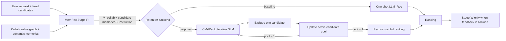

# CM-IRank — Full Research & Implementation Design

> **Working title:** Collaborative-Memory-Grounded Iterative Ranking for Full MemRec\
> **Short name:** **CM-IRank**\
> **Document role:** source-of-truth implementation/research specification for agents and human reviewers\
> **Status:** design v1.1 — user-approved model/snapshot amendment; method not yet validated\
> **Date:** 2026-09-30; execution ledger updated 2026-10-01\
> **Primary benchmark:** InstructRec Books unless the thesis scope is explicitly changed by the human researcher\
> **Primary metric:** NDCG@5\
> **Compute assumption:** self-hosted LLM/SLM and fine-tuning/RL are in scope. The existing internal GPU runbook allows **one H100 concurrently**; a two-H100 PPO run requires separate human approval and a runbook amendment. No GPU work is authorized by this design alone.

---

## 0. How this document must be used

This file is an **execution specification**, not a retrospective result report. An implementation agent should treat statements in this document in three categories:

1. **Locked project facts** — facts already established by project artifacts and the current benchmark documents. These must not be silently changed.
2. **Source-derived method facts** — descriptions of MemRec, R1-Ranker/IRanker, and nearby work. These are background constraints, not project results.
3. **Proposed design** — hypotheses and implementation decisions introduced by this project. These must be tested; they must never be written up as proven facts before the corresponding experiment passes.

### 0.1 Mandatory behavior for an implementation agent

The agent **MUST**:

- preserve the original InstructRec Books candidate-set task;
- keep the 5,377-user held-out outcomes sealed until the confirmation gate;
- never tune method choices, prompt wording, reward coefficients, model size, checkpoint, seed, candidate sampler, or stopping rule using the already-exposed 200 target labels;
- keep Stage-R/Stage-W changes separate from Stage-ReRank changes so attribution remains possible;
- record source commit, config, model revision, cohort hashes, prompt hash, candidate-manifest hash, checkpoint hash, prediction hash, and per-user failures for every promoted run;
- treat malformed rankings as failures in reported evaluation, not silently repair them into successes;
- run CPU/schema tests and a 20–30-example real-model smoke before every promoted GPU run;
- stop and report rather than improvising if a required source artifact, file, field, or provenance relationship is missing.

The agent **MUST NOT**:

- call a local-ranker-only experiment “full MemRec”;
- claim that Books supports strict global-time replay: `.inter` has only within-user order, not a cross-user global clock;
- use the test positive, its position, or any target-derived feature to construct Stage-R evidence at evaluation time;
- use the old random-negative/leaky benchmark as a valid comparison;
- choose the best training seed after looking at held-out target metrics;
- claim novelty for “RL for ranking” or “RL for adaptive memory retrieval” by themselves, because prior work already covers those ideas;
- silently fold a MemRec fidelity bug fix into the proposed method and then attribute its gain to CM-IRank.

### 0.2 Precedence when sources disagree

Use the following precedence:

1. immutable raw/current benchmark artifacts + hashes;
2. `BOOKS_BENCHMARK.md` for current Books protocol/results;
3. the thesis constraints in §0.3 and gates in this design;
4. `EXPLORATORY_HISTORY.md` for closed directions and negative results;
5. pinned project code/configs;
6. upstream paper descriptions;
7. this design, for yet-unimplemented components.

If an implementation detail in this design is incompatible with the actual repository/API, preserve the **scientific invariant** and adapt only the software interface. Record the deviation in a design-change log before running an experiment.

### 0.3 Thesis constraints inherited from the earlier roadmap

The method must have a falsifiable research question, a clear formulation, strong controls, ablations and failure analysis; code porting or fidelity repairs alone are not a thesis contribution. The solution must be general and robust: no Books-specific rule stack, manual prompt/weight/seed selection on exposed labels, negative-sampling shortcut, or hidden outcome leakage. A one-year master's thesis additionally needs reliable benchmark reconstruction, method/attribution analysis, robustness across cohorts or domains, cost–quality measurements, and sealed confirmation. A small positive delta on 200 development users is insufficient. If CM-IRank does not beat **full MemRec and SASRec** under matched protocol, report that honestly rather than rebranding local-ranker or efficiency-only gains as the original thesis goal.

### 0.4 G0 implementation ledger (updated 2026-10-01)

| Component | Status | Boundary |
|---|---|---|
| Repository and Books protocol inspection | Done | Existing 700/200 baseline and 5,377-user seal preserved; no new score |
| Opt-in `RankRequest` capture/replay | CPU implementation + synthetic parity tests done | Normal MemRec runs unchanged by default; real 30B request cache not yet generated |
| Opaque labels, strict action parser, N−1 environment | CPU implementation + synthetic tests done | No real SLM inference yet |
| MPSS, R1-binary and terminal-only reward functions | CPU implementation + rank-1…10 identity tests done | PPO reward-manager integration not yet done |
| Instruction provenance | Risk flagged, **not resolved** | `.instruction` is user-specific and may be target-conditioned; do not reuse for pseudo-target training without provenance evidence; neutral instruction is safe fallback |
| 1,500/300 policy split and last-train pseudo-target eligibility | **Approved/locked by researcher, 2026-09-30** | `configs/cmirank/policy_split_manifest.json` freezes source hash, seed, cohort/eligibility hashes, prefix ≥5 and novelty; 1,497/1,500 train and 300/300 validation users eligible; 3 short-history users excluded without replacement; final test targets not used |
| Static fidelity + 20-user fake-LLM trace | Done as G0 diagnostic, not performance | In the 20-user evaluation phase 318/318 selected neighbors were packed; all 214 selected item neighbors had placeholder overlap 0.5 and all 318 selected neighbors had zero memory similarity; Stage-W ran only in warm-up, no test-label write. Packer's early-break limitation was **not triggered in this sample**. |
| Primary memory provider signoff | **Approved by researcher, 2026-09-30** | `upstream_aligned` is primary; `feature_complete_fixed_rule` is a separately reported secondary control. No fidelity fix is attributed to CM-IRank. |
| Baseline-parity pseudo-graph snapshot | CPU graph audit done; **Stage-W memory not yet proven safe** | Approved roles `train[:-2]` / `train[-2]` / `train[-1]`; smoke 20 first, then all 1,797 eligible query users. Exactly 3,594 query edges removed; full graph hash `22c78a5b483e137f2b0cfff23c6027471c6c553f7313b4c1aa51ec67d9a37921`. No global clock or Stage-W memory state built yet |
| Pseudo-memory CPU wiring smoke | 20 users passed with fake LLM; **not quality/leakage proof for real LLM** | 20 warm-up Stage-W calls on `train[-2]`, 0 pseudo-target Stage-W writes, 20 target-blind RankRequests; 100 fake logical requests, 0 real requests; smoke-only uniform candidates, not the final sampler |
| Qwen3.5-4B model contract | Revision pinned; load/backward/one discarded AdamW update passed; **format smoke failed (4/20 valid)** | V2 fixed the logging bug. 16 outputs used bracketed rather than bare labels. Peak reserved 34.64 GiB for this short synthetic workload, GPU released; PPO runtime/memory and Books ranking quality remain untested. See §0.5 |
| Candidate audit and R1/VeRL smoke | Not done | G0 not passed; no training or held-out access |

**Pre-outcome researcher decisions, 2026-09-30:** The primary policy base is now **`Qwen/Qwen3.5-4B`**, replacing the proposed Qwen2.5-3B; the R1 binary-reward, terminal-only, direct/no-RL and MPSS arms must all use the same Qwen3.5-4B base for attribution. The official Hub revision `851bf6e806efd8d0a36b00ddf55e13ccb7b8cd0a` is pinned in `configs/cmirank/policy_model_v1.json`; at the time of this decision no weights had been downloaded or loaded. See §0.5 for the subsequent failed infrastructure smoke. Qwen2.5-3B remains a *fact about the R1-Ranker paper*, not this project's primary model. For each eligible policy user with `train=[..., warmup, target]`, the approved pseudo-episode roles are `graph=train[:-2]`, `Stage-W feedback=train[-2]`, and reward-only `pseudo-target=train[-1]`. This changes the earlier one-edge graph-only audit; the superseding audit is recorded below. Neither decision was based on CM-IRank ranking outcomes, which do not yet exist. PPO/backend compatibility remains to be verified before training.

Implementation paths added so far: `src/cmirank/`, opt-in capture in `src/models/memrec_agent.py`, replay in `src/models/reranker_llm.py`, and `tests/test_cmirank_g0.py`. The actual Stage-ReRank call receives facets, ordered candidate payloads/item memories, instruction and two prompt flags; it does **not** receive a separate personal-memory field. CM-IRank may not invent that field. For the full-MemRec prompt, candidate `tags` are present in Python payloads but not rendered by the existing LLM reranker; the CM-IRank serializer therefore only renders baseline-visible title and item memory. The instruction preview is not a provenance proof and does not open held-out labels.

Read-only split verification: `python scripts/cmirank/02_preview_policy_split.py --seed cmirank-books-v1-draft-20260930 --min-prefix-length 5 --verify-locked configs/cmirank/policy_split_manifest.json`. Policy-train/validation sorted-ID SHA-256 are `fd3d1573d7be98e9fbee236c9d317506da509aa40e947ce409448d7680b240d7` and `7817f0d6b2de27f84efac0eea91b70560b90c6ccaa1a4de4b3de6123eb18c83d`; exposed-200 hash remains `5395ee7775d9e5d0add11ed386715c34a002138c282f4f910f775ea90871a837`. Three ineligible policy-train users (4704, 4907, 7279) fail only the locked prefix-length criterion; there is no replacement or result-based filtering. This reveals only dev user IDs and `train_data` eligibility, not final test targets. Superseding snapshot audit: `python scripts/cmirank/03_audit_prefix_snapshot.py --query-users 20`, then `--query-users all`; the full run removed 3,594 query-user edges from 193,005 source edges, prepared 1,797 Stage-W feedback events without running them, and verified the target absent from its own graph. The earlier one-edge-only hash `4687c8...` is **obsolete** and must never key a promoted cache. This audit did **not** build or certify Stage-W memories. CPU wiring/fidelity command: `python scripts/smoke_full_memrec_cpu.py --users 20 --cmirank-fidelity-trace`; aggregate output is `results/full_memrec_cpu_smoke_20_eval-hnv/cmirank_fidelity_trace.json`. As of 2026-09-30 no real-model/GPU run had occurred; the subsequent infrastructure attempt is recorded in §0.5.

Local verification on 2026-10-01 after the v3 schema clarification: `python -m pytest -q` → **133 passed**; Python compilation, shell syntax checks and `git diff --check` passed. The five-document cap remains intact. These are software/data-integrity checks, **not** ranking results.

### 0.5 Qwen3.5 infrastructure smoke — 2026-10-01

**FAILED — logging bug before inference/backward:** `cmirank-qwen35-g0-smoke-v1-20261001-hnv`, locked in `configs/cmirank/qwen35_gpu_smoke.json`, launched from source commit `aa895a5813687d895b82ddbd8dcb41e8cba5a14e`. CPU preparation completed in an isolated Torch 2.8.0+cu128 / Transformers 5.13.0 environment, and the pinned official checkpoint (two weight shards) downloaded successfully. The launcher selected one empty H100; weight loading reached completion, but `save_json(..., loading)` failed with `TypeError: Object of type set is not JSON serializable`. This happened before checking loading-key diagnostics, generating the first output or calling backward. **No 20-example format result, gradient/optimizer result, peak-training-VRAM result or model-quality conclusion exists.** This is an infrastructure failure, not evidence against Qwen3.5-4B.

Cleanup recorded exit code 1, `gpu_released=true` and 1 MiB VRAM after exit; the subsequent one-time resource check also found that card empty with no compute process. The shared allocation remained RUNNING. All 13 run artifacts were copied to `results/cmirank-qwen35-g0-smoke-v1-20261001-hnv/` and their SHA-256 hashes matched the remote copies. The preparation log is also retained locally. Preserve the original manifest's stale `status=running` as raw evidence; `failure.json` and `cleanup.json` establish the terminal outcome. No remote output/model/cache was deleted.

The smoke uses 20 deterministic synthetic, target-free ranking requests: one elimination action each, greedy decoding, thinking disabled, BF16, SDPA, batch 1, input cap 2,048, output cap 128 and CUDA memory fraction 0.90. It then tests full text-backbone backward and one AdamW update with frozen vision parameters. This arbitrary format-only update is discarded; **no policy checkpoint, Books ranking score, PPO training or held-out access** is produced. A full N−1 real-Books smoke and rollout/trainer log-probability parity remain separate gates; this test cannot promote a research full run.

Implementation: `src/cmirank/gpu_resources.py`, `smoke_fixtures.py`, `provenance.py`; scripts `05_download_qwen35.py`, `06_smoke_qwen35_gpu.py`, `prepare_qwen35_smoke.sh`, `run_qwen35_gpu_smoke.sh`; resource/fixture tests in `tests/test_cmirank_gpu_safety.py`. Streaming SHA-256 replaces Python-3.11-only hashing so CPU audit scripts support the cluster's Python 3.10.

GPU process lifetime is bounded to 45 minutes. The launcher owns only its child PID, unloads/exits at task completion, saves before/after GPU/process snapshots and `cleanup.json`, and does not cancel the shared allocation. If format fails, the run is not promoted; any changed contract gets a new run ID. Full PPO peak memory is still unknown: the one-step AdamW smoke does not include a reference policy, critic, rollout backend or PPO activation footprint.

Preparation has its own 40-minute timeout and holds no GPU. The earlier provisional wall-clock ETA was 20–45 minutes including setup/download, not a measured throughput estimate. Status is checked once rather than continuously polled. This failed run cannot promote any full research run.

**Next, in order:** (1) fix only loading-diagnostic JSON serialization, add a CPU regression test for set-valued loading information, and create a v2 smoke run ID without changing the ranking prompt or decoding; (2) preflight again and rerun the same 20 synthetic actions plus backward/optimizer check, reusing the existing checkpoint; (3) after a pass, resolve the T0 PPO runtime, rollout/trainer log-probability parity and thinking contract before outcomes; (4) build/audit clean real Stage-W/Stage-R pseudo-request caches and mixed-hardness candidates, with a real 20-user N−1 smoke; (5) run matched direct/iterative controls and tiny PPO before any full training. The status request did not trigger a new GPU run. G0 remains incomplete.

**V2 follow-up, authorized by the subsequent “làm tiếp đi” request:** the diagnostic serializer now converts only `set`/`frozenset` to sorted JSON arrays; unknown objects and nonfinite numbers still fail rather than being silently stringified. Three CPU regression tests cover deterministic/nested collections, non-mutation and fail-closed behavior. The new run ID is `cmirank-qwen35-g0-smoke-v2-20261001-hnv`; model revision, fixtures, prompt, decoding, context/output caps, optimizer, dtype and memory cap are unchanged. The existing prepared environment and checkpoint will be reused. Preflight found one empty H100 (1 MiB, 0% utilization, no compute process), but the launcher must check again immediately before model load. V2 has not yet reported an outcome; G0 is not promoted.

**V2 launched:** source commit `55f53e8b2e0b9c8d4eb2a4b54843e9216856ca05`. The one status check found `manifest.json` recording RUNNING on the selected single H100, with no summary/failure yet. The original checkpoint hashes and environment versions were preserved. Provisional ETA is 5–15 minutes (no setup/download required), with the unchanged 45-minute timeout and automatic release. The next continuation must inspect the terminal artifacts and verify cleanup before proceeding to any new GPU task; this launch is not a PPO or Books performance result.

**V2 terminal result — FORMAT_SMOKE_FAILED (exit 3):** inspected on the next status request. Checkpoint loading had zero missing/unexpected/mismatched keys and no loading errors. All 20 synthetic actions completed, but only **4/20 (20%) met the locked schema**. Every invalid output had the same issue: `<answer>[Cxx]</answer>` instead of a bare label `<answer>Cxx</answer>`. All outputs were 11–12 tokens, so truncation did not cause this failure. The prompt displays candidates as `[Cxx]` and does not explicitly disallow copying those brackets into the answer; this is a plausible format-ambiguity explanation, not a ranking-quality diagnosis. Preserve all 16 failures under the original parser; do not retrospectively count them as successes.

Full text-backbone backward and one discarded AdamW update completed with finite loss **0.3509436**, nonzero gradients in 426 tensors, and 4,205,751,296 trainable text parameters; 333,514,240 vision parameters were frozen. Peak allocated/reserved VRAM was **35,412.33 / 35,474 MiB** (reserved **34.64 GiB**). Total process time was **55.35 s**, including **8.13 s** for 20 actions and **1.40 s** for backward/optimizer. These timings concern 355–356-token synthetic prompts and one short update, not full-length Books trajectories or PPO. The update was discarded; no trained policy checkpoint exists.

Cleanup reported `gpu_released=true`, 1 MiB VRAM and no compute process on the selected card; the shared allocation stayed RUNNING. All **15** remote run artifacts were copied locally and SHA-256 verified, including 20 distinct request hashes in `responses.jsonl`. No new GPU task was started during this status check. The raw manifest remains unchanged; `summary.json` and `cleanup.json` establish the terminal result.

**Revised immediate next step:** make the bare-label output contract unambiguous as a general schema clarification, with target-blind regression checks and a new v3 run ID; then repeat the 20-example smoke without relaxing the parser or changing ranking evidence. This is not prompt tuning on target ranking scores: no Books outcome has been read in these infrastructure runs. After a format pass, complete PPO/runtime parity and real-memory/candidate audits before training. G0 remains incomplete; neither this format failure nor the hardware smoke measures the method's recommendation quality.

**V3 prepared after researcher continuation:** `cmirank-qwen35-g0-smoke-v3-20261001-hnv` adds only a context-independent explanation that candidate-list brackets are display delimiters and that the answer must contain the bare `C` + two-digit label. No concrete label is used as a demonstration, avoiding an example-position cue. Parser, evidence, fixtures, model, decoding and optimizer settings are unchanged. Four CPU checks in `tests/test_cmirank_prompt_schema.py` verify active-label rendering, request non-mutation, context-independent instructions and continued rejection of bracketed answers. Preflight found one empty H100; selection must be repeated immediately before load. V3 is a new run, not a reinterpretation or repair of v2 outputs.

---

# 1. Executive decision

The project should pivot from graph-transition evidence as the main contribution to a learned ranking policy that consumes MemRec's collaborative semantic memory.

The central thesis hypothesis becomes:

> **A small ranking-optimized iterative policy can convert an already-synthesized collaborative memory into better candidate-ranking decisions than a one-shot general-purpose LLM under the same candidate task, while providing a measurable quality–cost trade-off and robustness to imperfect memory.**

The proposed system is **not** “replace MemRec with R1-Ranker.” It preserves the MemRec memory system and replaces only the final reasoning/ranking policy in a controlled way:

```text
MemRec Stage-R                 CM-IRank Stage-ReRank              MemRec Stage-W
--------------------------     --------------------------------   -------------------------
curate graph neighbors   ->    iterative SLM policy         ->    unchanged propagation
synthesize M_collab            consumes same M_collab
                               removes least-relevant item
                               step by step
```

The working method name is **CM-IRank**.

The proposed primary methodological additions over a literal IRanker transfer are:

1. **Collaborative-memory-grounded iterative ranking:** reformulate MemRec Stage-ReRank as a sequential elimination policy over the exact semantic context produced by MemRec, instead of using only user history and item text.
2. **Metric-Preserving Survival Shaping (MPSS):** a reward decomposition that gives step-level credit during elimination while preserving the exact episode-level NDCG@5 objective for the one-positive Books candidate task.
3. **Leakage-controlled memory-grounded RL episodes:** generate training episodes from pre-test interaction prefixes and frozen MemRec memory snapshots without using test outcomes, while explicitly acknowledging that Books lacks a global cross-user clock.
4. **Full-agent attribution and robustness analysis:** distinguish gains from iterative decomposition, RL, reward design, collaborative memory, and memory quality; report cost and failure rate alongside ranking quality.

The **primary claim is conditional on evidence**. If the full-agent confirmation gate fails, the thesis must report the failure honestly and may frame the work as a systematic study of when iterative ranking does or does not exploit collaborative semantic memory.

---

# 2. Locked project state at the start of this pivot

This section captures the current project state that all agents must respect.

## 2.1 Task contract

InstructRec Books is a **candidate ranking** benchmark, not full-catalog retrieval.

- 7,377 users.
- Exactly 10 distinct candidates per user.
- Exactly one positive target per candidate list.
- The target position is approximately balanced across the 10 positions; there is no known positional shortcut.
- Primary metric: **NDCG@5**.
- Secondary metrics: Hit@1, Hit@5, NDCG@3; Hit@10 is effectively uninformative for valid 10-item rankings and falls below 1 only when malformed/failure cases are counted as misses.
- Candidate/target ordered manifest is already audited and hash-locked in the benchmark document.

## 2.2 Split contract

The current split is:

- **Development:** 2,000 users.
- **Held-out confirmation:** 5,377 users.
- The 1,085 users whose outcomes were exposed in earlier work are contained in development.
- Held-out outcome overlap with exposed users is zero.
- The 5,377 held-out targets must remain sealed until the confirmation gate.

## 2.3 Current full-MemRec development baseline

The current reduced-cost full-agent experiment uses:

- 700 warm-up users;
- 200 scored development users;
- fixed original 10-candidate lists;
- `k=16`, token budget `τ=1800`;
- Stage-R, Stage-ReRank and warm-up Stage-W;
- no evaluation-label Stage-W;
- self-hosted `Qwen/Qwen3-30B-A3B-Instruct-2507-FP8`, pinned revision recorded in `BOOKS_BENCHMARK.md`;
- temperature 0.

Current 200-user results:

| Arm | NDCG@5 | Hit@1 | Hit@5 | Notes |
|---|---:|---:|---:|---|
| SASRec | 0.343320 | — | — | same scored users/candidates; different training budget |
| Full MemRec baseline | 0.7479179811 | 0.595 | 0.890 | 2 malformed / 200 |
| Full MemRec + directed one-step evidence in Stage-R | 0.7429683083 | 0.575 | 0.900 | did not pass improvement gate |

The paired difference for the Stage-R transition method is approximately `-0.00495`, with a 95% paired bootstrap interval crossing zero. That direction is considered **closed as the main thesis method** unless new independent evidence justifies revisiting it.

## 2.4 Fidelity caveat that must remain separate from CM-IRank

A code audit found that the current upstream/fork path contains placeholder or questionable curation features, including fixed item `metadata_overlap`, zero `memory_sim`, a recency transformation that is not literal days, and a greedy packer behavior that can stop at the first non-fitting snippet.

Therefore final thesis experiments must distinguish:

- **U — upstream-aligned baseline:** current implementation lineage, preserved for continuity;
- **F — feature-complete fixed-rule reference:** a separately frozen implementation in which curation features are explicitly computed and documented;
- **M — proposed CM-IRank method:** ranking-policy contribution layered on a frozen memory provider.

A fidelity fix is **not** part of the proposed method and must not be counted as method novelty.

## 2.5 Closed directions that must not be silently reintroduced

The project has already investigated and closed, for now:

- synthesis-only SFT/GRPO for `LM_Mem` as the main contribution;
- naive 2-hop/multihop expansion;
- candidate-conditioned evidence reranking;
- buffered propagation without valid global time;
- temporal transition/PPR as a full-MemRec improvement;
- zero-shot Laya as a replacement for Stage-ReRank.

CM-IRank is intentionally a different hypothesis: improve **decision policy over existing memory**, not add more graph evidence.

---

# 3. Source-derived background and novelty boundary

## 3.1 MemRec facts relevant to this design

MemRec architecturally separates memory management and recommendation reasoning. A memory model (`LM_Mem`) manages/synthesizes a collaborative memory graph; a reasoning model (`LLM_Rec`) consumes the synthesized collaborative memory for final ranking. The paper describes three conceptual stages:

1. collaborative memory retrieval / synthesis;
2. grounded reasoning / ranking;
3. asynchronous collaborative propagation.

The paper's main configuration uses values including `k=16`, `N_f=7`, context budget `τ=1800`, and temperature 0. Its Stage-ReRank prompt consumes the user request, collaborative preference facets, and candidate item memories and produces per-candidate relevance scores/rationales.

**Consequence for this project:** Stage-ReRank is a clean intervention point. A new ranking policy can consume the same structured inputs while Stage-R and Stage-W remain unchanged.

Source: [MemRec, arXiv:2601.08816](https://arxiv.org/abs/2601.08816), ACL 2026 version at [ACL Anthology](https://aclanthology.org/2026.acl-long.2061/).

## 3.2 R1-Ranker / IRanker facts relevant to this design

R1-Ranker proposes two RL-enhanced ranking designs:

- **DRanker:** generate a complete ranking in one pass;
- **IRanker:** repeatedly select the least suitable candidate, remove it, and reconstruct the final ranking by reversing the exclusion order.

IRanker uses step-level exclusion rewards and PPO. The paper evaluates a unified Qwen2.5-3B-Instruct policy across recommendation, routing, and passage-ranking tasks. In its recommendation setup, each example contains one positive and 19 random negatives; the user history contains 20 interactions and the 21st is the target.

Published training details include PPO via VeRL, Qwen2.5-3B-Instruct initialization, KL regularization, rollout temperature 0.9, maximum response length 1024, five epochs, actor LR `1e-6`, critic LR `2e-6`, global minibatch 36, microbatch 8, gradient checkpointing, and FSDP/offloading.

**Consequence for this project:** iterative elimination and PPO are prior art. The project must not claim them alone as novel. The thesis contribution must come from the collaborative-memory formulation, ranking-metric credit assignment, full-MemRec integration/attribution, and the associated empirical analysis.

Sources: [R1-Ranker, arXiv:2506.21638](https://arxiv.org/abs/2506.21638), [official repository](https://github.com/ulab-uiuc/R1-Ranker).

## 3.3 Nearby work that constrains the novelty claim: RRCM

RRCM learns an RL policy that decides whether/when to retrieve collaborative or metadata memories before producing a recommendation. It uses ranking-driven outcome rewards and GRPO.

**Consequence for this project:** do **not** frame CM-IRank as “RL learns which memory to retrieve.” In the primary method, memory acquisition is frozen. CM-IRank learns **how to rank given MemRec's synthesized memory**.

Source: [RRCM, arXiv:2605.07129](https://arxiv.org/abs/2605.07129).

## 3.4 Allowed novelty statement

A defensible novelty statement, if supported by experiments, is:

> We formulate MemRec's collaborative-memory-grounded ranking stage as a sequential elimination policy and introduce a top-k metric-preserving credit assignment for RL training, enabling a small specialized ranker to reason iteratively over fixed synthesized collaborative memory. We evaluate the method inside the full MemRec agent under matched memory, candidate, failure, and compute accounting, and analyze when collaborative memory helps or harms the learned ranking policy.

Do **not** write “first RL recommender,” “first iterative ranker,” or “first RL memory recommender.”

---

# 4. Research questions and falsifiable hypotheses

## 4.1 Main research question

**RQ1.** Given the same candidate set and the same MemRec collaborative-memory state, can a small ranking-optimized iterative policy improve NDCG@5 over MemRec's one-shot general-purpose `LLM_Rec`?

## 4.2 Mechanism questions

**RQ2.** How much of any gain comes from iterative decomposition alone versus RL post-training?

**RQ3.** Does a reward aligned with the final top-k metric produce better and more stable policies than the original binary exclusion reward when the task has one positive among ten candidates?

**RQ4.** Does the policy actually exploit collaborative memory, or would the same policy achieve comparable quality using only the user request/personal context and candidate metadata?

**RQ5.** How sensitive is the learned policy to noisy, missing, reordered, or low-quality collaborative facets?

**RQ6.** What is the quality–latency–token trade-off of a 4B iterative policy relative to a 30B-class one-shot ranker?

## 4.3 Primary hypothesis

`H1`: Under a frozen memory provider and identical candidate lists, CM-IRank improves paired NDCG@5 over the corresponding full-MemRec one-shot Stage-ReRank baseline on a sealed confirmation cohort.

A thesis claim requires both:

- 95% paired CI lower bound above 0 for the primary comparison; and
- point estimate at or above a practical effect threshold fixed **before** opening held-out outcomes.

The practical effect threshold is not hard-coded here. It must be set in the preregistration artifact using development variance and cost/power analysis, before G3.

## 4.4 Secondary hypotheses

- `H2`: iterative no-RL > direct no-RL under the same SLM and context;
- `H3`: CM-IRank RL > iterative no-RL;
- `H4`: MPSS > original R1 binary exclusion reward on fresh development pseudo-targets;
- `H5`: full collaborative memory > no-collaborative-memory for the trained policy, at least in sparse/tail slices where collaboration should plausibly matter;
- `H6`: the 4B policy offers a better quality-per-online-token or quality-per-latency point than the 30B one-shot reranker, even if total step count is larger.

Secondary failures do not automatically invalidate H1, but they constrain the mechanism claim.

---

# 5. Proposed system at a glance



### 5.1 Scientific invariant

For an attribution run comparing baseline versus CM-IRank:

```text
same user
same instruction
same ordered original candidate IDs
same Stage-R memory snapshot
same M_collab
same candidate item memories
same Stage-W state before scoring
only Stage-ReRank policy differs
```

This invariant should be enforced programmatically by hashes, not by assumption.

---

# 6. Formal problem formulation

## 6.1 Base candidate-ranking problem

For user `u`, let:

- `I_u` be the user request/instruction;
- `H_u` be allowed interaction history;
- `C_u = {c_1, ..., c_N}` be the fixed candidate set, with `N=10` for Books;
- `y_u ∈ C_u` be the one positive target used only by the evaluator/reward during training or scoring;
- `M_u` denote the target user's semantic memory when explicitly available;
- `M_collab(u, C_u)` denote collaborative facets synthesized by Stage-R;
- `M_i` denote candidate item memory/metadata for item `i`.

Define the frozen MemRec ranking context:

\[
X_u = \left(I_u, M_u, M_{collab}(u,C_u), \{M_i\}_{i\in C_u}\right).
\]

The ranker must output a permutation:

\[
\pi_u = [c^{(1)}, ..., c^{(N)}].
\]

For one relevant item, NDCG@5 reduces to:

\[
\mathrm{NDCG@5}(\pi_u,y_u)=
\begin{cases}
\frac{1}{\log_2(r_u+1)} & r_u\le5,\\
0 & r_u>5,
\end{cases}
\]

where `r_u` is the rank of `y_u` and ideal DCG is 1.

## 6.2 CM-IRank as a sequential decision process

CM-IRank converts the one-shot ranking into iterative elimination.

At step `t`, let:

- `C_t` be the active candidates;
- `m_t = |C_t|`;
- `E_t` be the ordered exclusion trace so far;
- `X_static` be the immutable prefix containing instruction and frozen memory context.

The state is:

\[
s_t = (X_{static}, C_t, E_t).
\]

The action is one active candidate label:

\[
a_t \in C_t,
\]

interpreted as **the least suitable remaining candidate**.

Transition:

\[
C_{t+1} = C_t \setminus \{a_t\},\qquad
E_{t+1}=E_t\Vert a_t.
\]

The policy is:

\[
a_t \sim \pi_\theta(a\mid s_t).
\]

Only `N-1` model actions are required; the final survivor is automatically assigned rank 1.

## 6.3 Ranking reconstruction

If the exclusion order is:

```text
E = [e_10, e_9, ..., e_2]
```

where the subscript denotes the rank assigned when excluded, and final survivor is `e_1`, then:

```text
final ranking = [e_1, e_2, ..., e_10]
```

Implementation invariant:

- no duplicate labels;
- every original candidate appears exactly once;
- an action must be in the current active set;
- no new item may be introduced.

## 6.4 Why the original R1 exclusion reward is insufficient as the only primary objective here

R1's immediate exclusion reward is conceptually:

\[
r_t^{R1}=\mathbb{1}[a_t\text{ is a negative candidate}].
\]

It is an important baseline. However, Books has exactly one positive among ten candidates and evaluates top-k rank. A reward that only says “negative excluded / positive excluded” does not directly encode the nonlinear NDCG@5 value of **when** the positive is eliminated.

The project therefore treats the R1 reward as an ablation, not the final proposed reward.

---

# 7. Proposed reward: Metric-Preserving Survival Shaping (MPSS)

## 7.1 Goal

We want both:

1. dense step-level learning signal for the iterative process; and
2. the exact episode return to equal the evaluation objective NDCG@5, apart from explicit format penalties.

This prevents the project from claiming “metric alignment” while actually optimizing a different uncontrolled proxy.

## 7.2 Rank-survival potential

Let:

\[
g(r)=\frac{1}{\log_2(r+1)}.
\]

For training only, the target `y` is known to the reward function.

Define a potential `Φ_t`:

- if `y` is still active when the pool size is `m_t`, set `Φ_t = g(m_t)`;
- if `y` has already been eliminated at final rank `r_y`, freeze `Φ_t = g(r_y)` for all subsequent steps.

Then define dense shaping reward:

\[
f_t = \Phi_{t+1}-\Phi_t.
\]

Interpretation:

- eliminating a negative while the target survives increases potential and gives positive credit;
- eliminating the target gives no survival improvement at that step;
- once the target is eliminated, later ordering among negatives gives no target-ranking credit.

The shaping sum telescopes:

\[
\sum_t f_t = g(r_y)-g(N).
\]

## 7.3 Terminal metric correction

Let:

\[
R_{metric}=\mathrm{NDCG@5}(r_y).
\]

At the final transition, add:

\[
R_{corr}=R_{metric}-\sum_t f_t.
\]

Thus, for every valid trajectory:

\[
\sum_t f_t + R_{corr}=R_{metric}.
\]

This is the core property of MPSS: **stepwise credit, exact final metric return**.

**G0 mathematical qualification:** the identity is for the *undiscounted sum* of valid step rewards. If the PPO/VeRL reward manager uses `γ<1`, delayed token placement, or truncation, its discounted objective need not equal NDCG@5; those semantics must be audited and fixed before calling the training objective metric-preserving. Because the final correction makes the full return identical to terminal NDCG@5, MPSS does not change the ideal undiscounted expected-return objective by itself. Its proposed benefit is optimization/credit-assignment behavior, which is **hypothesis**, not a theorem or observed gain. Compare with the terminal-only arm under the same PPO setup and report if there is no advantage.

## 7.4 Invalid-action penalty

The metric-preserving identity applies to valid trajectories. Invalid output is handled separately:

- invalid label, duplicate/removed label, missing answer, multiple labels, or out-of-set item => trajectory malformed;
- training: add `R_format = -1.0` and terminate the rollout;
- primary evaluation: count the user as a miss for ranking metrics; do not silently repair;
- log the raw model output and parser reason.

Do not tune the `-1.0` penalty against target metrics. It is chosen because NDCG@5 lies in `[0,1]` and invalid structure should be strictly dominated by any valid high-quality behavior.

## 7.5 No cost penalty in the primary quality model

The primary CM-IRank checkpoint should optimize ranking quality + validity, not an arbitrarily weighted token penalty. Cost is measured separately.

A cost-regularized policy may be explored **after** the quality gate using a separately preregistered objective, e.g.:

\[
R'=R_{metric}-\lambda_{tok}\cdot\text{normalized generated tokens}.
\]

It must not replace the primary method post hoc merely because it has a more attractive latency point.

## 7.6 Required reward ablations

At minimum:

- **A0:** iterative SLM, no RL;
- **A1:** PPO + original R1 binary exclusion reward;
- **A2:** PPO + terminal NDCG@5 only;
- **A3:** PPO + MPSS — proposed.

All four must use the same policy backbone, prompt family, candidate data, and checkpoint-selection protocol.

---

# 8. PPO objective and training policy

The primary optimizer should remain PPO initially to minimize departure from R1-Ranker.

Conceptually:

\[
J(\theta)=\mathbb{E}_{\tau\sim\pi_\theta}
\left[\sum_t \mathcal{L}_{PPO,t}(A_t) - \beta_{KL}\,D_{KL}(\pi_\theta\Vert\pi_{ref})\right].
\]

### 8.1 Initial hyperparameters

Use R1-Ranker's published settings as the starting reference, not as sacred optimal values:

```yaml
algorithm: ppo
base_model: Qwen/Qwen3.5-4B             # researcher-approved primary
base_model_revision: 851bf6e806efd8d0a36b00ddf55e13ccb7b8cd0a
full_parameter_training: true
epochs: 5
actor_lr: 1.0e-6
critic_lr: 2.0e-6
kl_coef: 1.0e-4
rollout_temperature: 0.9
max_response_tokens_r1_reproduction: 1024
global_minibatch: 36
microbatch_target: 8
gradient_checkpointing: true
fsdp: true
parameter_offload: true   # one-H100 feasibility must be measured, not assumed
gradient_offload: true    # same rule
```

For CM-IRank, the response limit may be reduced **once**, based on a token-length audit performed before looking at ranking outcomes. The chosen value must then be frozen in the G1 config. A reasonable starting candidate is 512 tokens/turn, but the agent must produce a length histogram before locking it. **These R1 settings are an initial research reference, not verified Qwen3.5-4B hyperparameters.** Qwen3.5's default thinking output and hybrid text/vision architecture require a separate tokenizer/chat-template, parser, text-only actor/reference/critic, reward-placement, and checkpoint round-trip audit before PPO. The model revision is pinned separately; the PPO/rollout backend is not yet validated or frozen. [Official Qwen3.5-4B model card](https://huggingface.co/Qwen/Qwen3.5-4B).

### 8.2 Evaluation decoding

Primary evaluation:

```yaml
temperature: 0.0
do_sample: false
num_return_sequences: 1
repair_attempts: 0
```

Training rollout sampling remains stochastic as required by PPO.

### 8.3 Optional GRPO

GRPO is not the primary optimizer because introducing it simultaneously with the new ranking formulation would make attribution harder and would overlap conceptually with RRCM. It may be studied only as an optimizer ablation after PPO works.

---

# 9. Integration architecture inside MemRec

## 9.1 Required abstraction

Introduce a reranker interface so both current `LLM_Rec` and CM-IRank consume one structured request.

Suggested conceptual interface:

```python
class RankRequest(TypedDict):
    user_id: str
    instruction: str
    candidate_ids: list[str]           # ordered external IDs
    candidate_payloads: list[dict]      # exact same information available to baseline
    collaborative_facets: list[dict]
    personal_memory: str | None
    stage_r_snapshot_id: str
    provenance: dict

class RankResult(TypedDict):
    ranked_candidate_ids: list[str]
    valid: bool
    failure_reason: str | None
    trace: list[dict]
    usage: dict
```

Backends:

```text
memrec_llm            -> current one-shot Stage-ReRank
cmirank_direct_slm    -> same SLM, one-shot ranking control
cmirank_iter_base     -> iterative base SLM, no RL
cmirank_iter_rl       -> proposed trained policy
```

## 9.2 Integration point

The agent should first locate the actual call boundary in the pinned fork, expected near:

- `src/models/memrec_agent.py`
- `src/models/reranker_llm.py`
- `src/train/trainer_memrec.py`

Do not rewrite Stage-R to accommodate CM-IRank. Add an adapter at the existing Stage-ReRank boundary.

## 9.3 Stage-R artifact capture

Before calling a reranker, serialize a canonical `RankRequest` and compute:

```text
rank_request_sha256 = SHA256(canonical_json(rank_request_without_runtime_fields))
```

The baseline and CM-IRank runs are considered matched only if this hash is identical for the same user.

This artifact enables cheap reranker replay without rerunning the 30B memory model.

## 9.4 Stage-W behavior

For evaluation:

- no test-label Stage-W;
- the reranker output itself must not mutate shared memory;
- if Stage-W exists after actual feedback in other modes, it is outside the CM-IRank comparison unless explicitly studied.

The baseline and CM-IRank must start from the same memory state.

---

# 10. Candidate representation and output contract

## 10.1 Use opaque candidate labels

Never require the SLM to reproduce long item IDs or titles exactly.

Render current active items with temporary labels:

```text
C00, C01, ..., C09
```

Each label maps to exactly one external item ID for the episode.

Example rendering:

```text
[C03]
Title: ...
Metadata / item memory: ...
```

## 10.2 Label ordering

For evaluation, label assignment follows the original candidate order, so no candidate order is altered before scoring.

For pseudo-training episodes, candidate order is deterministically hash-shuffled from a frozen seed. The target's label position must be audited for near-uniformity.

## 10.3 Primary response format

Use a narrow machine contract. The model may reason before the answer, but only the final answer controls the environment.

Project-authored template:

```text
<reasoning>
Briefly compare the remaining candidates against the user's request and collaborative preference evidence.
</reasoning>
<answer>C07</answer>
```

Parser rules:

- exactly one `<answer>...</answer>` span;
- contents must normalize to exactly one active candidate label;
- no fuzzy title matching;
- no substring guess;
- no fallback to “first mentioned label.”

Reasoning text is optional for parsing and must not be used to infer an action if `<answer>` is invalid.

## 10.4 Invalid evaluation behavior

If any step is invalid:

- mark the entire user ranking malformed;
- emit a deterministic completion of the remaining list only for debugging/storage, never for metric rescue;
- count ranking metrics as miss according to the same failure-denominator philosophy used by the current benchmark.

---

# 11. CM-IRank prompt design

The prompt should be project-authored rather than copied verbatim from R1-Ranker.

## 11.1 Static prefix

Place immutable content first to maximize vLLM prefix-cache reuse:

```text
SYSTEM
You are a ranking policy for a recommender system.
At each turn, select exactly one remaining candidate that is LEAST likely to satisfy the user's request.
Use only the evidence provided. Do not invent candidates.

USER CONTEXT
User request:
{instruction}

Collaborative preference evidence:
{formatted_facets}

Optional personal memory/context:
{personal_memory_if_baseline_exposes_it}
```

## 11.2 Dynamic suffix

Append the active candidate block after the static prefix:

```text
REMAINING CANDIDATES ({m}):
[C00] ...
[C02] ...
...

Choose the single LEAST suitable remaining candidate.
Return the candidate label inside <answer>...</answer>.
```

## 11.3 Evidence parity

The CM-IRank prompt may reorganize the same structured data for its iterative task, but it may not add:

- target labels;
- target position;
- candidate popularity computed from future/evaluation interactions;
- graph scores unavailable to baseline;
- descriptions retrieved from the internet;
- additional hidden user history unavailable to the baseline Stage-ReRank.

If CM-IRank uses more information than the baseline, it becomes a different system and must be labeled accordingly.

---

# 12. Training episode construction on Books

This is one of the highest-risk parts of the project. The implementation must make target leakage structurally difficult.

## 12.1 Do not train on the sealed test target

The policy must not train on any of the 5,377 held-out test targets.

For development users, training should use **pseudo-target interactions from pre-test history**, not the already-exposed final test targets.

## 12.2 Development-user partition for policy training

Recommended initial partition:

- start with the existing 2,000 development users;
- reserve the already-scored 200-user cohort as an integration-development cohort and **exclude them from policy training/checkpoint selection**;
- remaining 1,800 users are partitioned deterministically by user-ID hash into:
  - ~1,500 policy-train users;
  - ~300 policy-validation users.

Exact counts and hash must be frozen in `policy_split_manifest.json` before any training run.

**Locked v1, approved 2026-09-30:** `configs/cmirank/policy_split_manifest.json` fixes seed `cmirank-books-v1-draft-20260930`, 1,500 policy-train and 300 policy-validation users, excludes the exposed 200, and excludes three short-history policy-train users from episodes without replacement. The effective episode counts are 1,497/300. The seed string retains “draft” only because the researcher approved that exact previously previewed value; it is now locked. No split selection used ranking outcomes.

This creates three distinct development roles:

```text
1,500 pseudo-train     -> optimize weights
  300 pseudo-val       -> checkpoint/model selection
  200 exposed test     -> one-time integration headroom check; no tuning afterward
5,377 held-out target  -> sealed confirmation
```

## 12.3 Pseudo-target selection v1

Primary v1 uses **one pseudo-target per user** to minimize memory-snapshot complexity.

For an eligible policy user with ordered pre-test train interactions:

```text
H_u = [i_1, ..., i_L]
```

select:

```text
pseudo_target = i_L
allowed_prefix = [i_1, ..., i_{L-1}]
```

Eligibility requirements must be set before generation, e.g. minimum prefix length sufficient for the MemRec user representation. Do not change the minimum after observing ranking scores.

The target user's pseudo-target and any later suffix must be absent from that user's memory/graph state for the episode.

## 12.4 Books does not support a true global past snapshot

There is no cross-user clock. Therefore the training state must be described as:

> **prefix-conditioned static community snapshot**

not “strict-past global replay.”

Other users' allowed training interactions may exist in the collaborative graph even if their relative real-world order versus the target user's pseudo-event is unknown. This limitation must be reported in the thesis.

## 12.5 Common training memory snapshot

For v1, build one reproducible snapshot:

- for each eligible policy-train/val user with ordered `train=[..., warmup, target]`, use `train[:-2]` for graph, `train[-2]` as the sole Stage-W warm-up feedback event, and `train[-1]` as the reward-only pseudo-target; do not put either event in that user's graph by position;
- exclude that user's future suffix if one exists by construction;
- build all semantic memories and graph edges from the allowed inputs;
- use deterministic user processing order, but do not interpret that order as time;
- retain non-query users according to the selected baseline protocol and document whether their full train histories are available.

The agent must write a provenance report that answers:

- Can the pseudo-target appear in the target user's personal memory? **Must be no.**
- Can the target user's edge to the pseudo-target exist? **Must be no.**
- Can the same item appear in other users' histories? **Yes; that is legitimate collaborative evidence.**
- Can target-user post-target interactions leak into user memory? **Must be no.**
- Can Stage-W propagation from the removed interaction survive from a previous snapshot/cache? **Must be no. Build from a clean state or invalidate all dependent cache keys.**

**Status, 2026-09-30:** `src/cmirank/snapshot.py` constructs an immutable graph input from `train_data` only and returns warm-up events and pseudo-targets separately. The approved 20-user smoke and 1,797-user audit in `scripts/cmirank/03_audit_prefix_snapshot.py` verified the exact `[:-2]/[-2]/[-1]` positions, removed 3,594 query edges, and produced full graph hash `22c78a5b483e137f2b0cfff23c6027471c6c553f7313b4c1aa51ec67d9a37921`. This is a **graph-only audit**, not a clean Stage-W memory cache or complete episode. A fresh Stage-W journal and memory provenance audit remain mandatory; neither old baseline memory nor target-derived `.instruction` may be reused. An item may still be observed in other users' histories, which is permitted collaborative evidence rather than that user's leaked interaction. Because the graph is built for all 1,797 policy users at once without a global clock, this remains a prefix-conditioned static community snapshot, not event-time replay.

The subsequent `python scripts/cmirank/04_smoke_pseudo_memory_cpu.py --users 20` exercised actual MemRec Stage-R/ReRank/Stage-W wiring against a **fake JSON client**: 20 pre-target warm-up writes, then 20 captured pseudo-rank requests and zero post-target writes. This establishes call ordering and serializer boundaries only. The fake model emits generic memories and no neighbor propagation, so it cannot certify semantic-memory leakage or real-model ranking quality. Its candidate lists are deliberately marked smoke-only; the frozen mixed-hardness sampler is still pending.

## 12.6 Optional data expansion

A second pseudo-target per user is allowed only if it is pre-approved **before** examining method performance and is implemented with a second clean snapshot corresponding to the earlier prefix.

Do not create multiple anchors from one leaked snapshot.

---

# 13. Pseudo-training candidate construction

Evaluation candidates remain the immutable original lists. Pseudo-target episodes require synthetic candidate sets.

## 13.1 Candidate count

Use the evaluation shape:

```text
1 positive + 9 negatives = 10 candidates
```

Do not train only on 20-candidate R1 format and then silently transfer; that may be used for R1 reproduction but not as the only Books training data.

## 13.2 Deterministic mixed-hardness sampler

Default v1 composition per episode:

- 3 uniform eligible negatives;
- 3 popularity-matched negatives;
- 3 text-semantic hard negatives.

Constraints for every negative:

- not equal to target;
- not in the target user's allowed prefix;
- stable item identity;
- metadata available at the allowed preprocessing stage;
- no use of evaluation outcome statistics.

### Uniform

Sample from the frozen eligible item pool using a hash-based seed.

### Popularity-matched

Use popularity computed only from the allowed training graph/snapshot. Match the target's log-popularity bucket or nearest available bucket.

### Semantic-hard

Use a **frozen** text encoder on item metadata and select high-similarity items to the target. The encoder and item-text template must be chosen before target ranking metrics are inspected. This is a training-only sampler; it does not inject similarity scores into the ranker input unless separately declared.

## 13.3 Candidate sampler ablations

Robustness should later evaluate at least:

- uniform-only;
- popularity-matched-only;
- semantic-hard-heavy;
- original InstructRec candidate lists on the exposed/held-out test rows.

The primary model should not be chosen by whichever sampler makes it look best.

---

# 14. Instruction provenance audit

The `.instruction` content must be audited before use in pseudo-training.

Classify the instruction source into one of:

1. **generic/static task instruction** — safe to reuse;
2. **user-specific but derived only from allowed prefix** — safe if provenance is verified;
3. **constructed with knowledge of the target/test row** — unsafe for pseudo-training;
4. **unknown provenance** — treat as unsafe until proven otherwise.

If unsafe/unknown, pseudo-training uses a canonical neutral instruction template such as “Rank the candidate books by how likely they are to match the user's current preferences.”

Evaluation continues to use the benchmark's original instruction exactly as required by the baseline.

The agent must not infer that an instruction is safe merely because it does not literally contain the target title.

---

# 15. Stage-R cache generation

## 15.1 Why cache Stage-R

PPO requires many policy rollouts. It is neither necessary nor scientifically desirable to rerun `LM_Mem` during every rollout.

Therefore:

- construct memory context once under a frozen snapshot;
- serialize exact Stage-ReRank requests;
- train CM-IRank purely against cached structured contexts.

This isolates the ranking policy and makes reward training affordable.

## 15.2 Cache key

Every Stage-R cache entry must include a key over at least:

```text
memrec_source_commit
memory_provider_mode  # upstream / feature-complete
LM_Mem model + revision
Stage-R config hash
Stage-W/warm-up config hash
snapshot manifest hash
user_id
instruction hash
ordered candidate IDs hash
candidate metadata hash
personal-memory hash if present
```

Any change invalidates the cache.

## 15.3 Cache schema

Suggested JSONL entry:

```json
{
  "episode_id": "...",
  "user_id": "...",
  "snapshot_id": "...",
  "instruction": "...",
  "candidate_ids": ["..."],
  "candidate_payloads": [{"label":"C00","item_id":"...","text":"..."}],
  "collaborative_facets": [
    {
      "text": "...",
      "confidence": 0.0,
      "supporting_neighbors": ["..."]
    }
  ],
  "personal_memory": "...",
  "target_item_id": "TRAINING_ONLY_FIELD",
  "provenance": {
    "source_commit": "...",
    "config_sha256": "...",
    "snapshot_sha256": "...",
    "rank_request_sha256": "..."
  }
}
```

The `target_item_id` must never enter the prompt serializer.

## 15.4 Prompt-vs-reward separation test

Write a unit test that constructs two identical examples differing only in `target_item_id` and asserts:

```text
serialize_prompt(example_A) == serialize_prompt(example_B)
```

This is a mandatory leakage guard.

---

# 16. Training data format for VeRL/R1 infrastructure

Do not couple MemRec runtime dependencies directly into the PPO environment.

Use an intermediate dataset such as Parquet/Arrow with fields:

```text
episode_id
static_prompt_prefix
dynamic_candidate_records
candidate_labels
candidate_item_ids
target_label                 # reward manager only
initial_candidate_order
rank_request_sha256
snapshot_id
sampler_type/provenance
```

The policy environment should know target labels only in the reward manager, not in the model prompt.

Maintain a separate environment/container for:

- MemRec/vLLM 0.10.x baseline/cache generation;
- R1-Ranker/VeRL training stack pinned to a compatible PyTorch/vLLM/Ray version.

Do not upgrade the production MemRec environment just to satisfy an RL dependency.

---

# 17. Training program

## Phase T0 — R1 mechanism and Qwen3.5-4B infrastructure sanity

Purpose: verify the prior-art iterative mechanism and prove that the **approved Qwen3.5-4B** can actually participate in the chosen PPO stack before a CM-IRank training run. An R1 smoke on Qwen2.5 alone would not establish this compatibility.

Tasks:

1. Pin the R1-Ranker repository commit.
2. Create a separate environment.
3. Run its evaluation path on a small official recommendation subset or official checkpoint if available, without presenting this as a Qwen3.5 result.
4. Verify iterative removal, parser, ranking reconstruction, and reward logging on our adapter.
5. Verify the pinned official `Qwen/Qwen3.5-4B` commit and choose a compatible training/backend stack in an isolated environment. Test text-only loading from the official checkpoint, chat template and default thinking output, actor/reference/critic forward/backward, reward placement, checkpoint save/reload and 20–30-example inference before PPO.
6. Run a tiny Qwen3.5-4B PPO job (e.g. tens of batches) to confirm training and one-H100 peak VRAM; if it fails, diagnose infrastructure or ask before changing topology/training regime. Do not substitute a Qwen2.5 success for this gate.

Acceptance:

- no silent candidate duplication;
- reward agrees with an independent Python checker;
- checkpoint can be merged/reloaded;
- no OOM under the **approved** topology (one H100 by current runbook; two only after explicit authorization and updated runbook).

This is infrastructure validation, not a thesis result.

## Phase T1 — CM-IRank no-RL headroom

Use frozen Books Stage-ReRank request caches.

Compare the same base SLM:

- direct one-shot ranking;
- iterative exclusion without RL.

Do this first on policy-validation pseudo-targets and then, once frozen, on the exposed 200-user integration cohort.

Goal: determine whether decomposition alone is plausible.

Do not change prompts repeatedly against the 200 outcomes. Prompt syntax must be fixed using training/pseudo-val formatting checks first.

## Phase T2 — R1-style RL baseline

Train the same `Qwen/Qwen3.5-4B` base with original binary exclusion reward over the exact CM-IRank context.

This asks:

> Does R1-Ranker's training idea transfer when the input includes collaborative semantic memory?

This arm is necessary so a gain from MPSS is not confused with “any PPO works.”

## Phase T3 — Proposed CM-IRank MPSS

Train with MPSS under otherwise matched settings.

Use policy pseudo-validation for:

- checkpoint selection;
- early stopping if implemented;
- format-rate monitoring.

Do not use the exposed 200 target metrics for checkpoint selection.

## Phase T4 — Multi-seed confirmation on development

After architecture/reward/prompt are frozen, run at least 3 training seeds if compute permits.

Seed policy:

```text
seed list must be written before runs
no replacement of a “bad” seed
all seeds reported
```

Use the exposed 200 cohort once for the final development integration gate. If this gate fails, do not keep trying seeds/prompts against those 200 labels.

## Phase T5 — G2 robustness and full-agent controls

Only after the method shows a development signal, run the complete ablation/robustness matrix.

## Phase T6 — G3 sealed held-out confirmation

Freeze everything, write preregistration, then open/run the 5,377-user held-out evaluation.

---

# 18. Baselines and ablation matrix

The final thesis should contain enough controls to identify the source of a gain.

## 18.1 Required core arms

| ID | Memory provider | Ranker | Iterative? | RL? | Reward | Purpose |
|---|---|---|---:|---:|---|---|
| B0 | upstream/frozen | current 30B `LLM_Rec` | no | no | — | current full MemRec continuity |
| B1 | feature-complete/frozen | current 30B `LLM_Rec` | no | no | — | fair fixed-rule reference |
| B2 | same as primary | Qwen3.5-4B base direct | no | no | — | size/model control |
| B3 | same as primary | Qwen3.5-4B base iterative | yes | no | — | decomposition control |
| B4 | same as primary | Qwen3.5-4B DRanker-style PPO | no | yes | terminal metric | RL-without-iteration control |
| B5 | same as primary | Qwen3.5-4B IRanker-style PPO | yes | yes | R1 binary exclusion | reward-transfer baseline |
| M0 | same as primary | **CM-IRank** | yes | yes | **MPSS** | proposed method |
| A-noCollab | same ranker | no collaborative facets | yes | yes | MPSS | memory-value attribution |

If B4 is prohibitively expensive, it may move to secondary, but B2/B3/B5/M0/A-noCollab are strongly recommended.

## 18.2 Memory-provider cross-check

If the primary method is trained/evaluated on the feature-complete reference, also replay it on upstream-aligned Stage-R contexts when feasible. This tests whether CM-IRank depends on one particular memory-provider implementation.

Do not retrain a separate best model for each provider unless that is explicitly a transfer experiment.

---

# 19. Robustness program

## 19.1 Candidate order robustness

The Laya probe previously revealed strong order sensitivity, so CM-IRank must be audited.

On a preregistered development sample:

- create 5 deterministic permutations per candidate set;
- remap opaque labels accordingly;
- run the same frozen policy;
- measure target-rank variance, top-1 agreement, and NDCG variance.

Primary benchmark evaluation still uses the original candidate order.

## 19.2 Collaborative-memory removal

Remove `M_collab` while preserving candidate text/instruction. This measures whether the learned ranker really benefits from collaborative memory.

## 19.3 Facet dropout

For analysis, deterministically drop a fixed fraction of facets based on hash rather than model confidence.

Suggested perturbation levels to preregister:

```text
0%, 25%, 50%, 100%
```

Do not tune the policy on the test perturbations unless training robustness is a separately declared method variant.

## 19.4 Facet shuffle / wrong-user facets

Construct a corruption condition by replacing collaborative facets with facets from another user matched only by candidate-count/task format, not by target outcome.

Purpose: measure whether the policy blindly trusts plausible-looking memory.

## 19.5 Supporting-neighbor masking

If facets include supporting neighbor IDs, compare:

- full facet;
- text only;
- text + confidence but no neighbor IDs.

This is an interpretability/context-design ablation, not a new method.

## 19.6 Sparse/tail slices

Predefine slices from **training-side statistics only**, e.g.:

- user prefix length quantiles;
- target item popularity quantiles;
- neighbor count / usable facet count;
- memory confidence/length buckets if these are stable and not label-derived.

Report paired delta by slice with CIs. Do not define slices after observing where the method wins.

---

# 20. Optional robust-training extension

This is **not v1 primary**. Only implement after M0 has a clean positive signal.

A `CM-IRank-Robust` variant may add training-time memory dropout:

- clean context on most rollouts;
- deterministic facet dropout on a fixed fraction;
- optional full-collab removal on a small fraction.

The goal is graceful fallback when memory is missing, not adaptive retrieval.

Do not inject fabricated false facts into training until a safe corruption protocol is separately reviewed; such corruption can create hard-to-interpret behavior.

---

# 21. Efficiency design

Iterative inference has more calls than one-shot ranking. The implementation must take efficiency seriously.

## 21.1 Prefix caching

Static content should appear before dynamic candidates so vLLM can reuse KV cache:

```text
[system + instruction + M_collab + personal context]  # stable prefix
[current candidate block]                             # changing suffix
[action instruction]
```

Enable prefix caching where supported and record hit rate.

## 21.2 Step-synchronous batching

For offline evaluation:

1. batch all users at elimination step 1;
2. parse actions;
3. update candidate sets;
4. batch all valid users at step 2;
5. repeat.

This avoids one-user-at-a-time generation and gives predictable throughput.

## 21.3 Number of calls

Primary full iterative ranking requires at most 9 actions for 10 candidates.

Report:

- calls/user;
- generated tokens/user;
- input tokens/user, including cache accounting;
- wall-clock latency/user and throughput;
- peak VRAM;
- malformed step rate;
- total online Stage-ReRank compute.

## 21.4 Cost-optimized hybrid, secondary only

After quality is established, test:

- iteratively eliminate bottom 5;
- one-shot rank the 5 survivors.

This reduces steps but changes the policy/task. It is a secondary cost-quality variant, not a replacement for M0 chosen after seeing held-out results.

---

# 22. GPU and environment plan (one H100 authorized by current runbook)

## 22.1 Separate workloads

Do not co-host canonical MemRec Stage-R cache generation and PPO unless memory/throughput testing proves it safe.

Recommended phases:

### Memory-cache generation

- existing MemRec environment;
- 30B-A3B model as already validated;
- one H100 under the current runbook; do not parallelize state-mutating Stage-W warm-up;
- Stage-W/warm-up ordering must remain deterministic.

### Policy training

- dedicated R1/VeRL environment;
- one H100 initially; if a memory benchmark proves the pinned PPO stack cannot fit, pause for human approval before any two-H100 FSDP actor/critic/reference/rollout run;
- full-parameter **Qwen3.5-4B text policy** is the initial feasibility target, not a promise of fitting PPO on one H100; keep the unused vision branch frozen/excluded only if the pinned backend supports it correctly and report that training scope;
- keep Qwen3-30B unloaded during PPO.

## 22.2 Do not assume tensor/data parallelism is semantically free

Stage-W can mutate shared memory. Parallelizing warm-up users may change state semantics. Preserve the locked ordering unless the memory provider is proven order-independent.

Stage-ReRank replay over a frozen cache is semantically parallelizable, but **resource authorization is separate**: currently use one GPU at a time; two concurrent GPUs require an explicit project-specific runbook update.

## 22.3 Promotion ladder

Every GPU-heavy path must pass:

```text
unit tests
-> CPU fake-model integration test
-> 20-30 real examples
-> 100-200 dry-run / throughput audit
-> full promoted run
```

No direct jump to full 5,377-user evaluation.

---

# 23. Experiment gates

## G0 — fidelity, provenance, infrastructure

Must finish before method training.

Deliverables:

1. current Stage-R/Stage-W feature audit;
2. rank-request capture from current baseline;
3. instruction provenance audit;
4. pseudo-target snapshot audit;
5. R1/VeRL tiny reproduction;
6. deterministic candidate/reward/parser unit tests;
7. resource dry run.

**G0 pass condition:** the agent can produce a valid CM-IRank request and reward trajectory for known synthetic cases, with zero prompt leakage and reproducible hashes.

## G1 — decomposition and trainability

Run base Qwen3.5-4B direct vs iterative on pseudo-validation. Train one seed of R1-reward and MPSS.

**G1 is not “method won.”** It asks whether the environment trains, format rate is acceptable, and policy reward improves without collapse.

Stop/review if:

- >1% malformed on pseudo-validation after training;
- policy degenerates to positional exclusion;
- reward checker disagrees with logged return;
- target label can be recovered from prompt metadata;
- no useful learning signal appears even on pseudo-training validation.

## G2 — frozen development evidence

Freeze architecture, prompt, reward, checkpoint selection and seed list. Run required controls and the 200-user integration cohort.

The 200 labels are already exposed; use them only as a development integration check, not final evidence.

After this run:

- do not retune on these target metrics;
- any architecture change must be motivated independently and creates a new method version with a new preregistration.

## G3 — sealed confirmation

Before G3, write a preregistration artifact containing:

- source commits;
- memory provider;
- exact policy checkpoints/seeds;
- prompts;
- candidate protocol;
- metrics;
- practical delta threshold;
- bootstrap seed/count;
- handling of malformed outputs;
- cost metrics;
- planned slices and ablations.

Then run the sealed 5,377-user outcome evaluation.

No tuning afterward.

---

# 24. Full held-out evaluation protocol

## 24.1 Preferred canonical run

Target final protocol:

- full allowed pre-test graph/state for the original 7,377 users;
- deterministic warm-up protocol documented exactly;
- score all 5,377 held-out users on their original 10-candidate lists;
- no held-out target Stage-W;
- generate each user's Stage-R request once;
- feed the **same request** to baseline one-shot reranker and CM-IRank;
- count every malformed/failure in the denominator.

If full warm-up is computationally impossible, a reduced held-out cohort must be chosen **before** viewing outcomes using a hash-based sample and justified by power analysis. Do not choose users based on candidate properties correlated with outcome.

## 24.2 Baseline parity

For every held-out user:

```text
assert baseline.rank_request_sha256 == method.rank_request_sha256
```

If not, exclude neither result silently; mark the pair invalid and investigate. The final report must state how many pairs were missing/invalid.

---

# 25. Statistical analysis plan

## 25.1 Primary paired quantity

For user `u`:

\[
d_u = \mathrm{NDCG@5}_{CMIRank,u} - \mathrm{NDCG@5}_{MemRec,u}.
\]

Report:

- mean paired delta;
- 95% paired bootstrap CI over users;
- improved / worsened / unchanged counts;
- exact malformed counts for both arms.

Use a fixed bootstrap seed and at least 10,000 resamples, matching project convention unless preregistration specifies more.

## 25.2 Multi-seed policy reporting

Do not select the best training seed.

For 3 seeds:

- report metrics per seed;
- report mean across seeds;
- for a primary aggregate, compute per-user mean score across frozen seeds and bootstrap users, while also reporting between-seed spread.

Do not ensemble rankings unless “ensemble” is a separate preregistered system.

## 25.3 Secondary metrics

Report at minimum:

- Hit@1;
- Hit@5;
- NDCG@3;
- MRR;
- malformed rate;
- calls/user;
- input/output tokens;
- latency/throughput.

Hit@10 is diagnostic only because valid ten-item rankings trivially contain the positive.

## 25.4 Multiple comparisons

The primary comparison is singular and preregistered. For a family of secondary ablations, report CIs and, if formal significance claims are made across many arms, use an explicit multiplicity correction such as Holm. Do not fish across arms for whichever p-value is smallest.

---

# 26. Implementation layout

Do not scatter experimental code across unrelated existing modules. A recommended structure is:

```text
src/
  cmirank/
    __init__.py
    schemas.py
    labels.py
    prompts.py
    parser.py
    iterative_env.py
    rewards.py
    ranker_adapter.py
    memory_cache.py
    episode_builder.py
    candidate_sampler.py
    corruption.py
    metrics.py
    provenance.py
    audits.py

scripts/
  cmirank/
    00_audit_sources.py
    01_capture_rank_requests.py
    02_preview_policy_split.py          # implemented; verifies locked manifest read-only
    03_audit_prefix_snapshot.py         # implemented; graph-only audit, not memory build
    04_smoke_pseudo_memory_cpu.py        # implemented; fake LLM, no research score
    03_build_pseudo_snapshot.py         # planned fresh real Stage-W memory build
    04_build_training_candidates.py
    05_export_verl_dataset.py
    06_smoke_iterative_inference.py
    07_train_r1_reward.sh
    08_train_mpss.sh
    09_eval_policy_val.py
    10_eval_exposed200.py
    11_run_robustness.py
    12_prepare_preregistration.py
    13_eval_heldout.py
    14_paired_analysis.py

configs/
  cmirank/
    data_v1.yaml
    prompt_v1.yaml
    qwen25_3b_direct.yaml
    qwen25_3b_iter_base.yaml
    qwen25_3b_r1ppo.yaml
    qwen25_3b_mpss.yaml
    robustness_v1.yaml

results/
  cmirank/
    manifests/
    caches/
    training/
    eval/
    robustness/
    preregistration/
```

Actual repository conventions may differ. Preserve logical separation even if paths are adapted.

---

# 27. Suggested configuration schema

Example, to be frozen after G0 audits:

```yaml
project: cmirank-books-v1

benchmark:
  dataset: instructrec-books
  candidate_mode: original_fixed_for_test
  candidate_count: 10
  primary_metric: ndcg@5
  malformed_as_miss: true

memory_provider:
  mode: upstream_aligned              # approved primary; feature-complete is a separate control
  k: 16
  token_budget: 1800
  facets: 7
  stage_w_eval_feedback: none
  cache_rank_requests: true

policy:
  model: Qwen/Qwen3.5-4B
  revision: 851bf6e806efd8d0a36b00ddf55e13ccb7b8cd0a
  mode: iterative_elimination
  actions_per_valid_eval: 9
  output_contract: answer_tag_candidate_label
  eval_temperature: 0.0
  eval_repair_attempts: 0

training:
  algorithm: ppo
  epochs: 5
  actor_lr: 1.0e-6
  critic_lr: 2.0e-6
  kl_coef: 1.0e-4
  rollout_temperature: 0.9
  max_new_tokens: 512   # freeze only after pre-outcome length audit
  global_minibatch: 36
  gradient_checkpointing: true
  fsdp: true
  reward: mpss

pseudo_data:
  exclude_exposed200_from_training: true
  anchors_per_user: 1
  candidates_per_episode: 10
  negative_mix:
    uniform: 3
    popularity_matched: 3
    semantic_hard: 3
  candidate_seed: <LOCKED>
  split_seed: cmirank-books-v1-draft-20260930  # locked manifest

reporting:
  bootstrap_resamples: 10000
  bootstrap_seed: <LOCKED>
  save_step_traces: true
  save_raw_failures: true
  save_token_usage: true
```

Do not leave `<LOCKED>` at full-run time.

---

# 28. Required unit tests

## 28.1 Ranking reconstruction

Given a known sequence of exclusions, reconstructed permutation must be exact.

Test:

```text
initial: [A,B,C,D]
exclude: D, B, C
survivor: A
ranking: A,C,B,D
```

## 28.2 No duplicate action

Action on a removed label is invalid.

## 28.3 Label mapping bijection

Every temporary label maps to exactly one item ID and vice versa.

## 28.4 Reward closed-form equality

For every possible target rank `r ∈ {1,...,10}`, construct a trajectory and assert:

```python
abs(sum(mpss_rewards) - ndcg_at_5_from_rank(r)) < 1e-12
```

for valid trajectories before format penalties.

## 28.5 Prompt target-invariance

Changing the reward-only target field must not change serialized prompt bytes.

## 28.6 Snapshot exclusion

For each sampled pseudo episode, assert target-user target interaction absent from:

- target user's allowed history;
- target user's graph edge list;
- target user's serialized semantic memory input;
- Stage-W journal used to build the snapshot.

## 28.7 Candidate integrity

- exactly 10 unique candidate item IDs;
- target exactly once;
- no negative in allowed user prefix;
- candidate label count matches active set at each turn.

## 28.8 Baseline/method context parity

A replay test must assert identical `rank_request_sha256` for one-shot and CM-IRank backends.

---

# 29. Required integration tests

## 29.1 Fake-policy deterministic test

Use a fake policy that always removes the final active label. Confirm end-to-end ranking and usage logs without GPU.

## 29.2 Oracle-policy test

Training/test harness only: a fake oracle removes negatives until target is last. Expected NDCG@5 = 1.0. This verifies reward/evaluator, not a reported model.

## 29.3 Anti-oracle test

Fake policy removes target first. Expected target rank = 10 and NDCG@5 = 0.

## 29.4 Real-SLM 20–30 episode smoke

Check:

- no parser exceptions;
- active-set updates correct;
- prompt lengths below context limit;
- malformed rate recorded;
- memory context visible in prompt;
- no target ID appears in hidden metadata/prompt beyond its normal candidate identity.

## 29.5 Cache replay equality

Run one-shot baseline once live and once from captured `RankRequest`; ranking prompt input bytes/structured fields should match after removing runtime-only fields.

---

# 30. Logging and artifact ledger

Every run gets a unique `run_id` and `run_manifest.json`.

Required fields:

```json
{
  "run_id": "...",
  "purpose": "smoke|train|dev_eval|heldout_eval|ablation",
  "git_commit": "...",
  "memrec_upstream_commit": "58d9031ed91c623b8034d2bf04f39aa937424c33",
  "r1_upstream_commit": "...",
  "config_sha256": "...",
  "prompt_sha256": "...",
  "policy_model": "...",
  "policy_model_revision": "...",
  "memory_model": "...",
  "memory_model_revision": "...",
  "policy_checkpoint_sha256": "...",
  "dataset_manifest_sha256": "...",
  "candidate_manifest_sha256": "...",
  "snapshot_sha256": "...",
  "policy_split_sha256": "...",
  "seeds": {"train":0,"sampling":0,"bootstrap":0},
  "environment": {"torch":"...","vllm":"...","verl":"...","cuda":"..."},
  "gpu": ["..."],
  "start_time": "...",
  "end_time": "..."
}
```

Per-user evaluation JSONL should include:

```text
user_id
rank_request_sha256
original_candidate_ids
predicted_ranking
positive_rank (analysis file; not policy input)
ndcg@5
hit@1
hit@5
valid
failure_reason
steps
input_tokens
output_tokens
latency_ms
policy_checkpoint
```

Step trace file:

```text
user_id
step
active_labels_before
action_label
valid
raw_answer
raw_reasoning_or_output_reference
step_input_tokens
step_output_tokens
latency_ms
```

Do not require storing unrestricted reasoning text if storage/privacy policy prefers not to; storing raw final model output for research debugging is sufficient if approved.

---

# 31. Checkpoint selection

Checkpoint selection must use **pseudo-validation**, not exposed 200 test targets.

Primary selection metric:

```text
mean NDCG@5 on policy-validation pseudo-target episodes
```

Tie-breakers in order:

1. lower malformed rate;
2. lower generated tokens;
3. earlier checkpoint.

Do not select by the best exposed-200 result.

If training becomes unstable, changes to PPO hyperparameters should be justified using training diagnostics (KL explosion, OOM, invalid-format rate), not target-test gain.

---

# 32. Preventing accidental target leakage in RL

This deserves an explicit audit checklist because RL will exploit any shortcut aggressively.

For each pseudo episode, search prompt/rendered context for:

- explicit `target_item_id` field;
- labels such as `positive`, `ground_truth`, `clicked_next`;
- rank/position inherited from a data structure;
- memory sentence produced after the pseudo-target interaction;
- Stage-W propagation journal containing the pseudo-target event;
- target-dependent instruction text;
- candidate sampler metadata revealing which candidate was semantic anchor;
- different metadata completeness for positive vs negatives;
- deterministic label slot reserved for target.

Run simple shortcut baselines:

- target prediction from label position only;
- target prediction from metadata length only;
- target prediction from popularity only;
- target prediction from candidate sampler type/order only.

If any trivial feature predicts target above chance materially, fix the data pipeline before PPO.

---

# 33. Full-agent interpretation rules

## 33.1 What counts as full MemRec + CM-IRank

A result may be called full MemRec + CM-IRank only when:

- collaborative graph/memory exists;
- Stage-R synthesizes collaborative memory;
- CM-IRank consumes that Stage-R output for the actual target request;
- Stage-W/warm-up state follows the declared full-agent protocol;
- candidates are the benchmark candidates;
- ranking is generated by CM-IRank inside the agent, not fused afterward.

## 33.2 What does not count

- scoring cached candidate text without MemRec memory;
- adding a graph score after CM-IRank;
- training/evaluating on random negatives and calling it the original benchmark;
- local-ranker experiments on Amazon/MovieLens without Stage-R/W;
- pseudo-target PPO validation.

Those are controls or training diagnostics.

---

# 34. Failure modes and response plan

## 34.1 Iterative base model is much worse than direct ranking

Interpretation: decomposition may not match MemRec context or prompt length.

Allowed response before G2:

- audit parser and prompt structure;
- ensure “least suitable” direction is not reversed;
- check label/order bias;
- check candidate text truncation;
- run synthetic sanity cases.

Do not tune against exposed 200 labels.

## 34.2 PPO reward rises but validation ranking does not

Possible causes:

- reward bug;
- invalid-format exploitation;
- KL collapse;
- pseudo-candidate shortcut;
- train/val distribution mismatch.

Required response: inspect independent reward recomputation and shortcut audits before changing the method.

## 34.3 R1 reward works but MPSS does not

Report it. Do not force MPSS into the thesis as “better.” The contribution can pivot to an empirical finding about credit assignment only if evidence supports it.

## 34.4 CM-IRank beats same-4B controls but not 30B MemRec

Then the small-policy efficiency story may still be meaningful if quality/cost is favorable, but the project cannot claim it improves full MemRec ranking quality.

The thesis framing would need to emphasize efficient substitution rather than performance improvement.

## 34.5 Gain appears only on upstream-buggy memory, not feature-complete memory

Do not claim general improvement. Investigate whether the ranker learned to compensate for a specific implementation defect.

## 34.6 Gain disappears on held-out

No further held-out tuning. Report development/held-out discrepancy and analyze predeclared slices/failures.

## 34.7 Iterative policy has excessive malformed rate

Do not add silent repair to primary evaluation. Improve training-format supervision or parser-aligned action representation on pseudo-validation, then create a new frozen method version before further target evaluation.

---

# 35. Decision about supervised warm-start

A supervised warm-start is optional, not required in v1.

Possible safe SFT data:

- pseudo-training states;
- target-aware teacher action = choose any negative as the excluded item, with a deterministic preference rule among negatives;
- or teacher traces generated by a frozen high-quality ranker using only allowed context.

Risk: teacher action supervision may encode arbitrary negative ordering that is irrelevant to NDCG@5.

Recommendation for v1: start directly from the approved `Qwen/Qwen3.5-4B` with PPO. Add SFT only if PPO format instability is a demonstrable infrastructure problem; this is **not** an exact R1 model replication.

If SFT is added, it becomes a required ablation.

---

# 36. Why not train the 30B MemRec model itself

The experiment is intentionally asymmetric:

- `LM_Mem` / existing 30B-class stack remains a frozen memory/teacher-quality component;
- 4B policy is specialized for ranking.

Reasons:

1. isolates whether ranking post-training matters;
2. targets PPO feasibility within the currently authorized one-H100 limit, with a separately approved two-H100 option only if necessary;
3. directly tests the small-specialist vs large-generalist hypothesis;
4. avoids conflating memory-generation adaptation with ranking adaptation.

A 7B/8B scale-up is an optional later ablation, not the starting point.

---

# 37. Optional model-scale ablation

Only after M0 passes G2:

```text
4B primary specialist
7B/8B larger specialist
30B generalist one-shot baseline
```

Keep training data/reward/prompt fixed as far as tokenizer/model family permits.

Do not choose a new architecture family solely because it wins on the exposed 200 cohort.

---

# 38. Efficiency metrics and Pareto analysis

For each core arm, report:

```text
NDCG@5
Hit@1 / Hit@5
malformed rate
Stage-ReRank input tokens
Stage-ReRank output tokens
number of model calls
wall-clock latency
throughput users/minute
peak VRAM
model parameter count
```

Plot quality against:

- output tokens/user;
- total rerank tokens/user;
- latency/user;
- GPU-seconds/user.

Do not collapse these into a single subjective score. Present the frontier.

---

# 39. Memory-utility analysis

The thesis should answer not only “did it win?” but “when did the memory matter?”

For each user, compute paired changes:

```text
CM-IRank(full memory) - CM-IRank(no collab)
CM-IRank(full memory) - CM-IRank(corrupted memory)
CM-IRank - one-shot MemRec
```

Relate these deltas to predeclared features:

- user history length;
- item popularity;
- number of facets;
- Stage-R packed-neighbor count;
- total facet tokens;
- candidate text similarity/hardness proxies computed without outcome;
- upstream vs feature-complete memory provider.

Use descriptive analysis and confidence intervals. Avoid post hoc causal language.

---

# 40. Candidate hardness analysis

Because sampled candidate construction can make a ranking method appear artificially strong, the thesis should distinguish:

- training pseudo-candidate hardness;
- original InstructRec test candidates;
- semantic-hard stress candidates on development only.

For each candidate set, compute target-agnostic hardness diagnostics such as:

- pairwise metadata embedding similarity among candidates;
- popularity spread;
- text-length distribution;
- number of same-category candidates if category is available without target leakage.

Do not use the positive label to define the primary test cohort.

---

# 41. Reproducibility and deterministic replay

All preprocessing should be deterministic from:

```text
input hashes + code commit + config + seed
```

Recommended practices:

- canonical JSON serialization with sorted keys;
- UTF-8 normalization rules documented;
- candidate shuffles via a cryptographic hash of `(seed, episode_id)` rather than Python process hash;
- fixed tokenizer revision;
- explicit truncation policy;
- no “latest” model revision in promoted runs.

Record nondeterminism that remains in CUDA/vLLM rather than claiming byte-identical generation if not guaranteed.

---

# 42. Agent execution sequence

An autonomous implementation agent should follow this order and should not skip directly to training.

## Step 1 — repository/state audit

- verify current branch/commit;
- verify baseline artifacts/hashes referenced by `BOOKS_BENCHMARK.md`;
- verify H100 availability and scheduler allocation;
- create `results/cmirank/manifests/design_v1/`;
- save environment snapshot.

**Output:** `g0_repo_audit.md`, `environment.json`.

## Step 2 — Stage-ReRank capture adapter

- add structured request schema;
- instrument current baseline to dump `RankRequest` before one-shot reranking;
- replay one captured request through the existing reranker and confirm no semantic difference.

**Output:** 30-user cache and parity report.

## Step 3 — fidelity trace

- trace chosen/packed neighbors;
- measure placeholder features;
- confirm actual Stage-W writes;
- define upstream and feature-complete provider identities.

**Output:** `g0_memory_fidelity.md`.

Human signoff is required before choosing primary memory provider.

## Step 4 — pseudo-target split and leakage audit

- construct 1,800 policy users from dev minus exposed200;
- hash-split train/val;
- select last eligible pre-test interaction;
- build clean snapshot manifest;
- prove target interaction absent from user-specific state.

**Output:** `policy_split_manifest.json`, `pseudo_episode_manifest.jsonl`, `leakage_audit.json`.

## Step 5 — training candidate generation

- build mixed-hardness 1+9 lists;
- deterministic shuffle;
- audit target position and trivial shortcuts.

**Output:** candidate manifest + audit report.

## Step 6 — Stage-R pseudo cache

- build the frozen memory state;
- synthesize rank requests for policy episodes;
- hash every request;
- do not score target outcomes with the 30B ranker unless needed for a declared baseline.

**Output:** `policy_rank_requests.jsonl` or Parquet.

## Step 7 — R1 infrastructure smoke

- pin upstream R1 repo;
- verify iterative environment;
- verify PPO checkpointing on one H100 first; stop and ask before a two-H100 topology.

**Output:** `r1_infra_smoke.md`.

## Step 8 — direct and iterative no-RL controls

- evaluate base SLM on pseudo-val;
- lock prompt/token limit based on format/token diagnostics, not exposed target metrics.

**Output:** B2/B3 pseudo-val results.

## Step 9 — train B5 and M0

- one seed first;
- independently recompute reward from saved traces;
- promote to 3 seeds only after stability checks.

**Output:** checkpoints + manifests + train curves + validation predictions.

## Step 10 — freeze v1 method

Write `CMIRANK_V1_LOCK.md` containing:

- exact method formulation;
- all config hashes;
- checkpoint-selection rule;
- seed list;
- no further prompt/reward changes without creating v2.

## Step 11 — exposed-200 integration run

- replay exact frozen Stage-R requests where possible;
- run required controls;
- compute paired metrics;
- do not tune afterward.

**Output:** `g2_dev200_result.json`, paired prediction JSONL, analysis report.

## Step 12 — robustness and cost

Run predeclared permutation/memory-drop/corruption/sparse-tail analyses.

## Step 13 — held-out preregistration

- power/cost analysis;
- practical delta threshold;
- frozen checkpoints;
- final evaluation procedure.

**Output:** immutable `G3_PREREGISTRATION.md` + hash.

## Step 14 — held-out run

- build canonical full memory state;
- generate Stage-R requests once;
- score baseline and CM-IRank with matched hashes;
- save all failures.

## Step 15 — final statistical report

No retraining. Produce thesis tables/figures from raw predictions.

---

# 43. Human signoff points

The agent may perform all preparatory work, but the following should require explicit human approval:

1. which memory provider is primary after fidelity audit;
2. final policy-train/validation manifests;
3. any change from the now-approved Qwen3.5-4B + PPO as primary training setup (including a switch to LoRA/QLoRA as the principal arm rather than a feasibility-motivated, separately declared variant);
4. promotion from 1 seed to 3 seeds if resource budget is large;
5. practical effect threshold and G3 preregistration;
6. opening/running the sealed 5,377 held-out outcomes.

This prevents an autonomous agent from silently consuming the final test set.

---

# 44. Thesis chapter mapping

A possible final thesis structure if results support the method:

## Chapter 1 — Problem and motivation

- agentic recommendation and semantic memory;
- collaborative memory;
- observed limitation: strong memory does not imply optimal ranking policy;
- project negative results motivate moving from “more evidence” to “better decision policy.”

## Chapter 2 — Background and related work

- MemRec;
- LLM ranking;
- R1-Ranker/IRanker;
- RL-based recommender reasoning and RRCM;
- memory robustness and cost.

## Chapter 3 — Benchmark reconstruction and fidelity

- original candidate-set contract;
- split/leakage repair;
- upstream implementation caveats;
- feature-complete fixed-rule reference;
- strong SASRec/full-MemRec controls.

This chapter is important: it establishes experimental credibility even though fidelity fixes are not method novelty.

## Chapter 4 — CM-IRank

- iterative collaborative-memory ranking MDP;
- action/state design;
- MPSS derivation;
- training data construction;
- integration architecture.

## Chapter 5 — Experiments

- baselines;
- attribution ablations;
- robustness;
- cost-quality;
- development and sealed confirmation.

## Chapter 6 — Analysis

- when memory helps;
- sparse/tail slices;
- order sensitivity;
- failures;
- limitations from missing global time.

## Chapter 7 — Conclusion

Avoid claiming that iterative reasoning is universally superior; scope conclusions to tested tasks and protocols.

---

# 45. Claims matrix

| Claim | Evidence required | Forbidden shortcut |
|---|---|---|
| CM-IRank improves full MemRec | paired full-agent sealed result | local-ranker/pseudo-target gain |
| RL helps | trained policy vs iterative same-model no-RL | compare 4B RL vs 30B baseline only |
| iterative decomposition helps | direct vs iterative same base SLM | compare different models |
| MPSS helps | MPSS vs R1 reward and terminal-only under matched PPO | cherry-pick best seed |
| collaborative memory helps | full vs no-collab same trained policy/input budget | compare to SASRec only |
| robust to noisy memory | frozen corruption protocol | hand-select failures |
| more efficient | measured latency/tokens/GPU seconds | parameter count alone |
| general | independent cohort/domain | Books dev only |

---

# 46. Second-domain requirement

A strong generality claim should not rest only on InstructRec Books.

However, do not repeat the earlier mistake of calling a local ranker on MovieLens/Amazon “full MemRec.”

For a second-domain experiment, choose one of:

1. port full MemRec Stage-R/Stage-ReRank/Stage-W to a timestamped source with stable item IDs; or
2. explicitly label the second-domain experiment as **ranking-policy transfer** rather than full-agent transfer.

If time permits, the preferred final thesis evidence is full-agent transfer on a second domain. If not, keep the claim narrower and use second-domain ranking-policy transfer as supporting evidence only.

---

# 47. Why Books remains useful despite no global clock

CM-IRank does not require learning online propagation dynamics. Its primary intervention is Stage-ReRank over a frozen context. Therefore the lack of a cross-user clock is less damaging here than it was for the temporal-transition research program.

Still:

- pseudo-target memory snapshots must be described honestly as prefix-conditioned/static;
- do not claim learned online adaptation;
- do not use user-ID warm-up order as temporal evidence.

This is one reason this pivot fits the current project better than a thesis centered on temporal memory evolution.

---

# 48. Open design questions to resolve in G0, not by target-score tuning

These are legitimate unresolved engineering/research choices:

1. **Primary memory provider:** **resolved 2026-09-30** — upstream-aligned primary, feature-complete fixed-rule secondary; this choice does not waive the fidelity audit/control.
2. **Exact 4B model revision and runtime:** model ID **resolved by researcher, 2026-09-30** as `Qwen/Qwen3.5-4B`, with official Hub commit `851bf6e806efd8d0a36b00ddf55e13ccb7b8cd0a` pinned before outcomes. A compatible text-only PPO runtime and thinking/format contract are still open T0 gates. Qwen2.5-3B is the R1 paper's model, not our primary policy.
3. **Max new tokens per elimination turn:** choose from pre-outcome length/format audit.
4. **Whether personal memory is separately available to Stage-ReRank in the actual fork:** use exactly the baseline interface; do not invent a new field.
5. **Policy-training eligibility minimum history length:** choose from memory-pipeline requirements, not outcome gain.
6. **Practical held-out effect threshold:** determine by power/cost analysis before G3.

Any resolution must be written into a locked config before the corresponding outcome evaluation.

---

# 49. Minimal success criteria vs thesis-level success

## Minimal engineering success

- CM-IRank runs end to end;
- parser/reward are correct;
- Qwen3.5-4B PPO trains stably;
- full ranking is valid for >99% of pseudo-validation users.

This is not enough for a thesis contribution.

## Development scientific success

- CM-IRank beats matched 4B iterative/no-RL and R1-reward controls on pseudo-val;
- development integration shows positive evidence versus full MemRec without obvious cost/pathology;
- memory ablations support the proposed mechanism.

## Thesis-level success

- sealed paired improvement over a strong full-MemRec reference under frozen protocol;
- practical effect, not only statistical significance;
- robust across seeds/slices and at least one independent setting;
- clear quality–cost trade-off;
- mechanism ablations support iterative RL + collaborative memory rather than a hidden benchmark artifact.

---

# 50. If the primary hypothesis fails

The project still has a scientifically valid fallback narrative, but it must be decided from evidence rather than retrofitted.

Possible thesis contribution if G3 fails:

> A controlled study of iterative RL ranking over collaborative semantic memory, showing where ranking-policy specialization helps, where it fails to transfer beyond development, and how memory quality/order/candidate hardness govern the result.

This can still be valuable if the benchmark reconstruction, fidelity analysis, strong controls, and negative-result analysis are rigorous.

Do not open held-out and then create CM-IRank-v2 tuned to it.

---

# 51. Reference implementation pseudocode

## 51.1 Iterative inference

```python
def cmirank(rank_request, policy):
    labels = make_labels(rank_request.candidate_ids)  # C00..C09
    active = list(labels)
    exclusions = []
    trace = []

    static_prefix = render_static_context(rank_request)

    while len(active) > 1:
        prompt = static_prefix + render_active_candidates(rank_request, active)
        raw = policy.generate(prompt, temperature=0.0)
        parsed = parse_single_active_label(raw, active)

        if not parsed.valid:
            return RankResult(
                ranked_candidate_ids=debug_complete_only(active, exclusions, rank_request),
                valid=False,
                failure_reason=parsed.reason,
                trace=trace + [make_failure_trace(raw, active)],
                usage=collect_usage(trace),
            )

        excluded = parsed.label
        trace.append(step_record(active, excluded, raw))
        exclusions.append(excluded)
        active.remove(excluded)

    survivor = active[0]
    ranking_labels = [survivor] + list(reversed(exclusions))
    ranking_ids = map_labels_to_ids(ranking_labels)

    assert sorted(ranking_ids) == sorted(rank_request.candidate_ids)

    return RankResult(
        ranked_candidate_ids=ranking_ids,
        valid=True,
        failure_reason=None,
        trace=trace,
        usage=collect_usage(trace),
    )
```

## 51.2 MPSS reward

```python
from math import log2

def gain(rank: int) -> float:
    return 1.0 / log2(rank + 1.0)

def ndcg5_from_rank(rank: int) -> float:
    return gain(rank) if rank <= 5 else 0.0

def mpss_rewards(exclusion_labels, final_survivor, target_label, n=10):
    active = set(all_labels_for_episode())
    phi0 = gain(n)
    phi = phi0
    rewards = []
    target_rank = None

    for excluded in exclusion_labels:
        m = len(active)
        assert excluded in active

        if target_rank is None:
            if excluded == target_label:
                target_rank = m
                phi_next = gain(target_rank)  # same as gain(m), shaping increment = 0
            else:
                phi_next = gain(m - 1)
        else:
            phi_next = phi

        rewards.append(phi_next - phi)
        phi = phi_next
        active.remove(excluded)

    if target_rank is None:
        assert final_survivor == target_label
        target_rank = 1
        # phi should already equal gain(1) after the last negative exclusion

    metric = ndcg5_from_rank(target_rank)
    shaping_sum = sum(rewards)
    correction = metric - shaping_sum
    rewards[-1] += correction

    assert abs(sum(rewards) - metric) < 1e-12
    return rewards, target_rank
```

Implementation may distribute the correction through the reward manager differently, but the exact-return invariant must hold.

---

# 52. Example run naming convention

```text
cmirank-books-g0-rankrequest-smoke-v1
cmirank-books-policydata-v1
cmirank-books-q35-4b-iterbase-seed20261001-hnv
cmirank-books-q35-4b-r1ppo-seed20261001-hnv
cmirank-books-q35-4b-mpss-seed20261001-hnv
cmirank-books-g2-dev200-mpss-v1
cmirank-books-g3-heldout-mpss-v1
```

Names should encode method identity but not target metric values.

---

# 53. Source and provenance references

## Project source-of-truth documents

- `BOOKS_BENCHMARK.md` — current InstructRec Books benchmark, hashes, full-MemRec 700/200 result, transition-method result, artifact ledger.
- §0.3 and §§23–25 of this design — thesis constraints, fidelity caveat, research gates, held-out discipline (consolidated from the earlier roadmap).
- `EXPLORATORY_HISTORY.md` — closed directions and temporal/local-ranker evidence that must not be conflated with full MemRec.

## External method references

1. **MemRec: Collaborative Memory-Augmented Agentic Recommender System**\
   https://arxiv.org/abs/2601.08816\
   https://aclanthology.org/2026.acl-long.2061/\
   https://github.com/rutgerswiselab/memrec

2. **R1-Ranker: Teaching LLM Rankers to Reason**\
   https://arxiv.org/abs/2506.21638\
   https://github.com/ulab-uiuc/R1-Ranker

3. **RRCM: Ranking-Driven Retrieval over Collaborative and Meta Memories for LLM Recommendation**\
   https://arxiv.org/abs/2605.07129

---

# 54. Final execution checklist

Before an agent declares **“CM-IRank v1 implemented”**, all boxes below must be checked.

### Data/provenance

- [ ] Original test candidate manifest unchanged.
- [ ] Policy split hash frozen.
- [ ] Exposed 200 users excluded from policy training.
- [ ] Held-out target outcomes untouched.
- [ ] Pseudo-target absent from target-user memory/edges/writes.
- [ ] Training candidate shortcut audit passed.
- [ ] Instruction provenance classified.

### Memory

- [ ] Upstream fidelity report produced.
- [ ] Primary memory provider explicitly chosen.
- [ ] Stage-R rank requests cacheable/replayable.
- [ ] Baseline and method request hashes match per paired evaluation user.

### Policy

- [ ] Direct Qwen3.5-4B control works.
- [ ] Iterative no-RL control works.
- [ ] R1-reward PPO works.
- [ ] MPSS reward unit tests pass for ranks 1–10.
- [ ] Invalid-output handling deterministic.
- [ ] Checkpoint selected only on pseudo-validation.

### Evaluation

- [ ] Malformed outputs counted as miss.
- [ ] Per-user predictions saved.
- [ ] Paired bootstrap script independently recomputes metrics.
- [ ] Tokens/latency/calls recorded.
- [ ] Required ablations run under matched context.
- [ ] Exposed-200 run not used for retuning.

### Confirmation

- [ ] G3 preregistration written and hashed.
- [ ] Practical effect threshold fixed.
- [ ] Policy seeds/checkpoints frozen.
- [ ] Human approved opening held-out.
- [ ] Held-out evaluated once under locked protocol.
- [ ] No post-held-out tuning.

---

# 55. One-paragraph specification for an autonomous coding agent

Implement **CM-IRank** as a new Stage-ReRank backend in the existing MemRec fork. Preserve Stage-R and Stage-W and serialize their exact ranking context into hash-locked `RankRequest` artifacts. Build leakage-controlled pseudo-target episodes only from development users' pre-test histories (`graph=train[:-2]`, Stage-W feedback `train[-2]`, reward-only target `train[-1]`), excluding the exposed 200-user target cohort from policy training and never using held-out targets. Fine-tune the researcher-approved official `Qwen/Qwen3.5-4B` iterative elimination policy with PPO in a separate, compatibility-verified environment. At each step the model must remove exactly one active candidate using an opaque label. Implement R1 binary exclusion reward as a baseline and **Metric-Preserving Survival Shaping** as the proposed reward, with unit tests proving that valid trajectory return equals NDCG@5 exactly. Compare direct/no-RL, iterative/no-RL, R1-reward PPO, MPSS PPO, no-collaborative-memory, current full MemRec, feature-complete MemRec, and SASRec under matched candidate/context constraints. Freeze prompt/config/checkpoint selection on pseudo-validation before running the existing exposed 200-user integration cohort, then preregister and run the sealed 5,377-user paired confirmation exactly once. Save all hashes, per-user predictions, failures, step traces, token/latency statistics, and robustness analyses; never silently repair malformed outputs or tune on held-out outcomes.

---

## End of design v1.1

Any substantive change to the method after G1 must create a versioned amendment section in this document, describing what changed, why it changed, and which outcome data had already been observed. Do not add a sixth project document.
