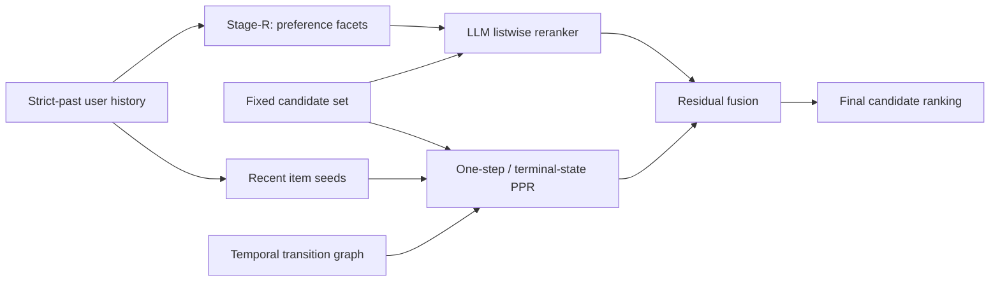
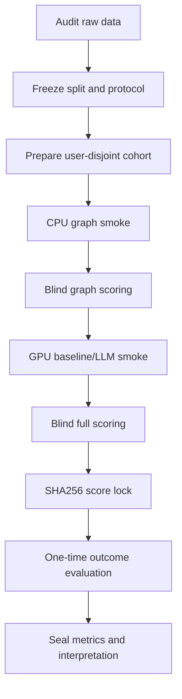

# TĂNG CƯỜNG MÔ HÌNH NGÔN NGỮ LỚN CHO KHUYẾN NGHỊ TUẦN TỰ BẰNG ĐỒ THỊ CHUYỂN TIẾP THEO THỜI GIAN

> **English title:** Temporal Transition Graph Augmentation for LLM-based
> Sequential Recommendation

> **Trạng thái bản thảo:** nội dung kỹ thuật và kết quả thực nghiệm đã được
> tổng hợp từ các protocol đã niêm phong đến ngày 24/09/2026. Các trường đánh
> dấu `[CẦN ĐIỀN]` phải được hoàn thiện theo biểu mẫu của cơ sở đào tạo trước
> khi nộp. Không sử dụng tài liệu này để thay đổi phương pháp hoặc tune lại trên
> các tập kết quả đã mở.

---

## Thông tin đồ án

| Trường thông tin | Nội dung |
|---|---|
| Cơ sở đào tạo | [CẦN ĐIỀN] |
| Khoa/Viện | [CẦN ĐIỀN] |
| Chương trình đào tạo | [CẦN ĐIỀN] |
| Sinh viên | [CẦN ĐIỀN HỌ VÀ TÊN] |
| Mã sinh viên | [CẦN ĐIỀN] |
| Giảng viên hướng dẫn | [CẦN ĐIỀN] |
| Thời gian thực hiện | [CẦN ĐIỀN] |
| Địa điểm, năm | [CẦN ĐIỀN], 2026 |

## Lời cam đoan — bản nháp

Tôi cam đoan nội dung và kết quả trình bày trong đồ án này được thực hiện trong
phạm vi nghiên cứu đã mô tả; các tài liệu, phương pháp và dữ liệu kế thừa đều
được ghi nguồn. Các bảng kết quả thực nghiệm được tổng hợp từ artifact đã khóa,
không lựa chọn lại tham số trên tập kiểm thử sau khi xem outcome.

> [CẦN XÁC NHẬN NỘI DUNG THEO MẪU CỦA TRƯỜNG VÀ KÝ TÊN]

## Lời cảm ơn — bản nháp

Tôi xin chân thành cảm ơn giảng viên hướng dẫn đã góp ý về định hướng nghiên
cứu, đặc biệt là yêu cầu kiểm tra headroom và đánh giá multi-hop dưới các
candidate khó thay vì chỉ tối ưu trên một thiết lập thuận lợi. Tôi cũng cảm ơn
đơn vị cung cấp hạ tầng tính toán và các tác giả của MemRec, Amazon Books,
MovieLens cùng các thư viện mã nguồn mở được sử dụng trong đồ án.

> [CẦN CÁ NHÂN HÓA TRƯỚC KHI NỘP]

## Các mục cần hoàn thiện trước khi chuyển sang bản nộp

- Điền thông tin hành chính và định dạng theo template chính thức.
- Xác minh BibTeX/DOI của danh mục tài liệu tham khảo và bổ sung ngày truy cập
  cho nguồn dữ liệu Kaggle, Hugging Face.
- Xuất các bảng kết quả chính thành bảng theo template của trường.
- Tạo hình minh họa từ sơ đồ Mermaid hoặc vẽ lại ở định dạng vector.
- Chọn các ví dụ định tính bằng quy tắc xác định trước; không chọn thủ công theo
  mức độ “đẹp” của kết quả.
- Kiểm tra lại thuật ngữ tiếng Việt và quy định viết tắt của cơ sở đào tạo.

## Mục lục

Mục lục, danh mục bảng và danh mục hình sẽ được sinh tự động khi chuyển bản
Markdown này sang template LaTeX/Word chính thức.

---

# Tóm tắt

Các hệ gợi ý dựa trên mô hình ngôn ngữ lớn có khả năng biểu diễn sở thích người
dùng dưới dạng ngữ nghĩa, nhưng thường khai thác chưa đầy đủ cấu trúc tuần tự
trong dữ liệu tương tác. MemRec giải quyết một phần hạn chế này bằng bộ nhớ cộng
tác trên đồ thị user–item, song cơ chế lan truyền được giới hạn ở các láng giềng
trực tiếp và đồ thị đồng sở thích không biểu diễn tường minh quan hệ “item nào
thường xuất hiện tiếp theo”. Đồ án này nghiên cứu việc tăng cường một bộ xếp
hạng LLM bằng **đồ thị chuyển tiếp item có hướng theo thời gian**.

Mỗi cạnh trong đồ thị được tạo từ hai batch hoặc session liên tiếp của cùng
người dùng và chỉ sử dụng dữ liệu quá khứ nghiêm ngặt. Từ tối đa sáu item gần
nhất, đồ án khảo sát hai tín hiệu: chuyển tiếp trực tiếp một bước và Personalized
PageRank dạng random walk với trạng thái kết thúc. Điểm đồ thị được kết hợp với
thứ hạng của một LLM cục bộ đã đóng băng bằng residual fusion. Toàn bộ thí
nghiệm dùng giao thức xếp hạng trong tập mười ứng viên gồm một positive và chín
negative, phù hợp với task chính của MemRec; đây không phải bài toán truy hồi
toàn bộ catalog.

Trên Amazon Books, kết quả discovery 100 sự kiện tăng NDCG@5 từ 0,6533 lên
0,7285. Một phép lặp nội bộ trên 200 người dùng không giao nhau tăng NDCG@5 từ
0,624675 lên 0,761807, với chênh lệch +0,137133 và khoảng tin cậy bootstrap 95%
[+0,090385; +0,183835]. Khi chuyển nguyên tham số sang MovieLens 32M với
negative lấy ngẫu nhiên, phương pháp tiếp tục cho mức tăng lớn, nhưng phân tích
cho thấy candidate set này dễ phân tách bằng độ phủ đồ thị.

Để loại bỏ shortcut trên, thí nghiệm xác nhận cuối cùng sử dụng 500 người dùng
mới và yêu cầu mọi negative đều có bằng chứng chuyển tiếp một bước trong cả hai
cách xây đồ thị. Trong thiết lập graph-hard này, LLM cục bộ đạt NDCG@5 bằng
0,436926; residual fusion với chuyển tiếp trực tiếp đạt 0,699773, tương ứng
chênh lệch +0,262847 và khoảng tin cậy 95% [+0,226284; +0,298401]. Tuy nhiên,
graph-only đạt 0,718712 và SASRec đạt 0,827329. PPR nhiều bước cũng không vượt
chuyển tiếp một bước một cách ổn định; một router OLS được đăng ký trước không
dự đoán được khi nào nên dùng độ sâu lớn hơn.

Kết quả cho thấy đồ thị chuyển tiếp thời gian cung cấp tín hiệu cấu trúc hữu ích
và có thể cải thiện đáng kể một LLM ranker đã đóng băng, kể cả khi loại bỏ
shortcut độ phủ. Đồng thời, kết quả không chứng minh rằng lan truyền nhiều bước
luôn tốt hơn, residual fusion là tối ưu, hay phương pháp vượt một hệ gợi ý tuần
tự mạnh. Đóng góp chính của đồ án vì vậy là phương pháp biểu diễn tín hiệu
chuyển tiếp, giao thức đánh giá strict-past và graph-hard, cùng phân tích có kiểm
soát về giới hạn của multi-hop trong khuyến nghị tuần tự dựa trên LLM.

**Từ khóa:** hệ gợi ý tuần tự, mô hình ngôn ngữ lớn, đồ thị chuyển tiếp thời
gian, Personalized PageRank, MemRec, graph-hard candidates.

# Abstract

Large-language-model recommenders can encode user preferences semantically but
often underuse the sequential structure of interaction data. MemRec addresses
part of this limitation with collaborative memory over a user–item graph, yet
its propagation is restricted to immediate neighbors and its co-preference
graph does not explicitly model which item tends to occur next. This thesis
augments a frozen LLM ranker with a **directed temporal item-transition graph**.

Edges are constructed from consecutive timestamp batches or sessions of the
same user under a strict-past contract. Starting from at most six recent items,
the study evaluates direct one-step transition evidence and a terminal-state
Personalized PageRank estimator. Graph scores are combined with frozen local
LLM rankings through residual fusion. Evaluation follows MemRec's ten-candidate
ranking task with one positive and nine negatives; it is not full-catalog
retrieval.

On Amazon Books, a user-disjoint 200-event replication improves NDCG@5 from
0.624675 to 0.761807, a gain of +0.137133 with a paired-bootstrap 95% confidence
interval of [+0.090385, +0.183835]. A frozen transfer to MovieLens 32M also
shows a large gain under uniform negatives, although that setting is highly
graph-separable. The final confirmatory study therefore evaluates 500 fresh
users under graph-hard candidates, requiring every negative to have positive
one-step evidence in both graph views. The frozen local LLM obtains 0.436926
NDCG@5, while direct-transition residual fusion reaches 0.699773, for a gain of
+0.262847 and a 95% confidence interval of [+0.226284, +0.298401]. However,
graph-only ranking reaches 0.718712 and SASRec reaches 0.827329. Fixed deeper
PPR and a preregistered OLS depth router do not consistently outperform direct
one-step transitions.

The findings support temporal transition graphs as a useful structural signal
for augmenting a frozen LLM ranker even after removing the simple reachability
shortcut. They do not support a claim that deeper propagation is universally
better, that fixed residual fusion is optimal, or that the proposed method is
state of the art. The main contributions are the transition representation, a
strict-past graph-hard evaluation protocol, and controlled evidence about the
limits of multi-hop propagation in LLM-based sequential recommendation.

**Keywords:** sequential recommendation, large language models, temporal
transition graph, Personalized PageRank, MemRec, graph-hard candidates.

---

# Danh mục từ viết tắt

| Viết tắt | Diễn giải |
|---|---|
| BPR | Bayesian Personalized Ranking |
| CI | Confidence Interval — khoảng tin cậy |
| GRPO | Group Relative Policy Optimization |
| H@K | Hit Rate tại vị trí K |
| LLM | Large Language Model — mô hình ngôn ngữ lớn |
| NDCG@K | Normalized Discounted Cumulative Gain tại vị trí K |
| OLS | Ordinary Least Squares |
| PPR | Personalized PageRank |
| SFT | Supervised Fine-Tuning |
| SASRec | Self-Attentive Sequential Recommendation |
| TP | Tensor Parallelism |

---

# Chương 1. Giới thiệu

## 1.1. Bối cảnh

Hệ gợi ý truyền thống thường biểu diễn người dùng và item bằng vector ẩn học từ
lịch sử tương tác. Cách tiếp cận này hiệu quả về mặt xếp hạng nhưng khó biểu
diễn tường minh những sở thích giàu ngữ nghĩa như chủ đề, phong cách, tác giả
hoặc sự thay đổi theo ngữ cảnh. Sự phát triển của LLM mở ra khả năng xây dựng bộ
nhớ người dùng dưới dạng ngôn ngữ tự nhiên và giải thích quyết định gợi ý dựa
trên nội dung.

Tuy nhiên, một LLM chỉ đọc lịch sử của chính người dùng vẫn bỏ qua hai nguồn
thông tin quan trọng. Thứ nhất là collaborative signal: hành vi của những người
dùng khác có thể bù cho lịch sử ngắn hoặc nhiễu. Thứ hai là sequential signal:
thứ tự tương tác cho biết người dùng thường chuyển từ loại item nào sang item
nào. Hai item có thể không giống nhau về ngữ nghĩa nhưng vẫn có quan hệ chuyển
tiếp mạnh trong hành vi tập thể.

MemRec [1] tổ chức bộ nhớ người dùng và item trên một Collaborative Memory
Graph. Hệ thống tách vai trò quản lý bộ nhớ khỏi vai trò suy luận gợi ý, gồm
Stage-R để tổng hợp collaborative memory, Stage-ReRank để xếp hạng candidate và
Stage-W để cập nhật/lan truyền bộ nhớ. Thiết kế này cho thấy giá trị của bộ nhớ
cộng tác, nhưng paper gốc cũng nêu giới hạn rằng propagation mới dừng ở láng
giềng trực tiếp và mở rộng nhiều hop có thể làm tăng nhiễu.

Điểm xuất phát của đồ án là câu hỏi: thay vì chỉ tăng số hop trên đồ thị đồng sở
thích, liệu có thể thay đổi **ngữ nghĩa cạnh** để graph bám sát trực tiếp bài
toán dự đoán item kế tiếp hay không? Đồ án xây một đồ thị item–item có hướng,
trong đó cạnh `a → b` biểu diễn việc `b` xuất hiện trong batch/session ngay sau
`a` trong lịch sử của một hoặc nhiều người dùng.

## 1.2. Bài toán nghiên cứu

Với người dùng `u`, thời điểm mục tiêu `t` và tập ứng viên `C(u,t)`, nhiệm vụ là
xếp item đúng `i*` càng cao càng tốt, chỉ sử dụng tương tác có thời gian nhỏ hơn
`t`. Mỗi sự kiện đánh giá trong đồ án có đúng mười candidate: một positive và
chín negative. Đây là **candidate-set ranking**, tương thích với benchmark chính
của MemRec; Stage-R truy hồi memory/evidence chứ không truy hồi item từ toàn bộ
catalog.

Ba câu hỏi nghiên cứu được đặt ra:

- **RQ1 — Transition signal:** đồ thị chuyển tiếp thời gian có cung cấp tín
  hiệu bổ sung cho một LLM-based semantic ranker hay không?
- **RQ2 — Propagation depth:** lan truyền nhiều bước có cải thiện ổn định so với
  chuyển tiếp trực tiếp một bước hay không?
- **RQ3 — Structural hardness:** hiệu quả có còn tồn tại khi mọi negative đều
  có graph evidence hợp lệ, thay vì phần lớn negative nhận điểm bằng không?

## 1.3. Mục tiêu

Đồ án hướng tới các mục tiêu sau:

1. Xây dựng đồ thị chuyển tiếp item có hướng từ lịch sử tương tác, bảo đảm
   strict-past và xử lý đúng các event đồng thời.
2. Thiết kế điểm one-step và PPR có thể ghép với một LLM ranker đóng băng mà
   không cần fine-tune LLM.
3. Đánh giá trên Amazon Books và MovieLens 32M với protocol, candidate order và
   tham số được khóa trước khi mở outcome.
4. Phân biệt gain do độ phủ dễ với gain do độ lớn/cấu trúc của transition
   evidence bằng graph-hard candidates.
5. So sánh với MostPopular, BPR-MF và SASRec trên cùng candidate set, từ đó xác
   định ranh giới claim phù hợp.

## 1.4. Đóng góp

Các đóng góp chính của đồ án gồm:

- Một cách biểu diễn collaborative sequential signal bằng **directed temporal
  transition graph**, thay cho việc tăng hop trên co-preference graph.
- Hai graph view xử lý độ phân giải thời gian khác nhau: exact-timestamp batch
  và session năm phút.
- Một pipeline label-blind từ graph scoring, LLM ranking, score locking đến đánh
  giá một lần, kèm kiểm soát leakage và no-manual-tuning.
- Giao thức graph-hard yêu cầu toàn bộ negative có one-step evidence trong cả
  hai graph view, giúp loại bỏ shortcut zero-versus-nonzero.
- Bằng chứng thực nghiệm gồm discovery, replication, frozen cross-domain
  transfer, graph-hard confirmation và các kết quả âm có kiểm soát đối với PPR
  sâu hơn và learned routing.

## 1.5. Phạm vi và giới hạn ngay từ đầu

Đồ án không giải quyết full-catalog retrieval. Candidate set luôn được cung cấp
trước cho các ranker. Kết quả vì vậy không được diễn giải như recall hoặc
latency của hệ thống recommender end-to-end ngoài production.

Đồ án cũng không claim phương pháp mới vượt các mô hình tuần tự mạnh. Mục tiêu
chính là kiểm định giá trị của graph signal đối với LLM ranker và hiểu vai trò
của propagation depth. Các thử nghiệm SFT/GRPO, rule tuning và target-aware
oracle không thuộc phương pháp cuối cùng.

## 1.6. Cấu trúc báo cáo

Chương 2 trình bày MemRec, recommendation tuần tự, graph propagation và các
baseline. Chương 3 mô tả phương pháp đề xuất. Chương 4 trình bày dữ liệu và
thiết kế thực nghiệm. Chương 5 báo cáo kết quả, trả lời các câu hỏi nghiên cứu
và phân tích giới hạn. Chương 6 kết luận và đề xuất hướng phát triển hợp lệ.

---

# Chương 2. Cơ sở lý thuyết và công trình liên quan

## 2.1. Hệ gợi ý tuần tự

Trong recommendation tuần tự, lịch sử người dùng được biểu diễn như một chuỗi
item có thứ tự. Mục tiêu không chỉ là ước lượng sở thích dài hạn mà còn dự đoán
item tiếp theo dựa trên trạng thái gần đây. BPR [2] tối ưu thứ tự tương đối giữa
positive và negative thông qua pairwise loss, trong khi SASRec [3] dùng
self-attention có causal mask để mô hình hóa phụ thuộc trong chuỗi.

Các phương pháp này là hai baseline quan trọng cho đồ án. BPR-MF kiểm tra liệu
tín hiệu collaborative tĩnh đã đủ giải thích kết quả hay chưa. SASRec là
baseline tuần tự mạnh, giúp tránh việc kết luận quá mức chỉ từ so sánh với một
LLM nhỏ.

## 2.2. LLM và bộ nhớ trong hệ gợi ý

LLM có thể đọc lịch sử ở dạng văn bản, rút ra preference facets và xếp hạng
candidate theo ngữ nghĩa. Ưu điểm là khả năng sử dụng metadata không cấu trúc và
đưa ra diễn giải gần với ngôn ngữ tự nhiên. Nhược điểm là chi phí inference,
giới hạn context và khả năng bỏ qua tín hiệu thống kê khó biểu đạt trong prompt.

MemRec [1] giải quyết vấn đề bộ nhớ cô lập bằng hai vai trò:

- `LMMem` quản lý graph, chọn neighbor, tổng hợp collaborative memory và cập
  nhật bộ nhớ;
- `LLMRec` nhận context đã nén để xếp hạng candidate.

Kiến trúc gốc có ba stage: Stage-R, Stage-ReRank và Stage-W. Đồ án kế thừa tư
tưởng tách semantic ranker khỏi collaborative evidence, nhưng không tái hiện
toàn bộ online memory-writing pipeline. Local LLM trong thí nghiệm tạo preference
facets từ strict-past history và xếp hạng mười candidate; transition graph cung
cấp một nguồn structural evidence độc lập ở ngoài prompt.

## 2.3. Đồ thị chuyển tiếp

Co-interaction graph trả lời câu hỏi hai người dùng hoặc item có liên quan hay
không, nhưng không nhất thiết bảo toàn chiều thời gian. Ngược lại, transition
graph giữ cạnh có hướng. Một cạnh `a → b` có ý nghĩa rằng sau khi tương tác với
`a`, cộng đồng đã quan sát `b` ở batch/session kế tiếp.

Cách biểu diễn này gần với first-order Markov model. Điểm one-step ưu tiên
những candidate xuất hiện trực tiếp sau các seed gần đây. Ưu điểm là tín hiệu rõ
ràng, dễ audit và ít khuếch đại noise. Nhược điểm là coverage thấp khi seed chưa
có outgoing transition hoặc destination chưa trùng candidate.

## 2.4. Personalized PageRank và lan truyền nhiều bước

PageRank [4] và Personalized PageRank mở rộng ảnh hưởng qua nhiều cạnh, đồng
thời dùng restart/stop probability để giữ phân phối gần seed. Trong đồ án, PPR
được xấp xỉ bằng deterministic Monte Carlo walks và chỉ đếm terminal state.
Mục tiêu là tăng coverage trên graph thưa, không phải mặc định thay one-step.

Multi-hop có trade-off cơ bản. Đi xa hơn có thể tìm được một candidate chưa có
direct edge, nhưng mỗi hop cũng giảm tính đặc thù của trạng thái hiện tại và
tăng xác suất đi vào hub. Vì vậy RQ2 cần được kiểm định riêng, thay vì suy ra từ
việc một graph arm tốt hơn local LLM.

## 2.5. Xếp hạng trong candidate set

MemRec nhận candidate set `C` rồi xếp hạng các item bên trong `C`. Stage-R tìm
memory liên quan, không sinh candidate catalog. Benchmark chính dùng `N=10` và
báo cáo H@1, H@3, H@5, NDCG@3 và NDCG@5 [1]. Đồ án giữ task family này để so
sánh nhất quán.

Khi target được đặt sẵn trong mười candidate, H@10 luôn bằng 1 và không có giá
trị phân biệt. Vì vậy đồ án không báo H@10. Kết quả cũng không phản ánh khả năng
retrieval item đúng từ hàng chục nghìn item; đây là một threat to external
validity được thảo luận ở Chương 5.

## 2.6. Khoảng trống nghiên cứu

Paper MemRec nêu multi-hop propagation là một hướng mở, nhưng tăng hop trên
graph đồng sở thích có thể chỉ tăng noise. Khoảng trống cụ thể mà đồ án xử lý
là:

1. đổi cạnh collaborative sang temporal next-item transition;
2. đo one-step và multi-hop trên cùng protocol;
3. tách gain do graph magnitude khỏi gain do reachability bằng graph-hard
   candidates;
4. kiểm tra graph augmentation bên cạnh các baseline cổ điển mạnh.

---

# Chương 3. Phương pháp đề xuất

## 3.1. Tổng quan hệ thống

Hệ thống gồm hai nhánh độc lập trước khi fusion: một local semantic ranker và
một temporal transition graph scorer.



Local ranker và graph scorer nhận cùng event key và candidate order, nhưng graph
scorer không nhận gold label. Sau khi mọi score được kiểm tra và hash, evaluator
mới đọc target để tính metric.

## 3.2. Phát biểu hình thức

Gọi `U` là tập người dùng, `I` là tập item và mỗi interaction là bộ
`(u, i, r, t)`. Với target event của user `u` tại thời điểm `t*`, strict-past
history là:

$$
H_u(t^*) = \{(i,r,t) \mid t < t^*\}.
$$

Tập candidate có kích thước mười:

$$
C_u = \{i^*\} \cup N_u, \qquad |N_u| = 9,
$$

trong đó `i*` là positive target và mọi negative trong `N_u` không xuất hiện
trong `H_u(t*)`. Nhiệm vụ là tìm permutation của `C_u` sao cho rank của `i*`
nhỏ nhất.

## 3.3. Xử lý đồng thời và session

Không được giả định thứ tự giữa các item có cùng timestamp. Với mỗi user, các
interaction được gom thành các batch:

$$
B(u,t_1), B(u,t_2), \ldots, B(u,t_m), \qquad t_1 < t_2 < \cdots < t_m.
$$

Đồ án dùng hai view:

- **Exact-timestamp:** mọi item cùng timestamp thuộc một unordered batch.
- **Session-300s:** các interaction liên tiếp cách nhau không quá 300 giây
  thuộc cùng một unordered session; cạnh chỉ nối hai session liên tiếp.

Exact-timestamp là primary view. Session-300s là robustness view được xác định
từ audit burstiness của MovieLens trước khi xem ranking outcome.

## 3.4. Xây đồ thị chuyển tiếp có hướng

Với hai batch liên tiếp `B(u,t_j)` và `B(u,t_{j+1})`, mỗi source item
`a ∈ B(u,t_j)` trỏ đến destination group `B(u,t_{j+1})`. Không tạo cạnh bên
trong cùng batch. Một source có thể có nhiều destination group quan sát được ở
những user/thời điểm khác nhau.

Group representation được giữ thay vì materialize toàn bộ Cartesian product.
Khi cần sample bước tiếp theo, thuật toán chọn một destination group đã quan sát
của source, sau đó chọn một item trong group. Cách này không gán một trật tự giả
cho các item đồng thời và tránh một batch lớn sinh quá nhiều cạnh độc lập.

Graph snapshot chỉ dùng interaction trước global validation cutoff. Với target
tại test time, graph không được cập nhật bằng target hoặc bất kỳ interaction
tương lai nào.

## 3.5. Chọn seed

Từ strict-past history của target user, hệ thống lấy tối đa sáu unique item gần
nhất. Phân phối seed là uniform. Giới hạn nhỏ giúp biểu diễn trạng thái gần đây,
khống chế compute và giữ cùng contract giữa Amazon và MovieLens.

## 3.6. Điểm chuyển tiếp một bước

Với seed `s` và candidate `i`, điểm one-step tỷ lệ với số lần `i` xuất hiện
trong destination group của `s`, có tính đến phép chọn uniform group rồi uniform
item trong group. Khi có nhiều seed, điểm được lấy trung bình theo phân phối
seed. Ký hiệu tổng quát:

$$
g_{1}(i \mid u) = \frac{1}{|S_u|}
\sum_{s \in S_u} P(i \mid s),
$$

trong đó `P(i|s)` được ước lượng từ các transition strict-past đã quan sát.
Candidate có điểm cao khi nhiều seed gần đây trực tiếp dẫn tới candidate đó
hoặc khi transition tương ứng được quan sát nhiều lần.

## 3.7. Terminal-state PPR

PPR variant thực hiện 50.000 random walks xác định theo seed cho mỗi event:

1. chọn một seed uniform;
2. tại mỗi bước, dừng với xác suất `ρ = 0,15`;
3. nếu tiếp tục, chọn một destination group của current item uniform rồi chọn
   một item trong group uniform;
4. dừng nếu current node không có outgoing group hoặc đã đủ 64 bước;
5. chỉ đếm terminal item nếu nó nằm trong candidate set.

Với `W = 50.000` walks, điểm của candidate `i` là:

$$
g_{\mathrm{PPR}}(i \mid u) =
\frac{1}{W}\sum_{w=1}^{W}\mathbf{1}[z_w=i],
$$

trong đó `z_w` là terminal state của walk thứ `w`. Đây là geometric-stop,
terminal-state estimator; không nên gọi là exact stationary PPR.

## 3.8. Local LLM ranker

Local ranker sử dụng `Qwen/Qwen3-4B-Instruct-2507` [8], revision cố định
`cdbee75f17c01a7cc42f958dc650907174af0554`, ở bf16 và greedy decoding:

1. Stage-R đọc tối đa sáu interaction strict-past gần nhất và sinh tối đa năm
   preference facets;
2. listwise reranker nhận facets cùng memory/metadata của mười candidate;
3. output là một permutation của nhãn A–J.

Trên Amazon, history có review và candidate memory dùng title cùng metadata
join exact-title. Trên MovieLens, history dùng title, genres, rating; candidate
memory chỉ dùng title và genres. Tags, IMDb/TMDb text và future aggregates không
được dùng.

Structured decoding ép output theo JSON schema. Nếu permutation lặp label,
parser giữ lần xuất hiện đầu và nối label thiếu theo thứ tự A–J. Đây là sửa cú
pháp xác định, không dùng item ID, graph score hay gold label. Mỗi run có repair
cap được khóa trước.

## 3.9. Residual fusion

Rank `r_i` của local LLM, bắt đầu từ 1, được đổi thành reciprocal-log score:

$$
\ell_i = \frac{1}{\log_2(r_i+1)}.
$$

Graph score được min–max trong đúng candidate set:

$$
\hat g_i = \frac{g_i-\min_j g_j}{\max_j g_j-\min_j g_j}.
$$

Nếu mọi graph score bằng nhau, hệ thống giữ nguyên local ranking. Nếu không,
điểm fusion là:

$$
s_i = \ell_i + \alpha\hat g_i,
\qquad \alpha=0,80.
$$

`α=0,80` được chọn trên Amazon calibration cohort, sau đó đóng băng cho Amazon
replication và toàn bộ MovieLens studies. Không calibrate lại theo test labels.

## 3.10. Độ phức tạp

Gọi `E_g` là số source-to-group links và `W` là số walks/event. Việc dựng graph
tuyến tính theo số transition quan sát được và yêu cầu bộ nhớ tỷ lệ với
`O(E_g)`. One-step scoring chỉ duyệt outgoing groups của tối đa sáu seed và mười
candidate. PPR scoring có độ phức tạp xấp xỉ `O(WL)` cho mỗi event, trong đó
`L ≤ 64` là số bước walk thực tế. Local LLM inference chiếm phần lớn GPU time;
graph scoring chạy CPU và không phát sinh LLM request.

## 3.11. Những hướng không thuộc phương pháp cuối cùng

Đồ án đã khảo sát nhưng loại bỏ SFT/GRPO cho LM_Mem, co-preference multi-hop,
candidate-conditioned rules, filtered 3-hop, 5-layer expansion và learned
depth routing. Các hướng này không được ghép vào final method vì oracle
headroom thấp, gate thất bại hoặc không tổng quát trên fresh cohort. Việc báo
cả kết quả âm giúp tránh biến phương pháp cuối thành một tập rule được chọn sau
khi xem test outcome.

---

# Chương 4. Thiết kế thực nghiệm

## 4.1. Nguyên tắc chung

Thiết kế thực nghiệm tuân theo bốn nguyên tắc:

1. **Strict-past:** event tại `t` chỉ đọc state có timestamp nhỏ hơn `t`.
2. **Label-blind scoring:** graph scorer và ranker không nhận gold index; label
   chỉ được mở sau khi score và manifest đã khóa bằng SHA256.
3. **Smoke-first:** mọi workload mới phải chạy 20–30 event trước full run và
   reuse kết quả smoke nếu contract giống hệt.
4. **No manual tuning:** prompt, alpha, graph view, depth, candidate rule,
   feature và model config không được đổi sau khi xem outcome của cohort tương
   ứng.

Luồng chung được mô tả như sau:



## 4.2. Amazon Books

### 4.2.1. Nguồn và tiền xử lý

Amazon Books snapshot [10] gồm:

- `Books_rating.csv`: user, item, rating/review và Unix timestamp;
- `books_data.csv`: metadata không có item ID tương ứng, được join bằng exact
  title.

Sau audit, có 2.438.194 interaction chứa user, item và timestamp hợp lệ;
561.787 dòng không có user và 19 timestamp lỗi bị loại. Timeline kéo dài từ
17/08/1996 đến 04/03/2013. Exact-title metadata coverage trên interaction hợp
lệ là 99,992%; không dùng fuzzy join.

Global event-quantile split 80/10/10 được tạo sao cho mọi event cùng timestamp
nằm ở cùng một phía của boundary. Positive là rating `>=4`. Candidate pool chỉ
chứa positive item đã xuất hiện trước train cutoff.

### 4.2.2. Cohort

Ba cohort được dùng trong quá trình phát triển:

| Cohort | Số event | Vai trò |
|---|---:|---|
| Calibration | 100 | chọn `α=0,80` và admission |
| Discovery | 100 | fresh primary test của P7-v2 |
| Internal replication | 200 | user-disjoint với toàn bộ 1.500 user cũ |

Mỗi user đóng góp đúng một target, có ít nhất năm positive strict-past
interactions. Candidate set có một positive mới và chín deterministic uniform
negative chưa xuất hiện trong history của user. Candidate order được hash.

### 4.2.3. Graph snapshot

Exact-day timestamp batch graph của replication có:

| Thuộc tính | Giá trị |
|---|---:|
| Người dùng | 1.008.972 |
| Source item | 142.572 |
| Consecutive batch pairs | 511.907 |
| Source-to-group links | 876.669 |

Không dùng rating filter cho cạnh, hub penalty, semantic filter, beam search
hoặc target-aware path selection.

## 4.3. MovieLens 32M

### 4.3.1. Audit dữ liệu

MovieLens 32M [5], [9] gồm 32.000.204 ratings, 200.948 user và 84.432 movie được
rating. Metadata có 87.585 movie; mọi rated movie có metadata. Timeline từ
09/01/1995 đến 13/10/2023 UTC. Có 15.938.231 rating `>=4,0`, tương ứng 49,81%.
MD5 của bốn file `ratings.csv`, `movies.csv`, `tags.csv`, `links.csv` đều khớp
README chính thức. Tags và external links không được dùng trong primary study.

### 4.3.2. Construct validity của timestamp

MovieLens timestamp phản ánh lúc người dùng nhập rating, không chắc là lúc xem
phim. Dữ liệu có burst mạnh:

| Khoảng cách hai rating liên tiếp | Tỷ lệ |
|---|---:|
| Cùng giây | 16,55% |
| Không quá 10 giây | 50,76% |
| Không quá 60 giây | 83,05% |
| Không quá 5 phút | 91,66% |
| Không quá 1 ngày | 95,47% |

Vì vậy target chỉ được chọn nếu nó là một singleton five-minute session: batch
timestamp có đúng một item, cách rating trước và sau hơn 300 giây. Kết quả phải
được gọi là dự đoán **next rating event**, không phải next watch.

### 4.3.3. Temporal split

| Partition | Điều kiện | Số event |
|---|---|---:|
| Train | `t < 1538551305` | 25.600.163 |
| Development | `1538551305 <= t < 1604605535` | 3.200.020 |
| Primary test | `t >= 1604605535` | 3.200.021 |

Các timestamp bằng nhau không bị chia qua hai partition. Development có 9.389
eligible user; primary test có 9.848 eligible user theo các điều kiện rating,
history, singleton session và candidate pool.

## 4.4. Các study trên MovieLens

### 4.4.1. M1 — frozen transfer với uniform negatives

M1 lấy 500 target từ 500 user, dùng một positive và chín negative uniform từ
pool 34.640 movie positive trước train cutoff. Toàn bộ model, PPR và fusion
parameter được chuyển nguyên từ Amazon. Exact view là primary và session-300s
là secondary.

Study này trả lời external transfer nhưng chưa loại bỏ graph reachability
shortcut. Do đó kết quả của M1 được dùng để thúc đẩy một experiment mới, không
được dùng để khẳng định multi-hop là nguyên nhân của toàn bộ gain.

### 4.4.2. M5 — graph-hard multi-hop headroom

M5 dùng 200 development user mới. Mỗi negative bắt buộc có positive one-step
score trong **cả exact và session graph**. Negative được sample uniform trong
reachable intersection, không dựa vào score magnitude, genre, popularity hoặc
semantic similarity. M5 chỉ so one-step graph-only với PPR graph-only để hỏi
liệu multi-hop còn headroom sau khi bỏ shortcut.

### 4.4.3. M6 — no-tuning depth router

Vì oracle M5 cho thấy PPR giúp một số event nhưng hại event khác, M6 thử một
router preregistered. Router dùng 12 feature chỉ từ hai vector score, gồm
coverage, concentration, margin, entropy, distance giữa hai phân phối và seed
count. OLS được đánh giá five-fold out-of-fold; chọn PPR khi predicted gain lớn
hơn 0. Không tune feature, model, regularization hoặc threshold.

### 4.4.4. M7 — graph-hard end-to-end confirmation

M7 là thí nghiệm xác nhận cuối cùng:

- 500 target từ 500 user mới;
- loại toàn bộ 520 user của M1 và fixed 500-user scan của M5;
- scan đúng 1.000 eligible user theo salt đã khóa và lấy 500 event feasible đầu
  tiên;
- mọi negative có positive one-step score trong cả exact và session graph;
- gold reachability không phải điều kiện eligibility;
- Local + exact one-step residual là sole primary comparison.

Candidate smoke cho thấy 992/1.000 scan user feasible. Full cohort có đủ 500
event mà không mở rộng scan. Toàn bộ 4.500 negative slots có one-step evidence
dương trong cả hai view.

## 4.5. Các ranking arm

Các arm được score trên cùng candidate order:

1. Local LLM;
2. MostPopular;
3. BPR-MF;
4. SASRec;
5. exact one-step graph-only;
6. local + exact one-step residual — primary treatment;
7. exact PPR graph-only và residual;
8. bốn graph/residual arm tương ứng cho session-300s.

MostPopular đếm positive trước validation cutoff. BPR-MF có embedding 64 chiều,
pairwise negative sampling và maximum 20 epoch. SASRec có embedding 64 chiều,
maximum sequence length 50, hai Transformer blocks, hai attention heads,
dropout 0,2 và maximum 50 epoch. Cả hai dùng learning rate `0,001`, seed
`20260923` và deterministic early stopping trên validation độc lập với 100
candidate/event. Không có grid search hay chọn seed tốt nhất.

## 4.6. Chỉ số đánh giá

Với một positive target, Hit@K được định nghĩa:

$$
\mathrm{H@K} = \mathbf{1}[\mathrm{rank}(i^*) \le K].
$$

Do mỗi event chỉ có một relevant item, NDCG@K rút gọn thành:

$$
\mathrm{NDCG@K} =
\begin{cases}
\dfrac{1}{\log_2(\mathrm{rank}(i^*)+1)}, &
\mathrm{rank}(i^*) \le K,\\
0, & \text{ngược lại.}
\end{cases}
$$

Kết quả báo cáo H@1, H@3, H@5, NDCG@3 và NDCG@5. NDCG [6] nhạy với vị trí
của target hơn Hit Rate, vì vậy NDCG@5 được dùng làm primary metric.

## 4.7. Kiểm định và decision gate

Chênh lệch NDCG@5 được tính theo cặp trên cùng event. Khoảng tin cậy 95% sử
dụng 10.000 paired bootstrap resamples [7] với seed khóa trước. Gate chính:

- Amazon discovery: mean delta `>= +0,02` và CI lower `>0`;
- Amazon replication: mean delta `>= +0,03` và CI lower `>0`;
- MovieLens M7: mean delta `>= +0,03` và CI lower `>0`.

Ngoài mean và CI, evaluator báo số event improved/worsened/unchanged. Secondary
arm không được thay primary nếu primary fail.

## 4.8. Môi trường và kiểm soát tài nguyên

LLM inference dùng đúng một H100 80 GB tại một thời điểm, TP=1. Model được
unload ngay sau task. Smoke và full run dùng cùng checkpoint, prompt, decoding,
dtype và candidate protocol; smoke cache được reuse.

M7 local run thực hiện đúng 1.000 physical requests, gồm 40 request smoke và
960 request mới. Tổng token là 478.375; peak VRAM 7,706 GiB. Baseline full peak
0,451 GiB. Sau run, cả bốn GPU trên node đều trở về 1 MiB. Full local test suite
đạt 61/61 test trước khi tài liệu kết quả được chốt.

## 4.9. Reproducibility và outcome sealing

Config, prepared cohort, method lock, graph scores, baseline scores, LLM calls,
checkpoint và evaluation manifest đều có SHA256. M7 combined score lock xác
nhận 500 graph rows, 500 baseline rows và 1.000 successful LLM keys trước khi
đọc `gold_item_id`. Evaluation được chạy đúng một lần.

Các lỗi vận hành trước outcome — telemetry CUDA chưa initialize, validation
sampler không hỗ trợ 100 candidate và thiếu biến guard Slurm — đều dừng trước
khi tạo score hợp lệ. Mỗi lỗi được sửa, thêm test và smoke lại dưới run ID mới;
không thay scientific config.

## 4.10. Đạo đức, riêng tư và tác động môi trường

Đồ án chỉ sử dụng các snapshot recommendation công khai trong phạm vi nghiên
cứu và không cố gắng tái định danh người dùng. User ID được xử lý như identifier
ẩn danh; prompt không chứa thông tin nhận dạng trực tiếp ngoài nội dung đã có
trong dataset. Artifact và log không lưu API key hoặc credential.

Transition graph có thể khuếch đại popularity bias: item xuất hiện thường xuyên
có nhiều transition hơn và dễ nhận điểm cao. Kết quả MostPopular mạnh trên M7
cho thấy đây là rủi ro thực tế, không chỉ lý thuyết. Đồ án chưa đánh giá fairness
theo nhóm người dùng vì dataset không cung cấp demographic attribute phù hợp;
đây là một giới hạn cần nêu rõ thay vì suy đoán thuộc tính nhạy cảm.

Để giảm tài nguyên lãng phí, các phase CPU-only phải pass trước GPU, LLM smoke
được reuse trong full run và model được unload ngay khi hoàn tất. Mỗi workload
chỉ dùng một H100 dù allocation có nhiều card. Audit token, runtime và peak VRAM
được ghi cùng kết quả để việc đánh giá phương pháp bao gồm cả chi phí tính toán.

---

# Chương 5. Kết quả và thảo luận

## 5.1. Amazon Books discovery

| Arm | NDCG@5 | Hit@5 |
|---|---:|---:|
| Frozen local LLM | 0,6533 | 0,800 |
| Transition-PPR residual | **0,7285** | **0,870** |

Chênh lệch NDCG@5 là +0,0752, CI95% [+0,0179; +0,1375]. Có 22 event cải
thiện, 16 event giảm và 62 event không đổi. Gate discovery pass.

Gold PPR reachability đạt 63/100, cao hơn one-step 21/100. Negative PPR
reachability là 97/900, trong khi one-step chỉ 1/900. Kết quả cho thấy PPR tăng
coverage trên Amazon graph thưa, nhưng cohort nhỏ và negative uniform khiến cần
một phép lặp user-disjoint.

## 5.2. Amazon Books internal replication

| Arm | NDCG@5 | Hit@5 |
|---|---:|---:|
| Frozen local Qwen ranker | 0,624675 | 0,820 |
| Transition-PPR residual, `α=0,80` | **0,761807** | **0,905** |

Chênh lệch là **+0,137133**, CI95% **[+0,090385; +0,183835]**. Có 64 event
cải thiện, 36 event giảm và 100 event không đổi. Replication gate pass mà không
retune alpha, restart, walk budget, depth hoặc prompt.

Gold PPR reachability đạt 123/200 so với one-step 36/200. Đối với negative, PPR
đạt 172/1.800, còn one-step đạt 8/1.800. Kết quả xác nhận signal có lặp lại trên
người dùng mới của cùng dataset. Tuy nhiên, chênh lệch reachability giữa gold và
negative vẫn là một lời giải thích thay thế cần kiểm soát ở MovieLens.

## 5.3. MovieLens frozen transfer với uniform negatives

| Ranking arm | NDCG@5 | Hit@5 |
|---|---:|---:|
| Frozen local LLM | 0,471944 | 0,702 |
| Exact one-step, graph-only | **0,861449** | 0,950 |
| Exact one-step, residual | 0,848785 | 0,948 |
| Exact PPR, graph-only | 0,844459 | 0,936 |
| Exact PPR, residual — primary | **0,838235** | **0,952** |
| Session one-step, graph-only | **0,869054** | 0,960 |
| Session one-step, residual | 0,841716 | 0,946 |
| Session PPR, graph-only | 0,854884 | 0,948 |
| Session PPR, residual | **0,849310** | **0,960** |

Exact PPR residual tăng +0,366290 so với local, CI95% [+0,330511;
+0,400667]. Session PPR residual tăng +0,377365, CI95% [+0,343037;
+0,411524]. Cả hai frozen-transfer gate pass.

Dù vậy, one-step graph-only mạnh hơn PPR graph-only trong cả hai view và
graph-only cũng nhỉnh hơn residual. Gold one-step reachability là 90,4% exact
và 95,4% session, trong khi negative chỉ là 30,02% và 54,51%. Do đó M1 chứng
minh transition signal transfer qua domain, nhưng chưa chứng minh multi-hop cần
thiết hoặc gain không phụ thuộc candidate separability.

## 5.4. Graph-hard multi-hop headroom

| View / graph-only arm | NDCG@5 | Hit@5 |
|---|---:|---:|
| Exact one-step | 0,593659 | 0,725 |
| Exact PPR | 0,613055 | 0,765 |
| Session one-step | **0,643045** | 0,755 |
| Session PPR | 0,607746 | 0,760 |

Exact PPR hơn one-step +0,019396 nhưng CI95% [-0,015394; +0,053643] cắt 0 và
không đạt margin +0,02. Session PPR kém one-step -0,035299 với CI95%
[-0,067050; -0,004538]. Cả hai gate fail, vì vậy study dừng trước LLM/GPU.

Mọi negative đều one-step reachable; gold coverage chỉ 83,0% exact và 88,5%
session. Kết quả này đảo chiều diễn giải từ M1: transition graph có signal,
nhưng fixed multi-hop PPR không tạo incremental gain ổn định khi shortcut độ
phủ đã bị loại.

## 5.5. Learned depth routing

| Policy | NDCG@5 | Delta so với one-step |
|---|---:|---:|
| Exact one-step | 0,593659 | — |
| Exact OOF router | 0,593283 | -0,000376 |
| Session one-step | 0,643045 | — |
| Session OOF router | 0,634396 | -0,008650 |

Exact router CI95% là [-0,026653; +0,025604], còn session router là
[-0,021419; +0,002334]. Router chọn PPR lần lượt cho 58,5% và 30,0% event nhưng
không pass. Kết quả cho thấy oracle heterogeneity không đồng nghĩa tồn tại một
deployable selector từ các feature đã khóa. Việc đổi feature/model/threshold
sau kết quả sẽ là post-outcome tuning nên không được tiếp tục.

## 5.6. M7 graph-hard end-to-end result

M7 là bảng kết quả chính để trả lời RQ1 và RQ3:

| Ranking arm | H@1 | H@3 | H@5 | NDCG@3 | NDCG@5 |
|---|---:|---:|---:|---:|---:|
| Local LLM | 0,204 | 0,480 | 0,666 | 0,361378 | 0,436926 |
| MostPopular | 0,498 | 0,772 | 0,862 | 0,654378 | 0,691561 |
| BPR-MF | 0,384 | 0,582 | 0,696 | 0,499497 | 0,547455 |
| **SASRec** | **0,660** | **0,894** | **0,960** | **0,800044** | **0,827329** |
| Exact one-step, graph-only | 0,546 | 0,780 | 0,866 | 0,682901 | 0,718712 |
| **Exact one-step residual — primary** | **0,528** | **0,754** | **0,854** | **0,658283** | **0,699773** |
| Exact PPR, graph-only | 0,528 | 0,778 | 0,848 | 0,675258 | 0,704266 |
| Exact PPR residual | 0,518 | 0,750 | 0,864 | 0,650235 | 0,697317 |
| Session one-step, graph-only | 0,596 | 0,806 | 0,878 | 0,718806 | 0,748939 |
| Session one-step residual | 0,554 | 0,798 | 0,892 | 0,696425 | 0,735243 |
| Session PPR, graph-only | 0,534 | 0,776 | 0,862 | 0,674378 | 0,709663 |
| Session PPR residual | 0,516 | 0,766 | 0,866 | 0,660116 | 0,701693 |

Primary exact one-step residual so với local:

- delta NDCG@5: **+0,262847**;
- paired-bootstrap CI95%: **[+0,226284; +0,298401]**;
- improved/worsened/unchanged: **256/83/161** event;
- ranking thay đổi trên 477/500 event;
- gate `delta >= +0,03` và CI lower `>0`: **pass**.

Gold one-step coverage là 461/500 (92,2%) exact và 487/500 (97,4%) session.
Trong khi đó, negative coverage là 4.500/4.500 ở cả hai view do chính graph-hard
contract. Vì negative đều có điểm dương nhưng target vẫn được xếp tốt hơn, gain
không thể được giải thích chỉ bằng phép phân biệt zero-versus-nonzero.

## 5.7. So sánh primary fusion, graph-only và baseline

M7 cho ba kết luận cần được trình bày đồng thời.

Thứ nhất, direct transition residual cải thiện local LLM rất lớn và có CI thấp
hơn 0 rõ ràng. Điều này hỗ trợ giả thuyết rằng một LLM semantic ranker bỏ lỡ
tín hiệu chuyển tiếp tập thể có thể khai thác từ graph.

Thứ hai, exact graph-only cao hơn primary fusion 0,018940 NDCG@5. Session
one-step graph-only là graph arm tốt nhất ở 0,748939. Vì vậy kết quả không chứng
minh hai signal tạo synergy tốt hơn từng thành phần; fixed residual fusion thậm
chí làm loãng graph signal trên cohort này. Một mô tả chính xác là graph
**augment** và cải thiện LLM, không phải fusion hiện tại là tối ưu.

Thứ ba, SASRec đạt 0,827329 và cao hơn primary fusion 0,127556. MostPopular đạt
0,691561, chỉ kém primary 0,008212. Candidate sampling và popularity structure
vì vậy ảnh hưởng mạnh tới kết quả. Đóng góp của đồ án là mechanism/evidence về
transition graph trong cùng candidate-ranking task, không phải một bảng xếp
hạng SOTA.

## 5.8. Trả lời câu hỏi nghiên cứu

### RQ1 — Transition signal có bổ sung cho LLM không?

**Có, trong phạm vi candidate-set ranking đã nghiên cứu.** Amazon discovery và
replication đều pass. Trên M7 graph-hard, exact one-step residual tăng NDCG@5
+0,262847 so với local với CI lower dương. Evidence vẫn tồn tại khi toàn bộ
negative có one-step graph evidence.

### RQ2 — Multi-hop có tốt hơn one-step không?

**Không có bằng chứng ổn định.** PPR hữu ích về coverage trên Amazon thưa,
nhưng one-step mạnh hơn ở MovieLens uniform-negative và session graph-hard.
Exact M5 chỉ có delta nhỏ với CI cắt 0. Learned router cũng fail out of fold.
Do đó PPR là secondary propagation variant, không phải method chính luôn tốt
hơn direct transition.

### RQ3 — Gain có còn khi bỏ reachability shortcut không?

**Có.** M7 yêu cầu 100% negative one-step reachability trong cả hai view nhưng
primary gate vẫn pass với margin lớn. Kết quả này củng cố kết luận rằng score
magnitude và structure của direct transitions chứa thông tin, không chỉ việc
candidate có được graph chạm tới hay không.

## 5.9. Kết quả âm và ý nghĩa phương pháp luận

Các hướng không hiệu quả gồm SFT/GRPO cho LM_Mem, selective 2-hop trên
co-preference graph, candidate-conditioned evidence, raw/filtered 3-hop,
3/5-layer candidate graph, learned adaptive multi-hop và OLS depth router.

Việc giữ các kết quả âm có hai ý nghĩa. Một là, “tăng thêm hop” không tự động
tạo thêm thông tin hữu ích; đổi edge semantics mới là pivot quan trọng. Hai là,
oracle headroom không đủ để biện minh một deployable method nếu feature có thể
quan sát tại inference không dự đoán được oracle choice.

## 5.10. Threats to validity

### Internal validity

Candidate order, graph scoring và local output được hash trước outcome; cohort
user-disjoint và strict-past. Tuy nhiên, implementation bugs vẫn là một rủi ro.
Đồ án giảm rủi ro bằng unit test, smoke-first, deterministic replay và artifact
validation. Các attempt fail trước outcome không được merge vào final run.

### Construct validity

Amazon timestamp có độ phân giải ngày nên thứ tự nội ngày không xác định.
MovieLens timestamp chủ yếu là rating-entry time, không phải watch time. Batch
và session representation tránh áp đặt thứ tự giả, nhưng kết quả MovieLens chỉ
được diễn giải là next-rating-event prediction.

### Statistical conclusion validity

Amazon discovery chỉ có 100 event và replication có 200. M7 có 500 event nhưng
vẫn là một target/user. Paired bootstrap mô tả uncertainty của mean delta trên
cohort, không giải quyết mọi dạng dataset shift. Nhiều secondary arm được báo
cáo mô tả; sole primary comparison đã được khóa để tránh chọn arm tốt nhất sau
kết quả.

### External validity

Hai dataset đều dùng task một positive/chín negative và không đánh giá
full-catalog retrieval. Amazon data cũ; MovieLens candidate task có popularity
structure mạnh. Goodreads snapshot hiện có không có timestamp và stable item ID
nên bị loại khỏi temporal scope, thay vì ép row order thành chronology.

### Model validity

Local ranker là Qwen3-4B và yếu hơn MostPopular/SASRec trên M7. Chưa có bằng
chứng graph augmentation giữ cùng effect với LLM ranker lớn hơn hoặc đã
fine-tune. Alpha cố định và rank-based fusion đơn giản; graph-only mạnh hơn
fusion cho thấy còn vấn đề calibration, nhưng không được tune trên M7 labels.

### Operational validity

PPR dùng 50.000 walks/event và graph snapshot lớn, chưa tối ưu latency hoặc cập
nhật online. GPU inference được kiểm soát tốt nhưng chi phí production, memory
refresh và serving concurrency chưa được đo.

---

# Chương 6. Kết luận và hướng phát triển

## 6.1. Kết luận

Đồ án bắt đầu từ hạn chế của collaborative memory trong MemRec: neighbor
propagation trực tiếp chưa mô hình hóa rõ chuyển tiếp tuần tự, trong khi tăng
hop trên graph đồng sở thích dễ khuếch đại nhiễu. Thay vì tiếp tục thêm rule,
phương pháp cuối chuyển sang đồ thị item–item có hướng, được xây từ batch hoặc
session liên tiếp và chỉ sử dụng dữ liệu strict-past.

Kết quả Amazon cho thấy terminal-state PPR có thể tăng coverage và cải thiện
LLM ranker trên graph thưa. Internal replication user-disjoint đạt +0,137133
NDCG@5 với CI95% hoàn toàn dương. Frozen transfer sang MovieLens cũng cho gain
lớn, nhưng đồng thời bộc lộ rằng uniform negatives tạo một candidate set dễ
phân tách theo reachability.

Graph-hard experiments là phần quan trọng nhất để làm rõ mechanism. Khi tất cả
negative đã có direct transition evidence, fixed multi-hop PPR và learned depth
router đều không vượt one-step ổn định. Tuy nhiên, trong fresh M7 cohort 500
event, direct one-step residual vẫn tăng NDCG@5 của local LLM từ 0,436926 lên
0,699773, CI95% [+0,226284; +0,298401]. Điều này trả lời dương cho giả thuyết về
transition signal, đồng thời trả lời âm cho giả thuyết “nhiều hop luôn tốt hơn”.

Ranh giới kết luận cũng rõ ràng: exact graph-only cao hơn primary fusion,
session graph-only còn cao hơn, và SASRec là hệ thống mạnh nhất trong bảng M7.
Do đó contribution không phải một recommender SOTA mà là: (i) representation
của temporal transition signal; (ii) cách kết hợp/audit với frozen LLM; và
(iii) protocol graph-hard chứng minh gain không chỉ do zero reachability.

## 6.2. Hướng phát triển

Các hướng sau có thể thực hiện trong nghiên cứu mới, với validation/test tách
khỏi các label đã niêm phong:

1. **Fusion có calibration:** học cách scale local và graph score trên
   development cohort mới, thay vì min–max và alpha cố định. Mục tiêu là kiểm
   tra liệu fusion có thể vượt graph-only, không phải tune cứu M7.
2. **Candidate difficulty curve:** tạo tỷ lệ graph-reachable negative cố định
   0/25/50/75/100% để mô tả effect thay đổi theo structural hardness. Phân tích
   này phải là analysis-only nếu dùng outcome hiện tại.
3. **Retrieval-scale evaluation:** thiết kế two-stage retrieval + ranking với
   100 hoặc nhiều candidate hơn. Cần metric Recall@K và latency riêng; không thể
   suy ra từ task A–J hiện tại.
4. **Graph động/online:** cập nhật transition counts tăng dần, decay theo thời
   gian và đo staleness mà không phá strict-past contract.
5. **Ranker mạnh hơn:** frozen-transfer sang LLM lớn hơn hoặc semantic ranker đã
   fine-tune, với graph parameters khóa trước.
6. **Dataset ngoài miền:** chỉ dùng Goodreads nếu tìm được interaction table có
   stable book ID và timestamp; nếu không, giữ dataset ngoài temporal core.
7. **Hiệu năng hệ thống:** thay Monte Carlo bằng sparse exact propagation hoặc
   cached one-step index, đo throughput, memory và latency end-to-end.

Các hướng như hand-tuned depth rule, target-aware path selection hoặc thay đổi
alpha trực tiếp trên M7 labels không hợp lệ về phương pháp luận và không được
xem là future work tiếp nối cùng test set.

## 6.3. Kết luận cuối

Thông điệp trung tâm của đồ án là:

> Trong candidate-set sequential recommendation, một đồ thị chuyển tiếp thời
> gian được xây strict-past cung cấp structural signal mạnh mà một LLM semantic
> ranker nhỏ có thể bỏ lỡ. Giá trị nằm ở ngữ nghĩa chuyển tiếp của cạnh; tăng độ
> sâu propagation không mặc nhiên cải thiện kết quả.

---

# Phụ lục A. Cấu hình thực nghiệm chính

## A.1. Local LLM

| Tham số | Giá trị |
|---|---|
| Model | `Qwen/Qwen3-4B-Instruct-2507` |
| Revision | `cdbee75f17c01a7cc42f958dc650907174af0554` |
| Dtype | bfloat16 |
| Tensor parallel | 1 |
| Seed | 20260921 |
| Decoding | greedy, temperature 0 |
| Max model length | 4096 |
| Stage-R max output | 384 tokens |
| Rerank max output | 96 tokens |
| Facet cap | 5 |
| Candidate labels | A–J |

## A.2. Transition graph

| Tham số | Giá trị |
|---|---:|
| Recent unique seeds | 6 |
| Exact session gap | 0 giây |
| Robustness session gap | 300 giây |
| PPR stop probability | 0,15 |
| Walks/event | 50.000 |
| Smoke walks/event | 5.000 |
| Maximum walk steps | 64 |
| Fusion alpha | 0,80 |
| Bootstrap resamples | 10.000 |

## A.3. M7 baseline

| Thành phần | Cấu hình |
|---|---|
| BPR-MF | dim 64; batch 8192; lr 0,001; L2 `1e-6`; max 20 epoch |
| SASRec | dim 64; seq 50; 2 blocks; 2 heads; dropout 0,2; batch 512; max 50 epoch |
| Early stopping | patience 5, validation NDCG@10, 100 candidates |
| Baseline seed | 20260923 |
| Selected BPR epoch | 20 |
| Selected SASRec epoch | 17 |

---

# Phụ lục B. Artifact và khả năng tái lập

## B.1. Source surface

Các module chính:

- `src/temporal_books/p7_transition_ppr.py`: chuẩn bị cohort, graph/PPR, fusion
  và evaluation Amazon;
- `src/temporal_books/p7_selfhost_local.py`: self-host LLM runner Amazon;
- `src/temporal_books/current_support.py`: data/ranking/journal utilities;
- `src/temporal_movielens/`: audit, adapter, cohort, graph scorer, baseline,
  local ranker, score lock và evaluator MovieLens;
- `configs/temporal_amazon_books_2014/`: sealed Amazon configurations;
- `configs/temporal_movielens32m/`: sealed M0/M1/M5/M6/M7 configurations.

## B.2. Lệnh kiểm tra cơ bản

```bash
python -m pytest -q

python -m src.temporal_books.p0_audit \
  --config configs/temporal_amazon_books_2014/dataset_audit.yaml

python -m src.temporal_books.p7_transition_ppr \
  --config configs/temporal_amazon_books_2014/transition_ppr_replication_200.yaml \
  --prepare
```

Các GPU command không được chạy trực tiếp trên login node. Chúng phải tuân theo
resource runbook nội bộ, kiểm tra Slurm allocation, chọn động đúng một GPU,
smoke trước full run và unload ngay khi hoàn tất.

## B.3. Amazon replication hashes

| Artifact | SHA256 |
|---|---|
| Config | `4a0aa4fee584983eaa4dedacd0633c1293e187da66739ab4ba621d7f43b62098` |
| Prepared cohort | `6b1726a620313051bdf0ea488d4a87f7c8dc42bf259cb87dea9b0e816e54a41e` |
| Locked method | `4e3d6e98cfed44143b43ce33c0fd6363352f494a353a069d40bd8b8e47d3936a` |
| Local LLM manifest | `77aec295a6745c9259720d98d1baddadd2b3dc5ade91869fa8bc15a2c814f36c` |
| Test scores | `58c550c5dc67dcc6a26d1e0f8cf3695e91b4669120b9de693e801894c7ebe219` |
| Metrics | `956cb632e00b7a1b45ae7307cbe06cd08c95953b3fd9e030cdd9eb6a99cefaf6` |
| Evaluation manifest | `688fb5c1fee96e047c7e3905334f389edbe861c246acc3e829ffb87be7efc3a7` |

## B.4. M7 hashes

| Artifact | SHA256 |
|---|---|
| Frozen config | `5311a8008a5ad2bf775b0f411509e328e24fd479f0d77e50a6ad9c989a5f1e2e` |
| Prepared cohort | `c19a64f18e7b340b5e278840d691b2dbb6d5f90947e10e5dbeb2c263d04c8a2e` |
| Method lock | `eddb551cd0c2d2ccb4c0ccd464413e87d61f537b5b14bc7ad08c526f786e9ca1` |
| Graph scores | `d0ac0831fc975de02612a6616798195dcabb8ba973bd74bed1ebcc402344e72e` |
| Baseline scores | `e57f216a7a6186c2a3841d53a36eb90bd3c246226a5b362478c01a8173d4b4ee` |
| Local calls | `7551d630f40896e5ae3a99896f54003df5f97b088d85cdc4b7de7529b58303c6` |
| Score lock | `92b1025d7fb8e4604c0937166772c9e9869d81c5b14ccf364c3654f399d0f460` |
| Metrics | `66df8e555e0a507d9c0f68d6ee875a9bfc6fe255e40f4995795c988b1bf69a1b` |
| Evaluation manifest | `ec49efc8ce5206fa62a5983aa1fb40ef63cf3b361b45dfba41557477122bc26b` |

M7 GPU inference dùng source commit
`93e28b3adfb1ee0ef712d22c952af2f536d82683`. Tài liệu final được chốt ở commit
`03c432787d76b71d40377d0fbffbb5257351ec83`.

## B.5. Tài liệu truy vết số liệu

- [Phương pháp và kết quả Amazon](TRANSITION_PPR_METHOD.md)
- [Frozen MovieLens transfer](MOVIELENS32M_PROTOCOL.md)
- [Graph-hard headroom](MOVIELENS_GRAPH_HARD_HEADROOM.md)
- [Learned depth router](MOVIELENS_DEPTH_ROUTER_PROTOCOL.md)
- [M7 graph-hard end-to-end](MOVIELENS_GRAPH_HARD_END2END_PROTOCOL.md)
- [Roadmap và interpretation boundary](THESIS_ROADMAP.md)

---

# Phụ lục C. Audit chi phí tính toán

| Study | LLM requests | Tổng token | Peak VRAM | Ghi chú |
|---|---:|---:|---:|---|
| Amazon discovery | 200 | 180.588 | 7,833 GiB | 0 retry/repair |
| Amazon replication | 400 | 363.311 | 7,863 GiB | 0 retry/repair |
| MovieLens frozen transfer | 1.000 | 475.937 | 7,707 GiB | 0 retry/repair |
| M5 graph-hard headroom | 0 | 0 | 0 | CPU-only, gate fail |
| M6 depth router | 0 | 0 | 0 | CPU-only, OOF gate fail |
| M7 graph-hard end-to-end | 1.000 | 478.375 | 7,706 GiB | 1 deterministic permutation completion |

Graph construction, PPR và bootstrap chạy CPU. M7 BPR/SASRec peak 0,451 GiB.
Mọi GPU workload chạy tuần tự trên đúng một H100 và giải phóng model ngay khi
hoàn tất.

---

# Phụ lục D. Decision trail của các hướng đã đóng

| Hướng | Kết quả chính | Quyết định |
|---|---|---|
| SFT/GRPO cho LM_Mem | Oracle synthesis headroom khoảng +0,06–0,08; practical gain ước tính +0,02–0,035 | Dừng trước full GRPO |
| Selective 2-hop co-preference | Oracle delta -0,0094; CI cắt 0 | Dừng |
| Candidate-conditioned evidence | Delta -0,0080; CI cắt 0 | Dừng |
| Raw 3-hop packet overlay | +0,0155 so với local; CI cắt 0 | Không tăng n-hop cùng representation |
| Filtered 3-hop | +0,0186; filter không tạo significant gain | Dừng rule tuning |
| Candidate graph 3/5-layer | 5-layer +0,0077 so với local, -0,0019 so với 3-layer | Deeper expansion tăng noise |
| Learned adaptive multi-hop P6 | Calibration +0,0265; fresh test -0,0225 | Dừng learned gate |
| MovieLens fixed PPR graph-hard | Exact CI cắt 0; session âm | Dừng global PPR promotion |
| MovieLens OLS depth router | Exact -0,000376; session -0,008650 | Dừng depth routing |

---

# Phụ lục E. Dataset bị loại khỏi temporal core

Goodreads snapshot hiện tại có metadata shards với `Id`, nhưng rating shards
chỉ có `ID, Name, Rating`. Dataset thiếu interaction timestamp và stable book
ID ở bảng rating. Row order không có định nghĩa chronology và title join có thể
gộp nhiều edition hoặc sách trùng tên. Vì vậy dataset bị deferred thay vì được
ép vào protocol.

Goodreads chỉ có thể được promote khi có ít nhất:

```text
user_id, stable_book_id, interaction_timestamp, rating_or_event
```

Stable book ID phải join rõ ràng với metadata, sau đó audit timestamp, duplicate,
sequence length, metadata coverage và strict-past eligibility trước mọi model
run.

---

# Tài liệu tham khảo

> Ghi chú: danh mục dưới đây đủ để liên kết nội dung bản thảo. Cần xuất lại theo
> chuẩn trích dẫn của cơ sở đào tạo và xác minh BibTeX/DOI trước khi nộp.

[1] W. Chen, Y. Zhao, J. Huang, Z. Ye, C. M. Ju, T. Zhao, N. Shah, L. Chen,
and Y. Zhang, “MemRec: Collaborative Memory-Augmented Agentic Recommender
System,” *Proceedings of ACL 2026*, 2026. arXiv:2601.08816.
https://aclanthology.org/2026.acl-long.2061/

[2] S. Rendle, C. Freudenthaler, Z. Gantner, and L. Schmidt-Thieme, “BPR:
Bayesian Personalized Ranking from Implicit Feedback,” in *Proceedings of UAI*,
2009, pp. 452–461.

[3] W.-C. Kang and J. McAuley, “Self-Attentive Sequential Recommendation,” in
*Proceedings of IEEE ICDM*, 2018, pp. 197–206. DOI:
10.1109/ICDM.2018.00035.

[4] L. Page, S. Brin, R. Motwani, and T. Winograd, “The PageRank Citation
Ranking: Bringing Order to the Web,” Stanford InfoLab Technical Report, 1999.

[5] F. M. Harper and J. A. Konstan, “The MovieLens Datasets: History and
Context,” *ACM Transactions on Interactive Intelligent Systems*, vol. 5, no. 4,
2015. DOI: 10.1145/2827872.

[6] K. Järvelin and J. Kekäläinen, “Cumulated Gain-Based Evaluation of IR
Techniques,” *ACM Transactions on Information Systems*, vol. 20, no. 4,
pp. 422–446, 2002. DOI: 10.1145/582415.582418.

[7] B. Efron and R. J. Tibshirani, *An Introduction to the Bootstrap*. New
York, NY, USA: Chapman & Hall/CRC, 1993.

[8] Qwen Team, “Qwen3 Technical Report,” arXiv:2505.09388, 2025. Checkpoint
used in this thesis: `Qwen/Qwen3-4B-Instruct-2507`, revision
`cdbee75f17c01a7cc42f958dc650907174af0554`.
https://huggingface.co/Qwen/Qwen3-4B-Instruct-2507

[9] GroupLens Research, “MovieLens 32M Dataset,” dataset README distributed
with the local snapshot. [CẦN BỔ SUNG URL VÀ NGÀY TRUY CẬP].

[10] Amazon Books Reviews and metadata snapshot, Kaggle distribution used by
the project. [CẦN BỔ SUNG TÊN DATASET, URL, LICENSE VÀ NGÀY TRUY CẬP].

---

# Checklist trước khi nộp

- [ ] Điền đầy đủ bìa, lời cam đoan, lời cảm ơn theo template.
- [ ] Xác minh toàn bộ reference và chuẩn hóa citation style.
- [ ] Thêm mục lục, danh mục bảng và danh mục hình tự động ở bản LaTeX/Word.
- [ ] Vẽ lại hai sơ đồ Mermaid thành SVG/PDF nếu template không hỗ trợ Mermaid.
- [ ] Bổ sung provenance/license/ngày truy cập của Amazon và MovieLens.
- [ ] Kiểm tra số liệu trong bảng với sealed metrics artifacts.
- [ ] Thêm tối đa một phân tích candidate-hardness nếu thực hiện theo
  analysis-only protocol; không tune method.
- [ ] Kiểm tra cách dùng dấu thập phân theo quy định tiếng Việt/tiếng Anh.
- [ ] Soát lỗi thuật ngữ, đạo văn và nội dung trích dẫn trước khi nộp.
